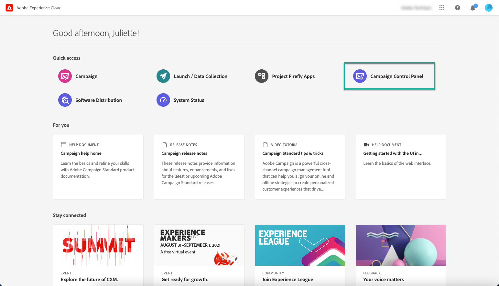
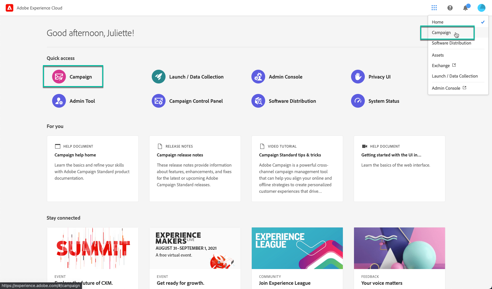
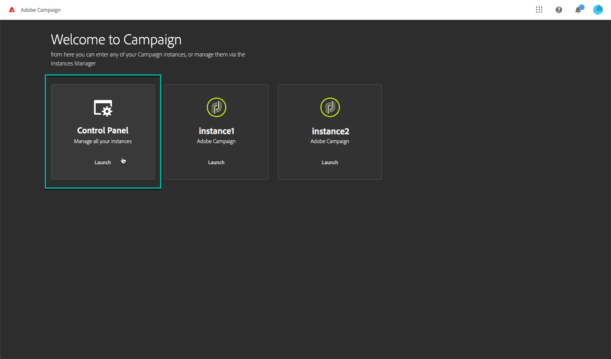
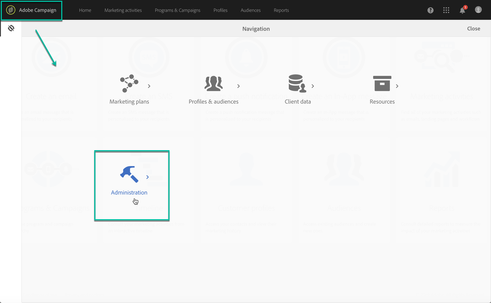
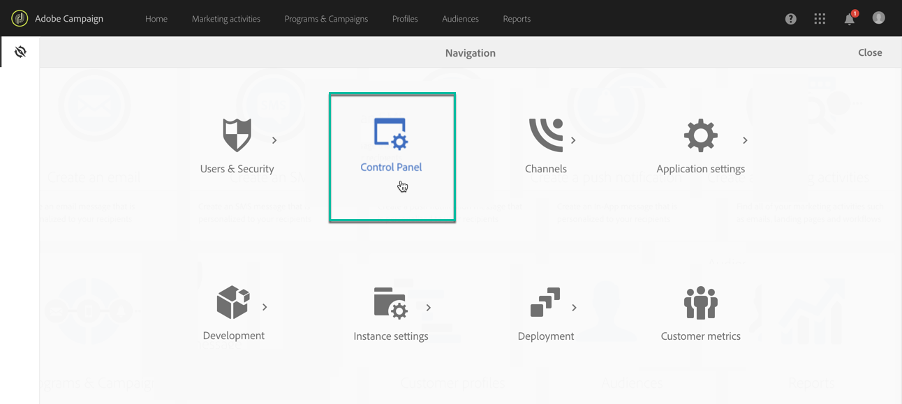

# 存取「控制面板」 {#accessing-control-panel}

您可以直接從Experience Cloud或產品本身使用「控制面板」。

您可存取 **管理員使用者** 僅限。 有關如何將使用者指派給管理員群組的詳細資訊，請參閱 [本節](../../discover/using/managing-permissions.md).

## 從Experience Cloud平台存取 {#access-experience-cloud-platform}

若要從Adobe Experience Cloud平台存取「控制面板」，請遵循下列步驟。

1. 導覽至 [Experience Cloud首頁](https://experiencecloud.adobe.com/){target="_blank"}.

1. 按一下 **快速存取** 區段。

   

您也可以從Experience Cloud平台存取「控制面板」 **解決方案選擇器**：

1. 從 [Adobe Experience Cloud首頁](https://experiencecloud.adobe.com/){target="_blank"}，選取 **Campaign** 從 **快速存取** 區段或右上方的功能表。

   

1. 您的Campaign執行個體清單隨即顯示。 按一下 **控制面板** 卡片以啟動它。

   

## 從產品存取 {#access-product}

>[!NOTE]
>
>可從產品記憶體取，適用於 [Campaign Standard](https://experienceleague.adobe.com/docs/campaign-standard/using/campaign-standard-home.html?lang=zh-Hant){target="_blank"} 僅限。

1. 開啟您的Campaign Standard產品。

1. 選取 **[!UICONTROL Administration]** 功能表來自 **導覽** 窗格。

   

1. 按一下 **[!UICONTROL Control Panel]** 圖示。

   
