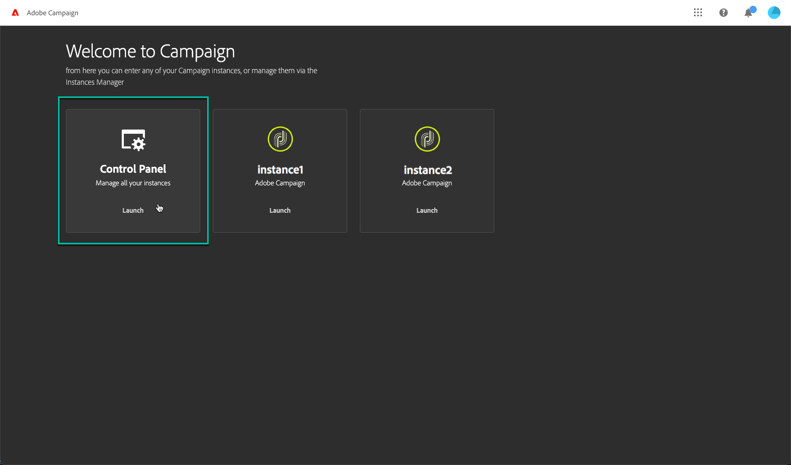
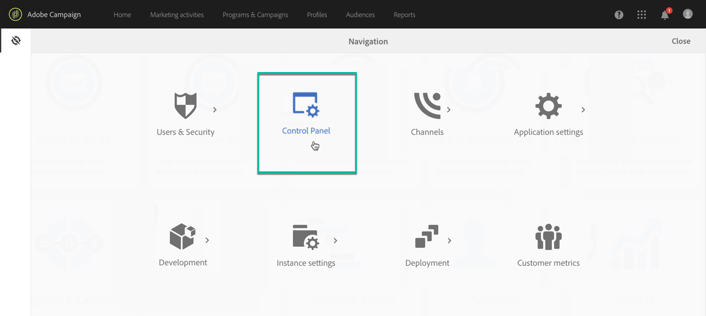

# 存取「控制面板」 {#accessing-control-panel}

您可以直接從 Experience Cloud 或從產品本身來使用「控制面板」。

## 先決條件 {#prerequisites}

請注意，就 Campaign v7/v8 而言，您的執行個體必須託管至 Amazon Web Services (AWS)，並升級至最新的 [Campaign 穩定版本](https://experienceleague.adobe.com/docs/campaign-classic/using/release-notes/rn-overview.html?lang=zh-Hant#rn-statuses) 或版本編號 9032 或以上。 在[本章節](https://experienceleague.adobe.com/docs/campaign-classic/using/getting-started/starting-with-adobe-campaign/launching-adobe-campaign.html?lang=zh-Hant#getting-your-campaign-version)中瞭解如何確認您的版本。 若要檢查您的執行個體是否託管在 AWS 上，請按照[本頁面](../../faq.md#hosted-aws)詳述的步驟操作。

在Microsoft Azure上託管的Campaign v8執行個體也可存取控制面板功能的子集： [執行個體存取的IP允許清單](../../instances-settings/using/ip-allow-listing-instance-access.md)、[SFTP伺服器的IP允許清單](../../sftp/using/ip-range-allow-listing.md)以及[客戶管理的SSL憑證管理](../../subdomains-certificates/using/renewing-subdomain-certificate.md)。

>[!IMPORTANT]
>
>依預設情況，只有屬於「管理員」產品設定檔的管理員使用者，才能存取控制面板。 根據貴組織的設定，產品設定檔可以有不同的名稱（「admin」、「admins」、「approval admin」等）。 **任何名稱包含「admin」字詞的產品設定檔都會自動授與「控制面板」的存取權**。 請仔細審核您的產品設定檔命名，確保只有經授權的使用者，才能存取控制面板。 [瞭解如何管理控制面板](../../discover/using/managing-permissions.md)的許可權。

## 從 Experience Cloud Platform 存取 {#access-experience-cloud-platform}

若要從 Adobe e Experience Cloud Platform 存取「控制面板」，請依照下列步驟進行。

1. 瀏覽至 [Experience Cloud 首頁](https://experiencecloud.adobe.com/){target="_blank"}。

1. 按一下&#x200B;**快速存取**&#x200B;區段中的專屬連結。

   

您也可以從 Experience Cloud Platform **解決方案選取器**&#x200B;存取「控制面板」：

1. 請到 [Adobe Experience Cloud 首頁](https://experiencecloud.adobe.com/){target="_blank"}那邊，從&#x200B;**快速存取**&#x200B;區段，或可至右上方的熱門選單，選取 **行銷活動**。

   

1. 隨即顯示 Campaign 執行個體清單。 按一下&#x200B;**控制面板**&#x200B;卡片予以啟動。

   

## 從產品存取 {#access-product}

>[!NOTE]
>
>只有 [Campaign Standard](https://experienceleague.adobe.com/docs/campaign-standard/using/campaign-standard-home.html?lang=zh-Hant){target="_blank"}，才提供可從產品那邊存取的功能。

1. 開啟 Campaign Standard 產品。

1. 選取&#x200B;**導覽**&#x200B;窗格中的&#x200B;**[!UICONTROL 管理]**&#x200B;選單。

   

1. 按一下&#x200B;**[!UICONTROL 控制面板]**&#x200B;圖示。

   
