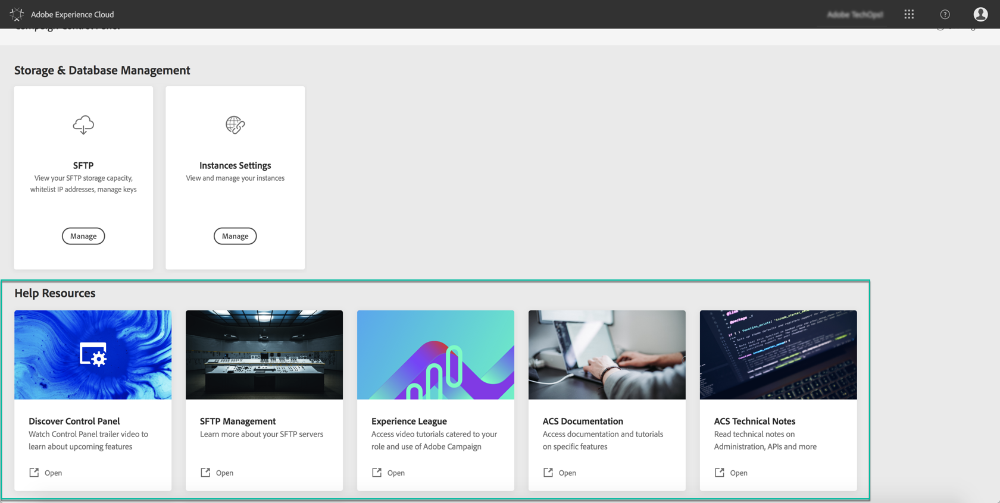

# 發現控制面板介面 {#discovering-interface}

「控制面板」首頁可讓您存取所有可在促銷活動例項上執行的動作。

它們由按主題（如儲存和資料庫管理）組織的 **卡表示**。

隨著即將發行的促銷活動，將會提供更多主題和資訊卡。

## 工作記錄檔 {#job-logs}

The **[!UICONTROL Job Logs]** button in the upper-right corner lets you audit all the changes that have been made by users of your organization.

按一下清單的元素，以取得詳細資訊。

The **[!UICONTROL Open]** button allows you to access directly the Control Panel tab where the change has been made.

## 說明資源 {#help-resources}

本節 **[!UICONTROL Help Resources]** 提供實用的說明檔案，可協助您使用「控制面板」和「促銷活動」產品。 不要猶豫地去探索它們。

