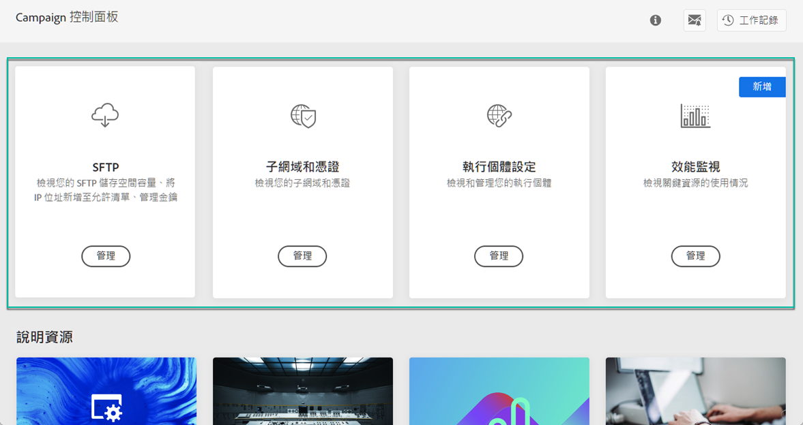
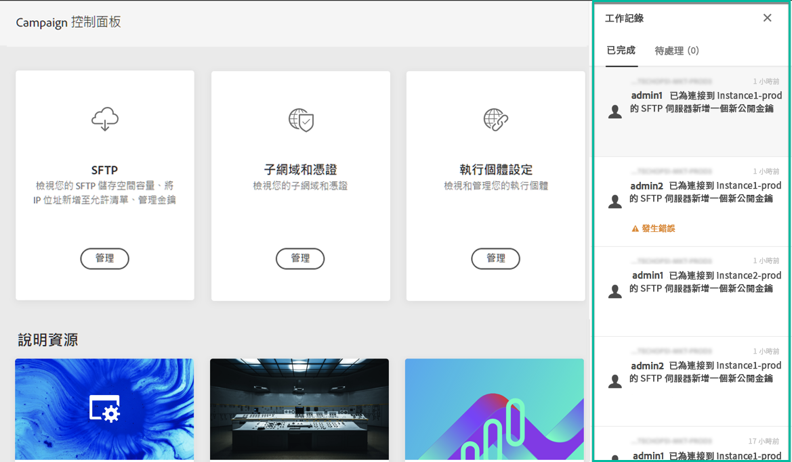
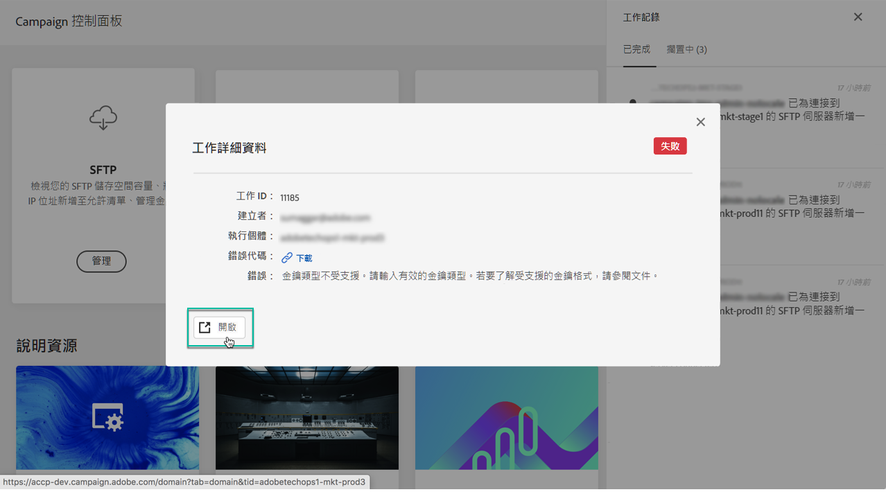
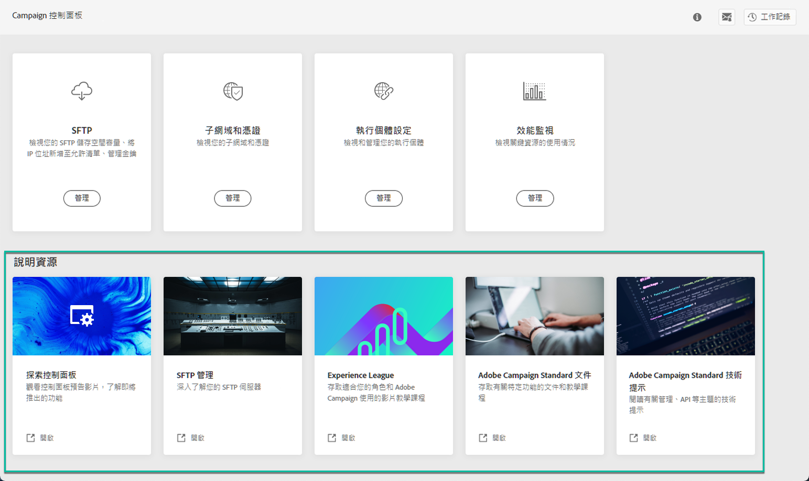

# 探索「控制面板」介面 {#discovering-interface}

「控制面板」首頁可讓您存取所有可在 Campaign 執行個體上執行的動作。

以依主題組織的卡片呈現，例如，**效能監視**。

<!--With upcoming Campaign releases, more topics and cards will be made available.-->

## 工作記錄 {#job-logs}

右上角的 **[!UICONTROL Job Logs]** 按鈕可讓您稽核組織的使用者所作的所有變更。

如需詳細資訊，請按一下清單的元素。

**[!UICONTROL Open]** 按鈕允許您直接存取「控制面板」標籤，也就是作出變更的位置。

## 說明資源 {#help-resources}

**[!UICONTROL Help Resources]** 區段提供實用文件，協助您使用「控制面板」和 Campaign 產品。 歡迎隨時探索。

## 支援的語言 {#languages}

「控制面板」使用者介面的設計旨在以符合瀏覽器設定的語言顯示。

如果瀏覽器設定的語言不受支援，「控制面板」會檢查瀏覽器語言清單的前三種語言，直到找到支援的語言為止。 如果「控制面板」不支援前三種語言，預設會使用英文 (美國)。

以下是「控制面板」目前支援的語言清單：

* 英文 (美國)
* 德文
* 法文
* 日文
* 義大利文 (義大利)
* 西班牙文 (西班牙)
* 韓文
* 葡萄牙文 (巴西)
* 中文 (簡體)
* 中文 (繁體)
