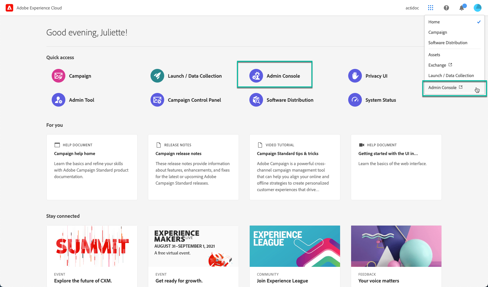
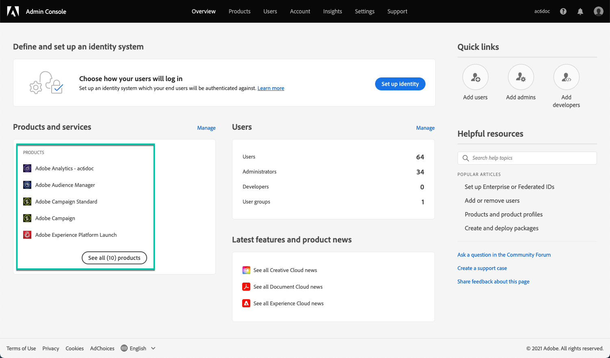
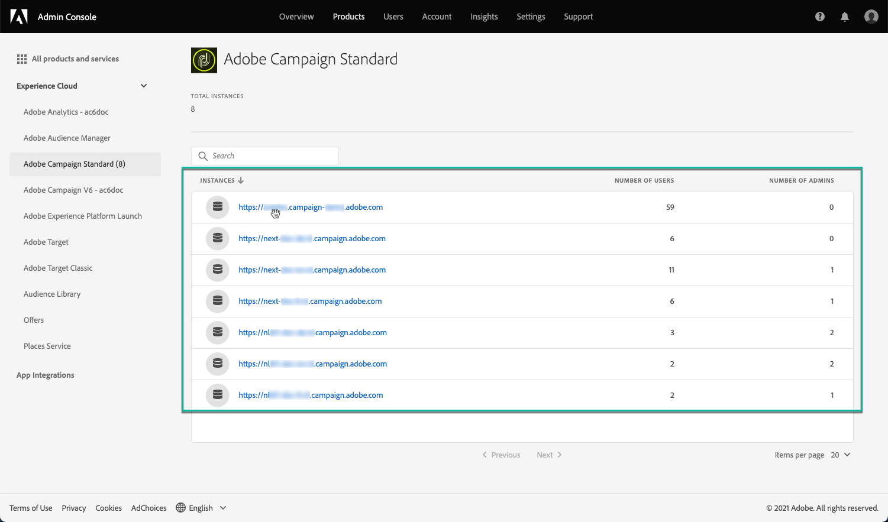
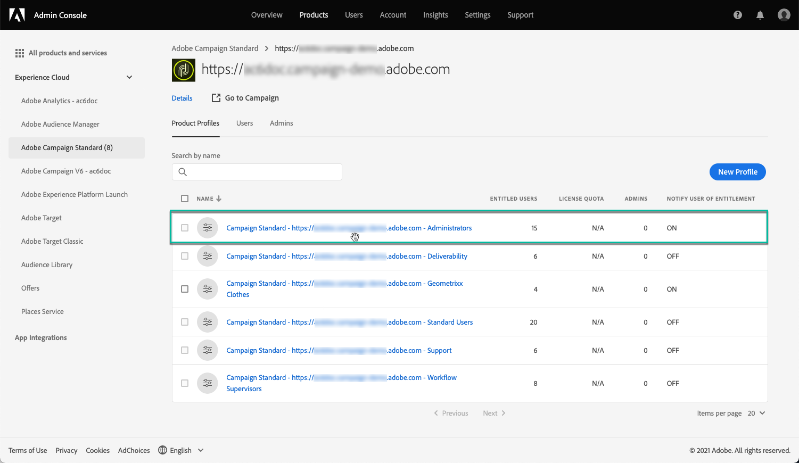
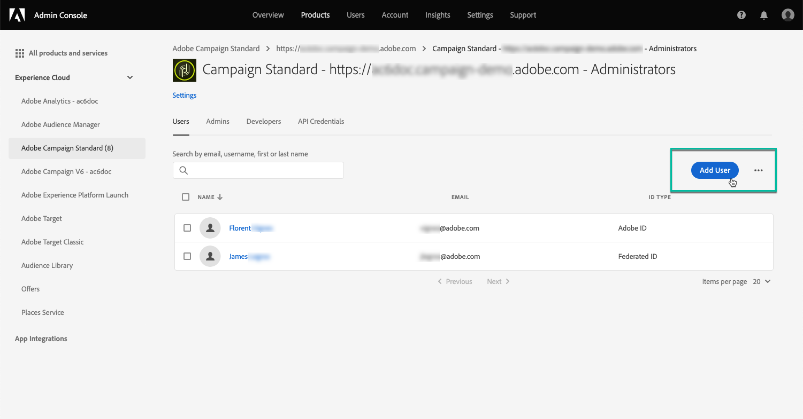

# 管理「控制面板」的權限 {#managing-permissions-control-panel}

Campaign執行個體的所有管理員使用者都可使用「控制面板」。 請依照下列步驟，將使用者指派給管理員群組，並授予他們對「控制面板」的存取權。

[ 在影片中探索此功能](../../discover/using/managing-permissions.md#video)

1. 導覽至 [Adobe Experience Cloud首頁](https://experiencecloud.adobe.com/){target="_blank"}.

1. 啟動 **Admin Console** 按一下 **快速存取** 區段或右上角功能表。

   

   >[!NOTE]
   >
   >如果 **Admin Console** 連結未顯示，這表示您沒有組織的管理員許可權。 請聯絡您的組織管理員，以便與他們一起執行步驟。

1. 從 **Admin Console**，從中選擇所需的Campaign產品 **[!UICONTROL 產品和服務]** 清單。

   

   >[!NOTE]
   >
   >如果沒有看見您的產品，請聯絡您的組織管理員，讓他們授予您存取權。

1. 隨即顯示Campaign產品的執行個體清單。 選取您要新增管理員使用者的執行個體。

   

   >[!NOTE]
   >
   >您可以為每個Campaign執行個體新增不同的管理員使用者。 管理員使用者將只能存取其所屬執行個體的「控制面板」。

1. 清單 **[!UICONTROL 產品設定檔]** 則會顯示所選執行個體的。 按一下 **[!UICONTROL 管理員]** 用於存取管理員使用者清單的產品設定檔。

   

   >[!NOTE]
   >
   >依預設，管理員使用者屬於「管理員」產品設定檔。 根據您的組織設定，產品設定檔的名稱可以不同（「管理員」、「管理員」等）。

1. 管理員使用者清單隨即顯示。 按一下 **[!UICONTROL 新增使用者]** 按鈕以新增所需的使用者。

   

>[!NOTE]
>
>設定存取許可權後，使用者必須登出Adobe Experience Cloud並重新登入，才能存取「控制面板」。

## 教學課程影片 {#video}

>[!VIDEO](https://video.tv.adobe.com/v/27147?quality=12)
