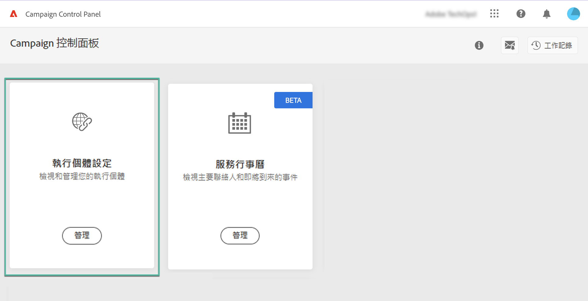
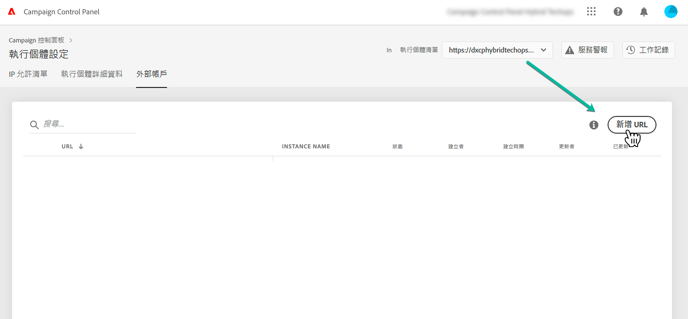
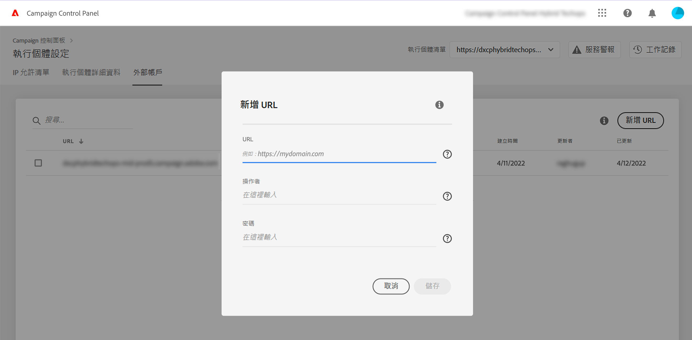
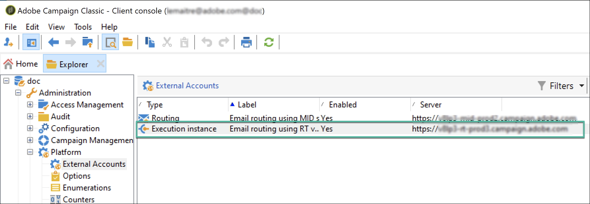
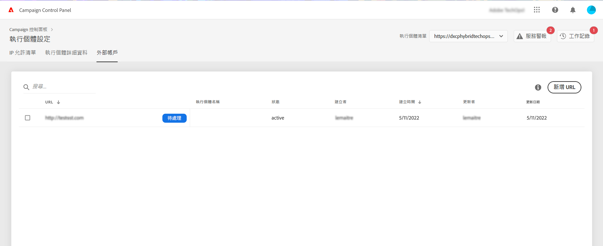
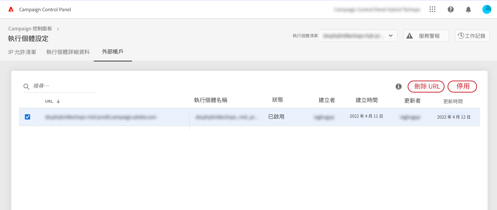
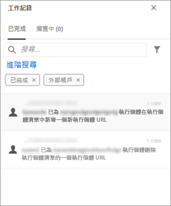

# 新增 MID/RT 例項 (混合模型){#add-mid-rt-instances-hybrid-model}

>[!CONTEXTUALHELP]
>id="cp_externalaccounts"
>title="外部帳戶"
>abstract="在此螢幕中，具有混合託管模型的客戶可以提供在「控制面板」行銷執行個體設定的 MID/RT 執行個體 URL，以便利用「控制面板」功能。"

控制面板允許使用混合託管模型的客戶利用特定的控制面板功能。 要執行此操作，您需要：

* 在控制面板中，提供您的行銷執行個體設定的 [MID/RT 執行個體 URL](#add)，
* [將 MID/RT 執行個體 IP 位址新增至允許清單](#ip)，以允許行銷執行個體進行連線。

有關託管模型的詳細資訊，請參閱 [Campaign Classic 文件](https://experienceleague.adobe.com/docs/campaign-classic/using/installing-campaign-classic/architecture-and-hosting-models/hosting-models-lp/hosting-models.html?lang=zh-Hant)。

## 新增 MID/RT 執行個體 {#add}

>[!CONTEXTUALHELP]
>id="cp_externalaccounts_url"
>title="URL"
>abstract="可以在「管理」>「平台」>「外部帳戶」功能表的「 Campaign 用戶端主控台」找到執行個體的 URL。"

>[!CONTEXTUALHELP]
>id="cp_externalaccounts_operator"
>title="操作員"
>abstract="Adobe 管理員在初始佈建後提供的操作員 ID。"

>[!CONTEXTUALHELP]
>id="cp_externalaccounts_password"
>title="密碼"
>abstract="Adobe 管理員在初始佈建後提供的操作員密碼。"

混合型客戶應透過 Experience Cloud 連結控制面板。 第一次存取控制面板時，首頁僅顯示兩張卡片。

>[!NOTE]
>
>如果您在存取「控制面板」時遇到任何問題，您的行銷執行個體很可能尚未對應您的[組織 ID](https://experienceleague.adobe.com/docs/core-services/interface/administration/organizations.html?lang=zh-Hant)。 請聯絡客戶服務部完成此設定才能繼續。 在成功連線時，您會看到「控制面板」首頁。

若要能夠存取「控制面板」功能，您需要在&#x200B;**[!UICONTROL 執行個體設定]**&#x200B;卡片提供 MID/RT 執行個體資訊。請依照下列步驟以執行此操作。

1. 在&#x200B;**[!UICONTROL 執行個體設定]**&#x200B;卡片，選取&#x200B;**[!UICONTROL 外部帳戶]**&#x200B;標籤。

1. 從下拉式清單選擇所需的行銷執行個體，然後按一下&#x200B;**[!UICONTROL 新增 URL]**。

   

1. 提供要新增的 MID/RT 執行個體資訊。

   

   * **[!UICONTROL URL]**：可以在&#x200B;**[!UICONTROL 管理]** > **[!UICONTROL 平台]** > **[!UICONTROL 外部帳戶]**&#x200B;選單的「 Campaign 用戶端主控台」找到執行個體的 URL。

     

   * **[!UICONTROL 操作者]** / **[!UICONTROL 密碼]**：Adobe 管理員在初始佈建後提供的操作者認證。

     >[!NOTE]
     >
     >如果無法取得這些詳細資訊，請聯絡客戶服務部。

1. 按一下&#x200B;**[!UICONTROL 儲存]**&#x200B;以確認。

在新增 MID/RT URL 時，會觸發非同步處理程序來驗證 URL 的正確性。 此過程可能需要幾分鐘。 在驗證 MID/RT 執行個體 URL 之前，工作將暫時擱置。 只有驗證完成後，您才能存取「控制面板」的主要功能。

您可以從清單中選擇 MID/RT 執行個體 URL，隨時刪除或停用。

請注意，您可以在&#x200B;**[!UICONTROL 工作記錄]**&#x200B;的&#x200B;**[!UICONTROL 外部帳戶]**&#x200B;標籤上監視對 MID/RT 執行個體 URL 執行的任何動作：

## 將 IP 位址新增至允許清單 {#ip}

新增 MID/RT 執行個體後，您必須將其 IP 位址新增至允許清單，這樣您的行銷執行個體就能連線至該 IP 位址。

這可以從&#x200B;**[!UICONTROL 執行個體設定]**&#x200B;卡片的 **[!UICONTROL IP 允許清單]**&#x200B;標籤中執行。 [了解如何將 IP 位址新增至允許清單](ip-allow-listing-instance-access.md)

完成後，您就能將「控制面板」功能用於 MID/RT 執行個體。

## 為混合型客戶提供的功能 {#capabilities}

在新增 MID/RT 執行個體到「控制面板」之後，您可以利用下列功能：

* [監視主要聯絡人及事件](../../service-events/service-events.md)
* [檢視執行個體的詳細資訊](../../instances-settings/using/instance-details.md)，
* [將 IP 位址新增至允許清單](../../instances-settings/using/ip-allow-listing-instance-access.md)，
* [設定新子網域](../../subdomains-certificates/using/setting-up-new-subdomain.md)，
* [續約子網域的 SSL 憑證](../../subdomains-certificates/using/renewing-subdomain-certificate.md)。
