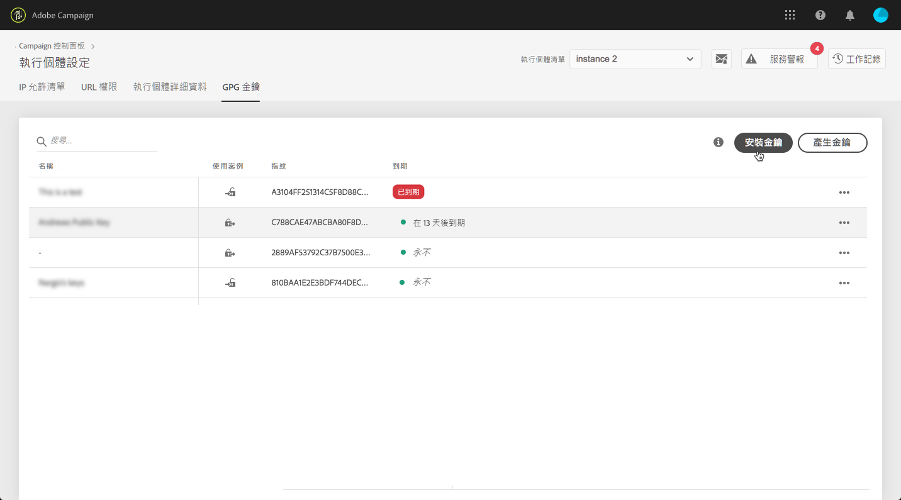
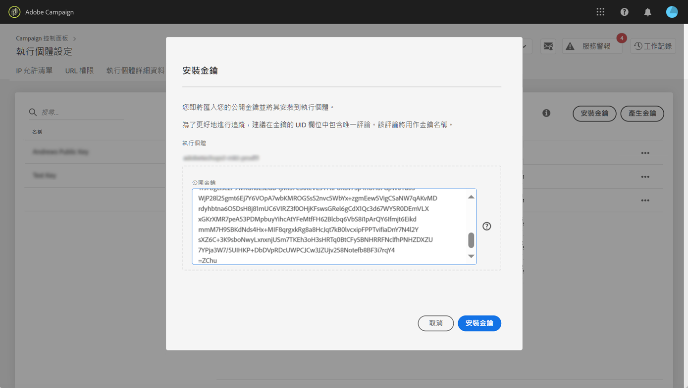
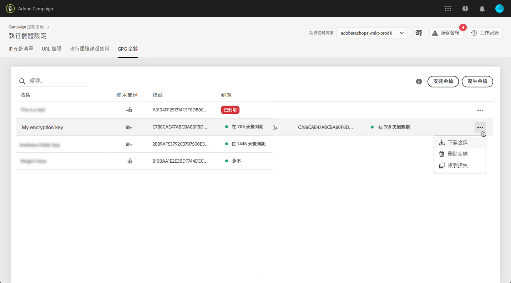
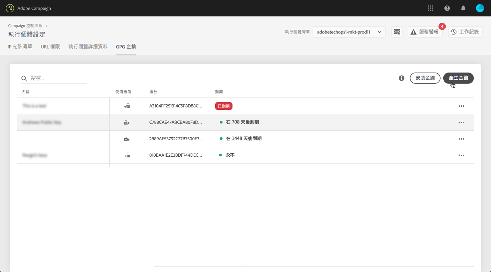
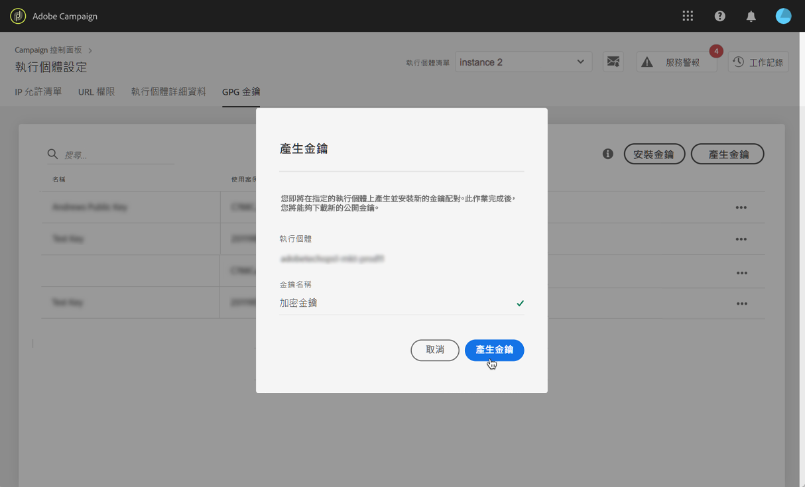
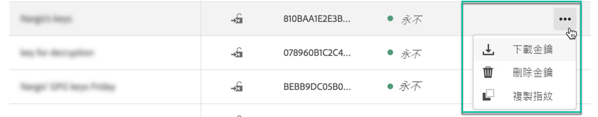
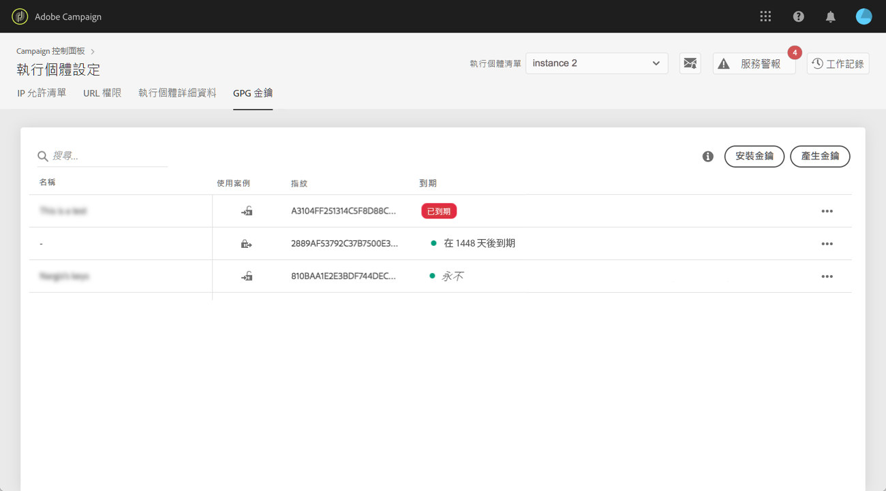
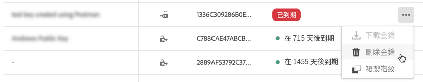

# GPG 金鑰管理 {#gpg-keys-management}

## 關於GPG加密 {#about-gpg-encryption}

GPG加密可讓您使用遵循[OpenPGP](https://www.openpgp.org/about/standard/)規範的公私金鑰組系統來保護資料。

實施後，您就可以在傳輸發生之前對傳入資料進行解密和加密，以確保沒有有效匹配密鑰對的任何人都不會訪問這些資料。

若要使用 Campaign實作 GPG加密，管理員使用者必須直接從控制面板在行銷執行實例安裝及/或產生 GPG 金鑰。

之後，您將能夠：

* **加密已發送的資料**:Adobe Campaign會在以已安裝的公開金鑰加密資料後，將資料傳出。

* **解密傳入的資料**:Adobe Campaign會使用從「控制面板」下載的公開金鑰，從外部系統接收已加密的資料。Adobe Campaign使用從「控制面板」產生的私密金鑰解密資料。

## 加密資料 {#encrypting-data}

「控制面板」可以讓您加密從 Adobe Campaign 執行個體傳出的資料。

若要這麼做，您需要從PGP加密工具產生GPG金鑰組，然後將公開金鑰安裝至「控制面板」。 然後，您就能先加密資料，再從執行個體傳送資料。 請依照下列步驟以執行此操作。

[ 在影片中探索此功能](#video)

1. 使用[OpenPGP規範](https://www.openpgp.org/about/standard/)後的PGP加密工具生成公用/私鑰對。 要執行此操作，請安裝GPG實用程式或GNuGP軟體。

   >[!NOTE]
   >
   >可使用開放原始碼自由軟體來產生金鑰。 不過，請務必遵循貴組織的准則，並使用IT/安全性組織建議的GPG公用程式。

1. 安裝該實用程式後，在Mac終端或Windows命令中運行以下命令。

   `gpg --full-generate-key`

1. 出現提示時，請為您的金鑰指定所需的參數。 必要參數為：

   * **鍵類型**:RSA
   * **鍵長度**:1024 - 4096位
   * **實** 名和電 **子郵件地址**:可追蹤建立金鑰組的人員。輸入連結至您的組織或部門的名稱和電子郵件地址。
   * **註解**:在註解欄位中新增標籤，可協助您輕鬆識別要用來加密資料的金鑰。
   * **有效期**:日期或「0」表示無到期日。
   * **密碼**

   

1. 確認後，指令碼將產生具有相關聯指紋的金鑰，您可將其匯出至檔案，或直接貼入「控制面板」。 要導出檔案，請運行此命令，然後運行生成的密鑰的指紋。

   `gpg -a --export <fingerprint>`

1. 若要將公開金鑰安裝至「控制面板」，請開啟&#x200B;**[!UICONTROL Instance settings]**&#x200B;卡片，然後選取&#x200B;**[!UICONTROL GPG keys]**&#x200B;標籤和所需的執行個體。

1. 按一下 **[!UICONTROL Install Key]** 按鈕。

   

1. 貼上已從PGP加密工具產生的公開金鑰。 您也可以直接拖放您匯出的公開金鑰檔案。

   >[!NOTE]
   >
   >公開金鑰應為OpenPGP格式。

   

1. 按一下 **[!UICONTROL Install Key]** 按鈕。

安裝公開金鑰後，該金鑰會顯示在清單中。 您可以使用&#x200B;**...**&#x200B;按鈕下載或複製指紋。

接著，金鑰便可在Adobe Campaign工作流程中使用。 使用資料擷取活動時，您可以用它來加密資料。

[ 在影片中探索此功能](#video)

如需此主題的詳細資訊，請參閱Adobe Campaign檔案：

**Campaign Classicv7和Campaign v8:**

* [壓縮或加密檔案](https://experienceleague.adobe.com/docs/campaign-classic/using/getting-started/importing-and-exporting-data/managing-data-encryption-compression/zip-encrypt.html)
* [使用案例：使用安裝在控制面板上的金鑰加密和匯出資料](https://https://experienceleague.adobe.com/docs/campaign-classic/using/automating-with-workflows/general-operation/how-to-use-workflow-data.html#use-case-gpg-encrypt)

**Campaign Standard:**

* [管理已加密的資料](https://https://experienceleague.adobe.com/docs/campaign-standard/using/managing-processes-and-data/importing-and-exporting-data/managing-encrypted-data.html)
* [使用案例：使用安裝在控制面板上的金鑰加密和匯出資料](https://experienceleague.adobe.com/docs/campaign-classic/using/getting-started/importing-and-exporting-data/managing-data-encryption-compression/zip-encrypt.html#use-case-gpg-encrypt)

## 解密資料 {#decrypting-data}

「控制面板」可讓您解密傳入Adobe Campaign執行個體的外部資料。

若要這麼做，您需要直接從「控制面板」產生GPG金鑰組。

* **公開金鑰**&#x200B;將與外部系統共用，外部系統將使用它來加密要傳送至Campaign的資料。
* Campaign將使用&#x200B;**私密金鑰**&#x200B;解密傳入的加密資料。

[ 在影片中探索此功能](#video)

若要在「控制面板」中產生金鑰組，請執行下列步驟：

1. 開啟&#x200B;**[!UICONTROL Instance settings]**&#x200B;卡片，然後選取&#x200B;**[!UICONTROL GPG keys]**&#x200B;標籤和所需的Adobe Campaign例項。

1. 按一下 **[!UICONTROL Generate Key]** 按鈕。

   

1. 指定鍵的名稱，然後按一下&#x200B;**[!UICONTROL Generate Key]**。 此名稱可協助您識別要在Campaign工作流程中解密的金鑰

   

產生金鑰組後，公開金鑰會顯示在清單中。 請注意，解密密鑰對是在沒有到期日的情況下生成的。

您可以使用&#x200B;**...**&#x200B;按鈕，下載公開金鑰或複製其指紋。

公開金鑰隨後可用於與任何外部系統共用。 Adobe Campaign將能夠在資料載入活動中使用私密金鑰來解密已使用公開金鑰加密的資料。

如需詳細資訊，請參閱Adobe Campaign檔案：

**Campaign Classicv7和Campaign v8:**

* [在處理前解壓縮或解密檔案](https://experienceleague.adobe.com/docs/campaign-classic/using/getting-started/importing-and-exporting-data/managing-data-encryption-compression/unzip-decrypt.html)
* [使用案例：匯入使用「控制面板」產生的金鑰加密的資料](https://experienceleague.adobe.com/docs/campaign-classic/using/getting-started/importing-and-exporting-data/managing-data-encryption-compression/unzip-decrypt.html#use-case-gpg-decrypt)

**Campaign Standard:**

* [管理已加密的資料](https://https://experienceleague.adobe.com/docs/campaign-standard/using/managing-processes-and-data/importing-and-exporting-data/managing-encrypted-data.html)
* [使用案例：匯入使用「控制面板」產生的金鑰加密的資料](https://https://experienceleague.adobe.com/docs/campaign-standard/using/managing-processes-and-data/importing-and-exporting-data/managing-encrypted-data.html#use-case-gpg-decrypt)

## 監控GPG金鑰

若要存取為您的執行個體安裝和產生的GPG金鑰，請開啟&#x200B;**[!UICONTROL Instance settings]**&#x200B;卡片，然後選取&#x200B;**[!UICONTROL GPG keys]**&#x200B;標籤。

清單會顯示已為您的執行個體安裝並產生的所有加密和解密GPG金鑰，並包含每個金鑰的詳細資訊：

* **[!UICONTROL Name]**:安裝或產生金鑰時已定義的名稱。
* **[!UICONTROL Use case]**:此欄會指定索引鍵的使用案例：

   :已安裝用於資料加密的密鑰。

   :已生成密鑰以允許資料解密。

* **[!UICONTROL Fingerprint]**:鑰匙的指紋。
* **[!UICONTROL Expires]**:密鑰的到期日。請注意，控制面板會在主要到期日臨近時提供視覺指示：

   * 30天前會顯示緊急（紅色）。
   * 警告（黃色）在60天前顯示。
   * 金鑰過期後，會顯示「已過期」的紅色橫幅。

   >[!NOTE]
   >
   >請注意，「控制面板」不會傳送任何電子郵件通知。

我們建議您移除您不再需要的任何金鑰，作為最佳實務。 要執行此操作，請按一下&#x200B;**...**&#x200B;按鈕，然後選擇&#x200B;**[!UICONTROL Delete Key]。**。

>[!IMPORTANT]
>
>移除金鑰之前，請確定未在任何Adobe Campaign工作流程中使用金鑰，以防止金鑰失敗。

## 教學課程影片 {#video}

以下影片說明如何產生和安裝資料加密所需的GPG金鑰。

[Campaign Classic](https://experienceleague.adobe.com/docs/campaign-standard-learn/control-panel/instance-settings/gpg-key-management/gpg-key-management-overview.html?lang=en#instance-settings)和[Campaign Standard](https://experienceleague.adobe.com/docs/campaign-classic-learn/control-panel/instance-settings/gpg-key-management/gpg-key-management-overview.html?lang=en#instance-settings)教學課程頁面提供與GPG金鑰管理相關的其他操作說明影片。

>[!VIDEO](https://video.tv.adobe.com/v/36386?quality=12)
