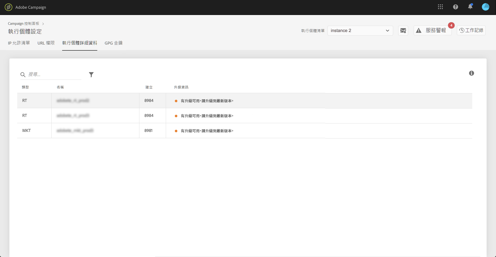

# 執行個體詳細資訊 {#instance-details}

>[!CONTEXTUALHELP]
>id="cp_instancesettings_instancedetails"
>title="關於執行個體詳細資訊"
>abstract="查看您的Adobe Campaign實例的詳細資訊：類型、名稱、生成資訊以及可能的升級建議。"

## 關於執行個體詳細資訊 {#about-instance-details}

>[!IMPORTANT]
>
>此功能僅適用於Campaign v7/v8實例。

您的 Adobe Campaign 執行個體架構可以包含數個伺服器，以便提供行銷活動的彈性。例如，您可以有行銷、即時 (或 Message Center) 和 Mid Sourcing 伺服器以支援您的執行個體。

「執行個體詳細資訊」功能可讓您檢視執行個體的平面架構。除了伺服器資訊外，它還讓您知道執行個體版本編號是否為最新版本，並會視需要建議升級。

>[!NOTE]
>
>我們建議您的實例每年至少升級一次，以避免效能下降，並能夠利用Adobe Campaignv7/v8必須提供的最新功能和修復。

**相關主題：**

* [執行版本編號升級](https://docs.campaign.adobe.com/doc/AC/getting_started/EN/buildUpgrade.html)
* [更新 Adobe Campaign](https://docs.campaign.adobe.com/doc/AC/en/PRO_Updating_Adobe_Campaign_Introduction.html)

## 擷取關於執行個體的資訊 {#retrieving-information-about-instances}

若要獲得與您執行個體連結的資訊，請執行以下步驟：

1. 開啟「**[!UICONTROL Instances Settings]**」卡片以存取「**[!UICONTROL Instance Details]**」標籤。

   >[!NOTE]
   >
   >如果「控制面板」的首頁上看不到「實例設定」卡，則表示您的IMS組織ID未與任何Adobe Campaignv7/v8實例關聯

1. 在左窗格中，選取所需的 Campaign 執行個體。

   >[!NOTE]
   >
   >所有 Campaign 執行個體都會顯示在左側窗格清單中。由於「實例詳細資訊」功能僅專用於市場活動v7/v8實例，因此如果您選擇了Campaign Standard實例，則會顯示「不適用實例」消息。

1. 隨即顯示伺服器連結的執行個體。

   

可用資訊包括：

* **[!UICONTROL Type]**：伺服器的類型。可能的值包括 MKT (行銷)、MID (Mid sourcing) 和 RT (Message Center/即時傳送訊息)。
* **[!UICONTROL Name]**：伺服器的名稱。
* **[!UICONTROL Build:]**：安裝在伺服器上的版本編號。
* **[!UICONTROL Upgrade info]**：此欄會通知您伺服器是否需要更新。
   * 綠色：您的伺服器為最新狀態，不需要升級。
   * 黃色：您應考慮升級。您缺少了最新的功能和修正項目。
   * 紅色：盡快升級。您缺少了新功能，伺服器可能無法提供最佳效能。

如果您的其中一台伺服器需要升級，請參閱[本文件](https://docs.campaign.adobe.com/doc/AC/getting_started/EN/buildUpgrade.html)以瞭解如何處理的詳細資訊。

## 常見問題 {#common-questions}

**我在執行個體架構上沒有看到 MID 伺服器，是否代表我的執行個體無法正常運作？我是否需要 RT 執行個體才能做到今天無法做到的事？**

您自己的執行個體看起來可能非常不同，它可能並沒有所有類型的伺服器，或者可能有多個相同的伺服器。沒有任何一種或另一種類型的伺服器，並不代表您不能傳送即時訊息或執行其他類型的活動。您可以要求額外的伺服器容量，但需支付額外費用。

如果您認為「執行個體詳細資訊」頁面中並未顯示某些伺服器，請聯烙客戶服務。請務必在您的訊息中註明特定的執行個體 URL。
