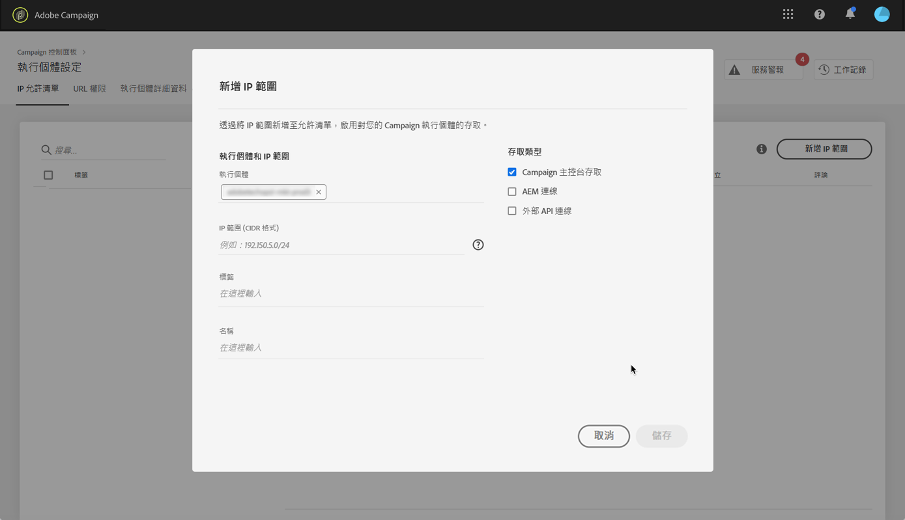

# IP 允許清單 {#ip-allow-listing}

>[!CONTEXTUALHELP]
>id="cp_instancesettings_iprange"
>title="關於 IP 允許清單"
>abstract="將 IP 位址新增至允許清單，以存取您的執行個體。"
>additional-url="https://images-tv.adobe.com/mpcv3/045cac99-f948-478e-ae04-f8c161dcb9e2_1568132508.1920x1080at3000_h264.mp4" text="觀看示範影片"

## 關於 IP 允許清單 {#about-ip-allow-listing}

>[!IMPORTANT]
>
>此功能僅適用於Campaign v7/v8實例。

依預設，您的 Adobe Campaign 執行個體無法從各種 IP 位址進行存取。

如果您的 IP 位址尚未新增至允許清單，您就無法從此位址登入執行個體。同樣地，如果 IP 位址尚未與該執行個體明確地新增至允許清單，您可能無法將 API 連結到您的 Message Center 或行銷執行個體。

「控制面板」可讓您將 IP 位址範圍新增至允許清單，以將新的連線設定到您的執行個體。請依照下列步驟以執行此操作：

將 IP 位址新增至允許清單之後，您就可以建立 Campaign 運算子，並將其連結至這些 IP 位址，以便使用者可以存取該執行個體。

 [在影片中探索此功能](https://experienceleague.adobe.com/docs/campaign-classic-learn/control-panel/instance-settings/ip-allow-listing.html#instance-settings)

## 最佳實務 {#best-practices}

在「控制面板」上，將 IP 位址新增至允許清單，請務必遵循下列建議和限制。

* 如果您不想要將 IP 位址連線至您的 RT 伺服器或 AEM 安全區域，**請勿對所有「存取類型」啟用 IP 存取權限**。
* **如果您暫時對 IP 位址啟用了執行個體的存取權限**，請確保在不再需要連線至執行個體時，從允許清單的 IP 位址中刪除該 IP 位址。
* **我們不建議將公共場所的 IP 位址新增至允許清單**（機場、飯店等）。請一律使用您的公司 VPN 地址，確保執行個體安全無虞。

## 將IP地址添加到允許實例訪問清單 {#adding-ip-addresses-allow-list}

>[!CONTEXTUALHELP]
>id="cp_instancesettings_iprange_add"
>title="IP 範圍設定"
>abstract="定義您要新增至允許清單的 IP 範圍，以便連線至執行個體。"

>[!NOTE]
>
>如果 **[!UICONTROL Instance Settings]** 「Control Panel（控制面板）」的首頁上看不到卡，這意味著您 [組織ID](https://experienceleague.adobe.com/docs/core-services/interface/administration/organizations.html?lang=zh-Hant) 不與任何Adobe Campaignv7/v8實例關聯。

若要將 IP 位址新增至允許清單，請執行下列步驟：

1. 開啟 **[!UICONTROL Instances Settings card]** 以存取 IP 允許清單索引標籤，然後按一下 **[!UICONTROL Add new IP Range]**。

   

1. 填入您想要新增至允許清單的 IP 範圍資訊，如下所述。

   

   * **[!UICONTROL Instance(s)]**：IP 位址可連線的執行個體，可同時操作多個執行個體。例如，您可透過相同步驟，在「生產」和「階段」執行個體上執行 IP 允許清單。
   * **[!UICONTROL IP Range]**：您希望新增至允許清單的 IP 範圍，以 CIDR 格式表示。請注意，IP 範圍不能與允許清單上的現有範圍重疊。在該情況下，請先刪除包含重疊 IP 的範圍。

   >[!NOTE]
   >
   >CIDR (無類別域間路由) 是使用「控制面板」介面新增 IP 範圍時支援的格式。語法由 IP 位址、後面加上「/」字元和十進位數字組成。[本文](https://whatismyipaddress.com/cidr)會詳細說明格式及其語法。
   >
   >您可以在網際網路上搜尋免費線上工具，協助您將現有的 IP 範圍轉換為 CIDR 格式。

   * **[!UICONTROL Label]**：將顯示在允許清單中的標籤。
   * **[!UICONTROL Name]**：此名稱必須是「存取類型」、「執行個體」(若是外部 API 連線) 和 IP 位址的唯一名稱。

1. 指定要授予 IP 位址的存取類型：

   * **[!UICONTROL Campaign Console Access]**:允許IP地址連接到市場活動客戶端控制台。 請注意，Console 僅為行銷執行個體啟用。由於不允許存取 MID 和 RT 執行個體，因此並未啟用此功能。
   * **[!UICONTROL AEM connection]**：指定的 AEM IP 位址可以連線至行銷執行個體。
   * **[!UICONTROL External API connection]**：具有指定 IP 位址的外部 API 可以連線至行銷和/或 Message Center (RT) 執行個體。請注意，系統並未啟用與 RT 執行個體控制台的連線。

   >[!NOTE]
   >
   >如果使用具有混合主機模型的實例，則只能在「外部API連接」中為MID和RT實例添加IP地址。

   

1. 按一下 **[!UICONTROL Save]** 按鈕。會將 IP 範圍新增至允許清單。

   <!---->

依預設，您的 Adobe Campaign 執行個體無法從各種 IP 位址進行存取。

要從允許清單中刪除一個或多個IP範圍，請選擇它們，然後按一下 **[!UICONTROL Delete IP range]** 按鈕

**相關主題：**

* [將安全區域連結到運算子](https://experienceleague.adobe.com/docs/campaign-classic/using/installing-campaign-classic/additional-configurations/security-zones.html#linking-a-security-zone-to-an-operator)
