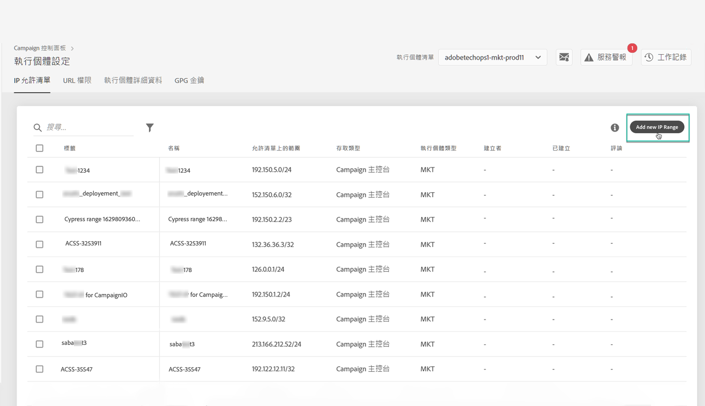

# IP白名單 {#ip-whitelisting}

>[!CAUTION]
>
>此功能僅適用於Campaign Classic例項。

## 關於IP白名單 {#about-ip-whitelisting}

依預設，您的Adobe Campaign Classic例項無法從各種IP位址存取。

如果您的IP位址未列入白名單，您將無法從此位址登入執行個體。 同樣地，如果IP位址未明確列在例項的白名單中，您可能無法將API連線至您的訊息中心或行銷例項。

「控制面板」可讓您將IP位址範圍加入白名單，以設定與例項的新連線。 若要這麼做，請依照下列步驟進行。

一旦將IP位址列入白名單，您就可以建立Campaign運算子並將其連結至這些運算子，讓使用者可以存取該例項。

## 最佳實務 {#best-practices}

在「控制面板」中將IP位址加入白名單時，請務必遵循下列建議和限制。

* **如果您不想要將IP位址連線至您的RT伺服器或AEM安全區，請勿啟用對所有「存取類型」的IP存取。**
* **如果您暫時啟用了對實例的IP地址訪問**，請確保在不再需要連接到實例時從白名單的IP地址中刪除IP地址。
* **我們不建議將公共場所** （機場、酒店等）的IP位址列入白名單。 請隨時使用您的公司VPN地址來確保實例的安全。

## 實例訪問的白名單IP地址 {#whistelisting-ip-addresses}

要將IP地址列入白名單，請執行以下步驟：

1. 開啟以 **[!UICONTROL Instances Settings card]** 存取IP白名單標籤，然後按一下 **[!UICONTROL Add new IP Range]**。

   >[!NOTE]
   >
   >如果「控制面板」的首頁上未顯示「例項設定」卡片，表示您的IMS組織ID與任何Adobe Campaign Classic例項不相關聯

   

1. 如下所述，填寫您要列入白名單的IP範圍資訊。

   

   * **[!UICONTROL Instance(s)]**:IP位址可連接的例項。 可同時操控多個實例。 例如，IP白名單可透過相同步驟同時執行於生產與階段例項。
   * **[!UICONTROL IP Range]**:您要以CIDR格式將IP範圍列入白名單。 請注意，IP範圍不能與現有白名單範圍重疊。 在這種情況下，請先刪除包含重疊IP的範圍。
   >[!NOTE]
   >
   >CIDR（無類域間路由）是使用控制面板介面添加IP範圍時支援的格式。 語法由IP位址、後接'/'字元和十進位數字組成。 本文對其格式及語法作了 [詳細說明](https://whatismyipaddress.com/cidr)。
   >
   >您可以在Internet上搜索免費的聯機工具，這些工具將幫助您將現有的IP範圍轉換為CIDR格式。

   * **!UICONTROL Label]**:將顯示在白名單IP位址清單中的標籤。
   * **[!UICONTROL Name]**:此名稱對於「存取類型」、「例項」（對於「外部API連線」）和IP位址必須是唯一的。

1. 指定要授予IP位址的存取類型：

   * **[!UICONTROL Campaign Console Access]**:IP位址可以連線至Campaign Classic Console。 請注意，僅針對行銷例項啟用主控台存取。 不允許存取MID和RT例項，因此未啟用。
   * **[!UICONTROL AEM connection]**:指定的AEM IP位址將可以連線至Marketing例項。
   * **[!UICONTROL External API connection]**:具有指定IP位址的外部API可以連線至行銷和／或訊息中心(RT)例項。 請注意，未啟用與RT實例控制台的連接。
   

1. Click the **[!UICONTROL Save]** button. 「IP範圍」會新增至白名單的IP位址清單。

   

若要刪除白名單的IP範圍，請選取範圍，然後按一下 **[!UICONTROL Delete IP range]** 按鈕。

**相關主題：**
* [IP白名單（教學課程影片）](https://docs.adobe.com/content/help/en/campaign-learn/campaign-classic-tutorials/administrating/control-panel-acc/ip-whitelisting.html)
* [將安全區連結到操作員](https://docs.campaign.adobe.com/doc/AC/en/INS_Additional_configurations_Configuring_Campaign_server.html#Linking_a_security_zone_to_an_operator)
