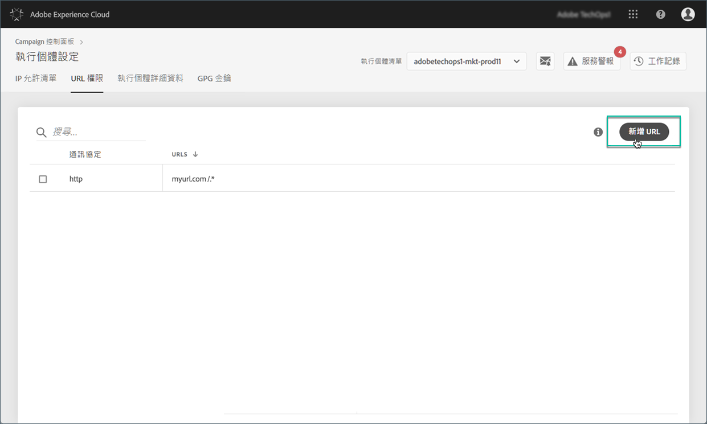
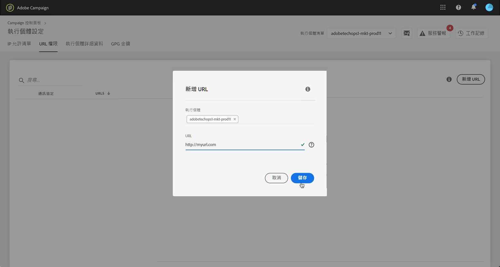
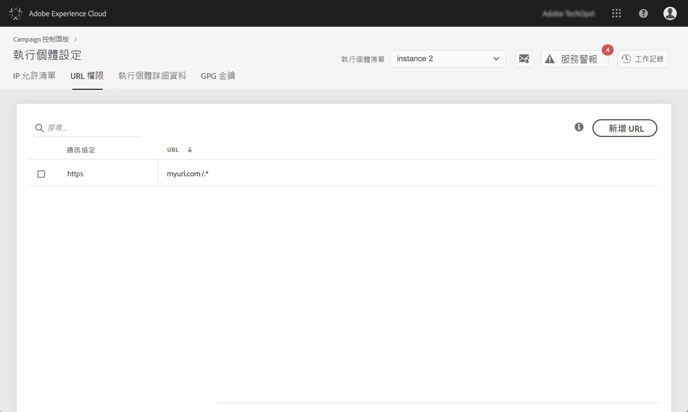

# URL 權限 {#url-permissions}

>[!CONTEXTUALHELP]
>id="cp_instancesettings_urlpermissions"
>title="關於 URL 權限"
>abstract="管理您的 Adobe Campaign 執行個體可連至的 URL。"
>additional-url="https://images-tv.adobe.com/mpcv3/91206a19-d9af-4b6a-8197-0d2810a78941_1563488165.1920x1080at3000_h264.mp4" text="觀看示範影片"

## 關於 URL 權限 {#about-url-permissions}

>[!IMPORTANT]
>
>此功能僅適用於8850組建版本的Campaign v7/v8執行個體。 如果您使用舊版組建，則需進行升級，才能使用此功能。

可由您的 Campaign Classic 執行個體的 JavaScript 程式碼 (工作流程等等) 呼叫之預設 URL 清單限制。 這些是可讓您的執行個體正常運作的 URL。

依預設，執行個體不得連線到外部 URL。「控制面板」可讓您將一些外部 URL 新增至授權 URL 清單，以便您的執行個體可以連結到這些 URL。這可讓您將 Campaign 執行個體連結到外部系統，例如 SFTP 伺服器或網站，以啟用檔案和/或資料傳輸。

新增 URL 後，執行個體的設定檔案 (serverConf.xml) 便會參照該 URL。

 [在影片中探索此功能](https://experienceleague.adobe.com/docs/campaign-classic-learn/control-panel/instance-settings/adding-url-permissions.html#instance-settings)

**相關主題：**

* [設定 Campaign 伺服器](https://experienceleague.adobe.com/docs/campaign-classic/using/installing-campaign-classic/additional-configurations/configuring-campaign-server.html)
* [傳出連線的保護](https://experienceleague.adobe.com/docs/campaign-classic/using/installing-campaign-classic/security-privacy/server-configuration.html#outgoing-connection-protection)

## 最佳實務 {#best-practices}

* 請勿將您的 Campaign 執行個體連結到您不想連結的網站/伺服器。
* 刪除您不再使用的 URL。不過請注意，如果您公司的其他區域仍然連線到您刪除的 URL，則沒有人能再使用它。
* 「控制面板」支援 **http**、**https** 和 **sftp** 通訊協定。輸入無效的 URL 或通訊協定將會導致錯誤。

## 管理 URL 權限 {#managing-url-permissions}

>[!CONTEXTUALHELP]
>id="cp_instancesettings_url_add"
>title="URL 定義"
>abstract="新增 URL 以允許連線至您的 Campaign 執行個體。"

若要新增您執行個體可連線的 URL，請執行下列步驟：

1. 開啟 **[!UICONTROL Instances Settings]** 卡片以存取 **[!UICONTROL URL Permissions]** 索引標籤。

   >[!NOTE]
   >
   >如果「控制面板」首頁上未顯示「執行個體設定」卡片，這表示您的 [組織ID](https://experienceleague.adobe.com/docs/core-services/interface/administration/organizations.html?lang=zh-Hant) 未與任何Adobe Campaign例項關聯
   >
   ><b>URL 權限</b> 索引標籤會列出您執行個體可連線的所有外部 URL。此清單不包含 Campaign 運作所需的 URL (例如基礎架構元件之間的連線)。

1. 在左側窗格中選取想要的執行個體，然後按一下 **[!UICONTROL Add new URL]** 按鈕。

   

   >[!NOTE]
   >
   >所有 Campaign 執行個體都會顯示在左側窗格清單中。
   >
   >由於「URL權限」管理專用於Campaign v7/v8執行個體，如果您選取Campaign Standard執行個體，則會顯示「不適用執行個體」訊息。

1. 輸入要授權的 URL 及其相關關的通訊協定 (http、https 或 sftp)。

   >[!NOTE]
   >
   >您可授權多個執行個體以連線至 URL。若要這麼做，只要輸入執行個體的第一個字母，即可直接從「執行個體」欄位中新增。

   

1. URL 會新增至清單，您現在便可以連線至該 URL。

   >[!NOTE]
   >
   >「/.*」字元經過驗證後，就會自動新增到您輸入的 URL 結尾中，以覆蓋輸入頁面的所有子頁面。

   

您隨時可以選取 URL 並按一下 **[!UICONTROL Delete URL]**&#x200B;按鈕以刪除該 URL。

請注意，如果您刪除 URL，您的執行個體就無法再呼叫它。

## 常見問題 {#common-questions}

**我新增了新的 URL，但我執行個體仍然無法連線至該 URL。為什麼？**

在某些情況下，您嘗試連結的 URL 需要列入清單、輸入密碼或其他驗證形式。「控制面板」不會管理其他驗證。
