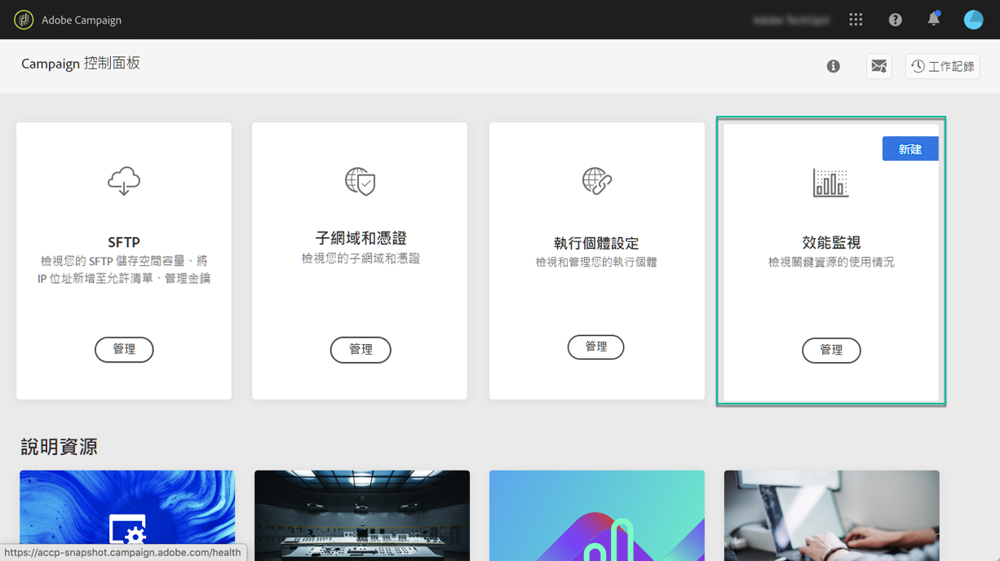

# 關於效能監視 {#about-performance-monitoring}

「控制面板」提供多項功能，可協助您監控執行個體並確保最佳效能。

「控 **[!UICONTROL Performance monitoring]** 制面板」首頁中的資訊卡可讓您監控促銷活動例項的使用情形，例如其資料庫容量。 如需詳細資訊，請參閱[本章節](../../performance-monitoring/using/database-monitoring.md)。

>[!NOTE]
>
>隨著控制面板即將推出，此卡將提供其他監控功能。

此外，「控制面板」可讓您註冊，以在每次在其中一個促銷活動例項偵測到問題時接收電子郵件通知。 如需詳細資訊，請參閱[本章節](../../performance-monitoring/using/email-alerting.md)。

 使用 [Campaign Classic或](https://experienceleague.adobe.com/docs/campaign-classic-learn/control-panel/performance-monitoring/monitoring-databases.html?lang=en#performance-monitoring) Campaign Standard在視訊中探索此 [功能](https://experienceleague.adobe.com/docs/campaign-standard-learn/control-panel/performance-monitoring/monitoring-databases.html?lang=en#performance-monitoring)
