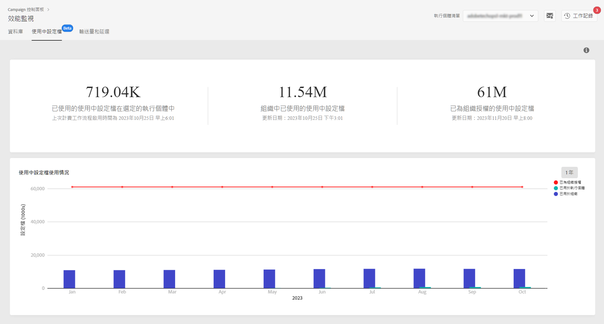

# 作用中設定檔監控{#active-profiles-monitoring}

## 關於作用中設定檔 {#about-active-profiles}

>[!IMPORTANT]
>
>從「控制面板」進行作用中設定檔監控的功能會在測試版提供，且可能會不時更新和修改，恕不另行通知。
>
>此功能適用於 AWS 代管的客戶，這些客戶來自 Campaign Standard 10368 組建及 Campaign Classic 8931 組建。如果您使用舊版組建，則需進行升級，才能使用此功能。

根據您的合約，您的每個 Campaign 執行個體都已佈建特定數量的作用中設定檔，而且會計算這些設定檔數量以結算費用。請參閱您的最新合約，以參考已購買作用中設定檔數目。

「設定檔」是指一筆代表終端客戶或潛在客戶之資訊的記錄 (例如：nmsRecipient 表格或外部表格中的記錄，包含 cookie 識別碼、客戶識別碼、行動識別碼或特定通路相關的其他資訊)。

如果設定檔在過去 12 個月期間，曾經透過任何通道而被設為目標或進行通訊，請將此類設定檔視為「作用中」。

>[!NOTE]
>
>Facebook 和 Twitter 通路不包含在內。

如需作用中設定檔的詳細資訊，請參閱 [Campaign Standard](https://docs.adobe.com/content/help/zh-Hant/campaign-standard/using/profiles-and-audiences/managing-profiles/active-profiles.html) 和 [Campaign Classic](https://docs.adobe.com/content/help/zh-Hant/campaign-classic/using/getting-started/profile-management/about-profiles.html#active-profiles) 文件。

## 監視作用中設定檔 {#monitoring-active-profiles}

「控制面板」可讓您監控每個 Campaign 執行個體的作用中設定檔使用量。

要執行此操作，請依照下列步驟執行：

1. 開啟 **[!UICONTROL Performance Monitoring]** 卡片，然後選取 **[!UICONTROL Active Profiles]** 索引標籤。

1. 從 **[!UICONTROL Instance List]** 中選擇所需的執行個體。

1. 此時會顯示執行個體使用的作用中設定檔數目，也會顯示上次在執行個體上執行計費工作流程的時間。

>[!NOTE]
>
>會依據每天在執行個體上執行的專屬技術工作流程，來計算作用中設定檔。
>
>* Campaign Standard的[「計費」](https://docs.adobe.com/help/zh-Hant/campaign-standard/using/administrating/application-settings/technical-workflows.html)工作流程、
>* Campaign Classic 的[「作用中計費設定檔數目」](https://experienceleague.adobe.com/docs/campaign-classic/using/automating-with-workflows/advanced-management/about-technical-workflows.html)工作流程。

下方區域以圖形化表示過去 30 天的作用中設定檔使用量。您可以使用右上方的可用篩選器，將顯示的時段變更為 1 年。

將滑鼠指標暫留在其中一個圖形列上，這可讓您取得所選時段使用之作用中設定檔的確切數目。
