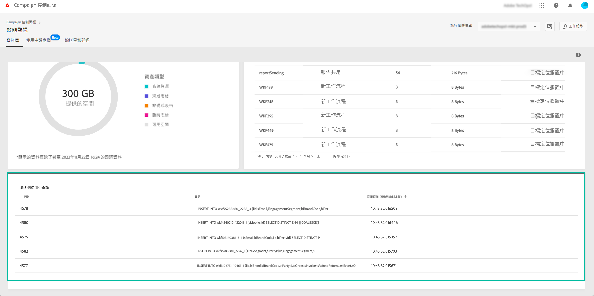

# 監視使用中查詢 {#long-running-queries}

 標籤的&#x200B;**[!UICONTROL Databases]**&#x200B;區域&#x200B;**[!UICONTROL Active queries]**&#x200B;列出在選定執行個體上執行時間最長的五個查詢。

**[!UICONTROL Duration]** 欄指定在執行個體上執行查詢的時間。 持續時間以此格式顯示：`hh:mm:ss.ms`。

>[!IMPORTANT]
>
>如果其中一個查詢已執行超過 24 小時，請聯絡客戶服務，以便他們確定問題並加以解決。 您需要提供 **[!UICONTROL PID]** 欄值，這是查詢的唯一識別碼。
