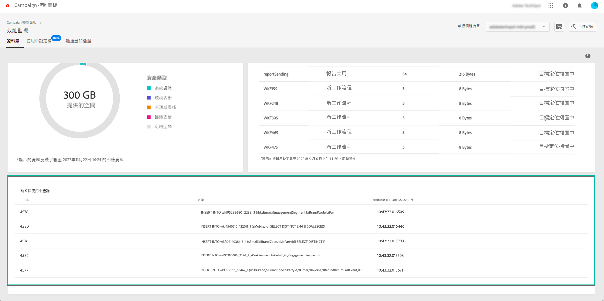

# 監視使用中查詢 {#long-running-queries}

**[!UICONTROL 資料庫]**&#x200B;標籤的&#x200B;**[!UICONTROL 作用中查詢]**&#x200B;區域列出在選定執行個體上執行時間最長的五個查詢。

**[!UICONTROL 期間]**&#x200B;欄表明在執行個體上執行查詢的時間。 持續時間以此格式顯示：`hh:mm:ss.ms`。

>[!IMPORTANT]
>
>如果其中一個查詢已執行超過 24 小時，請聯絡客戶服務，以便他們確定問題並加以解決。 您需要為其提供 **[!UICONTROL PID]** 欄值，這是查詢的唯一識別碼。
