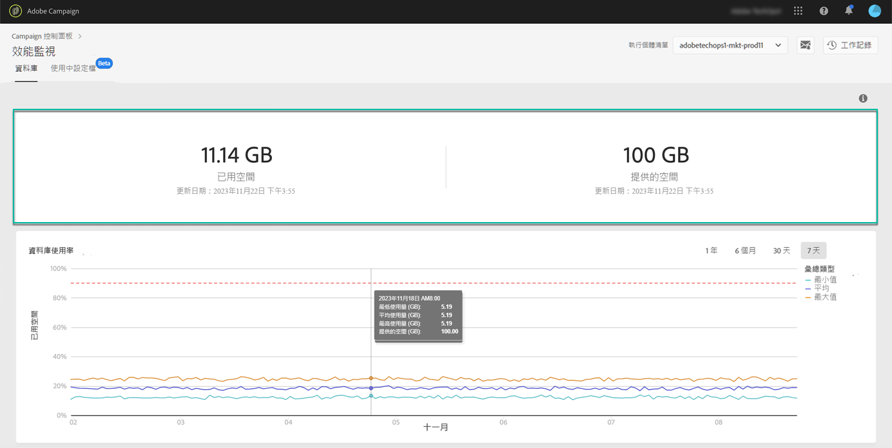
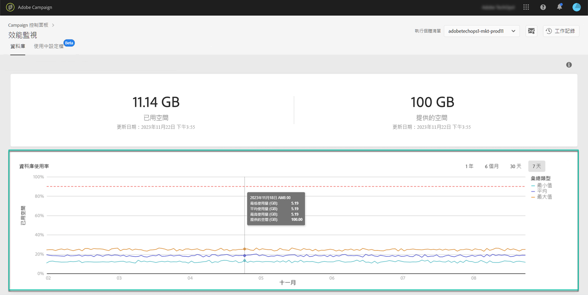
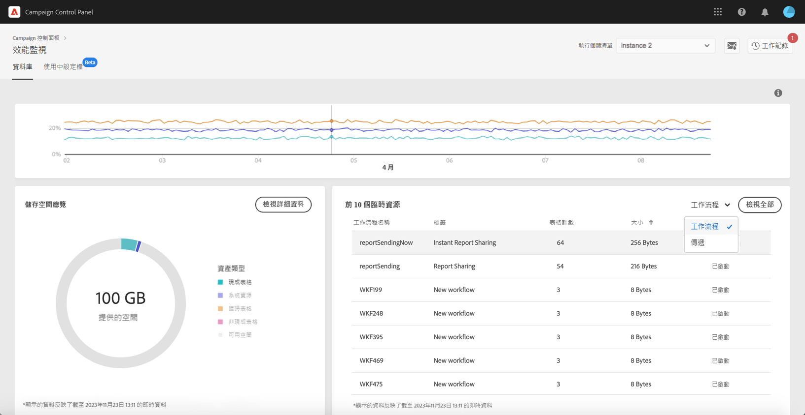
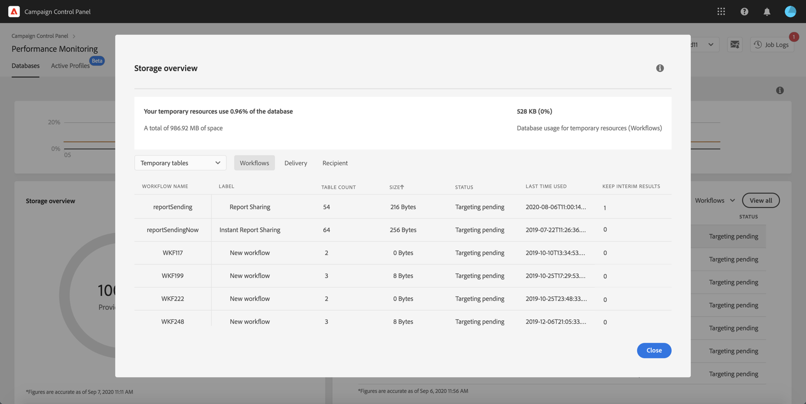

# 資料庫監視 {#database-monitoring}

## 關於執行個體資料庫{#about-instances-databases}

根據您的合約，您的每個 Campaign 執行個體都會以特定數量的資料庫空間佈建。

資料庫包含所有儲存在 Adobe Campaign 的&#x200B;**資產**、**工作流程**&#x200B;及&#x200B;**資料**。

隨著時間過去，資料庫可能會達到最大容量限制，特別是永遠不從執行個體中刪除儲存資源，或是有許多工作流程處於暫停狀態。

執行個體資料庫溢出可能會導致幾個問題 (無法登入、傳送電子郵件等)。因此，監視執行個體的資料庫是確保最佳效能的關鍵。

>[!NOTE]
>
>如果控制面板中所顯示提供的資料庫空間量未反映合約的指定數量，請聯絡客戶服務。

## 監視資料庫使用情況{#monitoring-instances-database}

利用 [Campaign Classic](https://experienceleague.adobe.com/docs/campaign-classic-learn/control-panel/performance-monitoring/monitoring-databases.html?lang=zh-Hant#performance-monitoring) 或 [Campaign Standard](https://experienceleague.adobe.com/docs/campaign-standard-learn/control-panel/performance-monitoring/monitoring-databases.html?lang=zh-Hant#performance-monitoring) 在影片中瞭解此功能

控制面板允許您監視每個 Campaign 執行個體的資料庫使用情況。若要這麼做，請開啟 **[!UICONTROL Performance Monitoring]** 卡片，然後選取 **[!UICONTROL Databases]** 標籤。

從 **[!UICONTROL Instance List]** 中選擇所需的執行個體，以顯示有關執行個體的資料庫容量和已用空間的資訊。

>[!NOTE]
>
>請注意，此儀表板的資料會根據在您的 Campaign 執行個體上執行的 **[!UICONTROL Database cleanup technical workflow]** 更新 (請參閱 [Campaign Standard](https://docs.adobe.com/help/zh-Hant/campaign-standard/using/administrating/application-settings/technical-workflows.html#list-of-technical-workflows) 和 [Campaign Classic](https://docs.adobe.com/help/zh-Hant/campaign-classic/using/monitoring-campaign-classic/data-processing/database-cleanup-workflow.html) 文件)。
>
>傳統上您可以確認，當其中一個資料庫到達其 c 值時，即上次工作流程執行在 **[!UICONTROL Used Space]** 和 **[!UICONTROL Provided Space]** 的度量之下，您會收到通知。請注意，如果工作流程在 3 天後仍未執行，我們建議您與 Adobe 客戶服務聯絡，以便他們調查工作流程未執行的原因。

此儀表板提供其他度量，說明如下，以協助您分析執行個體資料庫的使用狀況。

### 資料庫使用{#database-utilization}

**[!UICONTROL Database utilization]** 區域以圖形呈現過去 7 天內最小、平均和最大資料庫使用率，以紅色虛線表示的 90% 資料庫使用率臨界值。

若要變更時間週期，請使用圖表右上角可用的篩選條件。

為了提高閱讀方便性，您也可以在圖形中強調一條或多條曲線。若要這麼做，請從 **[!UICONTROL Aggregation Type]** 圖例選取。

如需特定期間的詳細資訊，請將滑鼠游標暫留在圖表上，以顯示有關目前資料庫使用狀況的資訊。

### 儲存空間概覽{#storage-overview}

**[!UICONTROL Storage overview]** 區域以圖形呈現以下項目佔用的空間：

* **[!UICONTROL System resources]**

   請注意，如果系統資源耗用大部分的資料庫空間，我們建議您聯絡客戶服務。

* 您的 Campaign 執行個體預設提供的 **[!UICONTROL Out-of-the-box tables]**、
* 由工作流程和傳遞內容建立的 **[!UICONTROL Temporary tables]**、
* 在建立自訂資源後產生的 **[!UICONTROL Non-out of the box tables]**。

按一下 **[!UICONTROL View details]** 按鈕，以針對消耗資料庫空間的不同資產獲取更多詳細資訊。

使用篩選器可縮小搜尋範圍並顯示特定資產類型的表格。

### 前 10 項臨時資源{#top-10}

**[!UICONTROL Top 10 temporary resources]** 區域列出了工作流程及傳遞內容所消耗的 10 大臨時資源。

監視資料庫的關鍵步驟，就是針對建立大型臨時資源的工作流程和傳遞進行監視。若有任何臨時資源消耗過多資料庫空間，請確定有必要保留此工作流程或傳遞，最終再導向您的執行個體以停止。

>[!IMPORTANT]
>
>一般建議避免在非開箱即用資源中使用&#x200B;**超過 40 個欄位**。

>[!NOTE]
>
>若發現工作流程有大量表格數或龐大的資料庫規模，建議您檢視工作流程，以調查工作流程中為何會產生如此大量的資料。
>
>此頁面的最後亦提供 Campaign Standard 及 Classic 資源，協助您防止資料庫超載。

**[!UICONTROL View all]** 按鈕讓您能存取這些臨時資源的詳細資訊。

>[!NOTE]
>
>**[!UICONTROL Keep interim results]** 欄中的值表示選項在 Campaign 中為啟用 (&quot;1&quot;) 或停用 (&quot;0&quot;)。 可在工作流程的屬性中存取 **[!UICONTROL Keep interim results]** 選項。 它讓您可在工作流程各種活動之間儲存轉換的結果 (請參見[Campaign Standard](https://docs.adobe.com/content/help/zh-Hant/campaign-standard/using/managing-processes-and-data/executing-a-workflow/managing-execution-options.html) 和 [Campaign Classic](https://docs.adobe.com/content/help/zh-Hant/campaign-classic/using/automating-with-workflows/general-operation/workflow-best-practices.html#logs) 文件)。
>
>如果您其中一個工作流程已啟用此選項，則資料庫清理工作流程將無法回收臨時結果所消耗的空間。因此，我們建議您檢視工作流程，以檢查是否可以關閉該選項。

## 防止資料庫超過負荷{#preventing-database-overload}

Campaign Standard 和 Classic 提供多種方法來防止過度消耗資料庫磁碟空間。

下節提供 Campaign 文件中的實用資源，以協助您最佳化資料庫的使用：

**工作流程監視**

* [工作流程最佳實務](https://docs.adobe.com/content/help/zh-Hant/campaign-standard/using/managing-processes-and-data/workflow-general-operation/best-practices-workflows.html) (Campaign Standard)
* [監視工作流程的執行](https://docs.adobe.com/help/zh-Hant/campaign-classic/using/automating-with-workflows/monitoring-workflows/monitoring-workflow-execution.html) (Campaign Classic)

**維護資料庫**

* 清理資料庫的技術工作流程 ([Campaign Standard](https://docs.adobe.com/help/zh-Hant/campaign-standard/using/administrating/application-settings/technical-workflows.html#list-of-technical-workflows) / [Campaign Classic](https://docs.adobe.com/help/zh-Hant/campaign-classic/using/monitoring-campaign-classic/data-processing/database-cleanup-workflow.html))
* [資料庫維護指南](https://docs.adobe.com/content/help/zh-Hant/campaign-classic/using/monitoring-campaign-classic/database-maintenance/recommendations.html) (Campaign Classic)
* [針對資料庫效能進行疑難排解](https://experienceleague.adobe.com/docs/campaign-classic/using/monitoring-campaign-classic/troubleshooting-toc/database-issues-toc/database-performances.html?lang=zh-Hant) (Campaign Classic)
* [資料庫的相關選項](https://docs.adobe.com/help/zh-Hant/campaign-classic/using/installing-campaign-classic/appendices/configuring-campaign-options.html#database) (Campaign Classic)
* 資料保留 ([Campaign Standard](https://docs.adobe.com/help/zh-Hant/campaign-standard/using/administrating/application-settings/data-retention.html) / [Campaign Classic](https://docs.adobe.com/help/zh-Hant/campaign-classic/using/configuring-campaign-classic/data-model/data-model-best-practices.html#data-retention))

>[!NOTE]
>
>此外，您可以在其中一個資料庫鄰近最大容量時收到通知。若要這麼做，請訂閱[電子郵件通知](../../performance-monitoring/using/email-alerting.md)。
