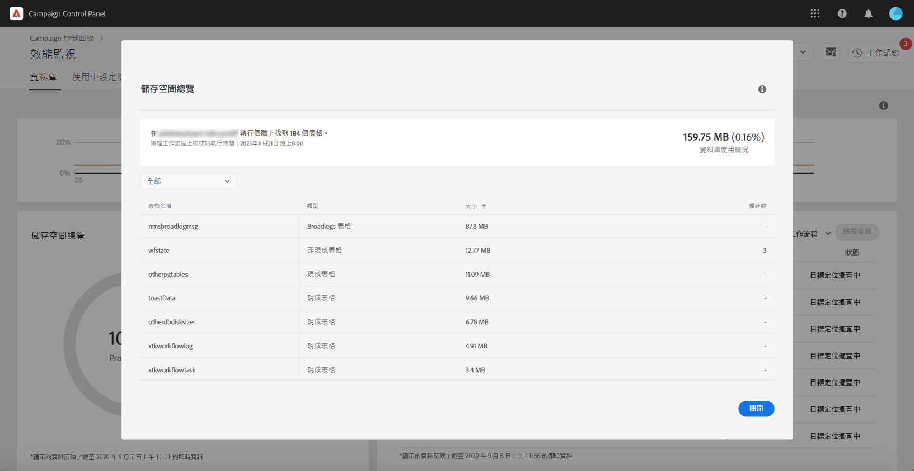

# 資料庫監視 {#database-monitoring}

## 關於實例資料庫{#about-instances-databases}

根據您的合約，您的每個促銷活動例項都會布建特定數量的資料庫空間。

資料庫包含儲存在Adobe Campaign的所有&#x200B;**資產**、**工作流程**&#x200B;和&#x200B;**資料**。

隨著時間的推移，資料庫可以達到其最大容量，特別是如果儲存的資源從未從實例中刪除，或者如果有許多工作流處於暫停狀態。

溢出實例資料庫可能會導致幾個問題（無法登錄、無法發送電子郵件等）。 因此，監控實例的資料庫是確保最佳效能的關鍵。

>[!NOTE]
>
>如果「控制面板」中顯示的提供資料庫空間量未反映合約中指定的數量，請聯絡客戶服務。

## 監視資料庫使用{#monitoring-instances-database}

 使用促銷活動類別Campaign Standard在視訊中 [探索](https://experienceleague.adobe.com/docs/campaign-classic-learn/control-panel/performance-monitoring/monitoring-databases.html?lang=en#performance-monitoring) 此功 [能](https://experienceleague.adobe.com/docs/campaign-standard-learn/control-panel/performance-monitoring/monitoring-databases.html?lang=en#performance-monitoring)

「控制面板」可讓您監控每個促銷活動例項的資料庫使用情形。 若要這麼做，請開啟&#x200B;**[!UICONTROL Performance Monitoring]**&#x200B;卡片，然後選取&#x200B;**[!UICONTROL Databases]**&#x200B;標籤。

從&#x200B;**[!UICONTROL Instance List]**&#x200B;中選擇所需的實例，以顯示有關實例的資料庫容量和已用空間的資訊。

>[!NOTE]
>
>請注意，此控制面板的資料會根據在您的促銷活動例項上執行的&#x200B;**[!UICONTROL Database cleanup technical workflow]**&#x200B;更新(請參閱[Campaign Standard](https://docs.adobe.com/help/en/campaign-standard/using/administrating/application-settings/technical-workflows.html#list-of-technical-workflows)和[Campaign Classic](https://docs.adobe.com/help/en/campaign-classic/using/monitoring-campaign-classic/data-processing/database-cleanup-workflow.html)檔案)。
>
>您可以選擇性地檢查，當您的其中一個資料庫上次在&#x200B;**[!UICONTROL Used Space]**&#x200B;和&#x200B;**[!UICONTROL Provided Space]**&#x200B;量度下執行工作流程時，就會收到通知。 請注意，如果工作流程自3天以來尚未執行，我們建議聯絡Adobe客戶服務，以便他們調查工作流程未執行的原因。

此控制面板中提供下述的其他度量，可協助您分析例項資料庫的使用情形。

### 資料庫利用率{#database-utilization}

**[!UICONTROL Database utilization]**&#x200B;區域以圖形方式表示過去7天內最低、平均和最大資料庫利用率，以及由紅色虛曲線表示的90%資料庫利用率閾值。

若要變更時段，請使用圖形右上角的可用篩選器。

為了提高可讀性，您也可以在圖形中加亮一或多條曲線。 若要這麼做，請從&#x200B;**[!UICONTROL Aggregation Type]**&#x200B;圖例中選取它們。

有關特定時段的詳細資訊，請將滑鼠指標暫留在圖形上，以顯示目前使用的資料庫資訊。

### 儲存概述{#storage-overview}

**[!UICONTROL Storage overview]**&#x200B;區域提供由以下項目佔用的空間的圖形表示：

* **[!UICONTROL System resources]**

   請注意，如果系統資源佔用了大部分的資料庫空間，我們建議聯絡客戶服務。

* **[!UICONTROL Out-of-the-box tables]** 預設提供您的促銷活動例項，
* **[!UICONTROL Temporary tables]** 由工作流程和傳送建立，
* **[!UICONTROL Non-out of the box tables]** 在建立自訂資源後產生。

按一下&#x200B;**[!UICONTROL View details]**&#x200B;按鈕，以獲取有關佔用資料庫空間的不同資產的詳細資訊。

使用篩選器僅從特定資產類型調整搜尋和顯示表格。

### 前10名臨時資源{#top-10}

**[!UICONTROL Top 10 temporary resources]**&#x200B;區域列出了工作流程和傳送所產生的10大臨時資源。

監控正在建立大量臨時資源的工作流程和傳送是監控資料庫的關鍵步驟。 如果有任何臨時資源佔用了太多的資料庫空間，請確定需要有此工作流或交付，並最終導航到實例以停止它。

>[!IMPORTANT]
>
>一般建議是避免在非現成資源中有&#x200B;**超過40欄**。

>[!NOTE]
>
>如果發現工作流有大量的表計數或資料庫大小，我們建議複查該工作流，以調查它為何生成如此多的資料。
>
>本頁末尾還提供Campaign Standard和傳統資源，以幫助您防止資料庫過載。

**[!UICONTROL View all]**&#x200B;按鈕允許您訪問這些臨時資源的詳細資訊。

>[!NOTE]
>
>**[!UICONTROL Keep interim results]**&#x200B;欄中的值會指出促銷活動中是啟用(&quot;1&quot;)或停用(&quot;0&quot;)選項。 **[!UICONTROL Keep interim results]**&#x200B;選項可在工作流的屬性中訪問。 它允許您保存工作流中各種活動之間的轉換結果(請參見[Campaign Standard](https://docs.adobe.com/content/help/en/campaign-standard/using/managing-processes-and-data/executing-a-workflow/managing-execution-options.html)和[Campaign Classic](https://docs.adobe.com/content/help/en/campaign-classic/using/automating-with-workflows/general-operation/workflow-best-practices.html#logs)文檔)。
>
>如果為其中一個工作流啟用了該選項，則資料庫清理工作流將無法回收臨時結果佔用的空間。 因此，我們建議檢閱工作流程，以檢查選項是否可關閉。

## 防止資料庫過載{#preventing-database-overload}

Campaign Standard和Classic提供多種方法來防止資料庫磁碟空間過度耗用。

下節提供Campaign檔案的有用資源，以協助您最佳化資料庫的使用：

**工作流程監控**

* [工作流程最佳實務](https://docs.adobe.com/content/help/en/campaign-standard/using/managing-processes-and-data/workflow-general-operation/best-practices-workflows.html) (Campaign Standard)
* [監控工作流執行](https://docs.adobe.com/help/en/campaign-classic/using/automating-with-workflows/monitoring-workflows/monitoring-workflow-execution.html) (Campaign Classic)

**資料庫維護**

* 資料庫清理技術工作流程([Campaign Standard](https://docs.adobe.com/help/en/campaign-standard/using/administrating/application-settings/technical-workflows.html#list-of-technical-workflows) / [Campaign Classic](https://docs.adobe.com/help/en/campaign-classic/using/monitoring-campaign-classic/data-processing/database-cleanup-workflow.html))
* [資料庫維護指南](https://docs.adobe.com/content/help/en/campaign-classic/using/monitoring-campaign-classic/database-maintenance/recommendations.html) (Campaign Classic)
* [資料庫效能故障排除](https://experienceleague.adobe.com/docs/campaign-classic/using/monitoring-campaign-classic/troubleshooting-toc/database-issues-toc/database-performances.html) (Campaign Classic)
* [與資料庫相關的選項](https://docs.adobe.com/help/en/campaign-classic/using/installing-campaign-classic/appendices/configuring-campaign-options.html#database) (Campaign Classic)
* 資料保留([Campaign Standard](https://docs.adobe.com/help/en/campaign-standard/using/administrating/application-settings/data-retention.html) / [Campaign Classic](https://docs.adobe.com/help/en/campaign-classic/using/configuring-campaign-classic/data-model/data-model-best-practices.html#data-retention))

>[!NOTE]
>
>此外，當您的其中一個資料庫達到其容量時，您可以收到通知。 若要這麼做，請訂閱[電子郵件警報](../../performance-monitoring/using/email-alerting.md)。
