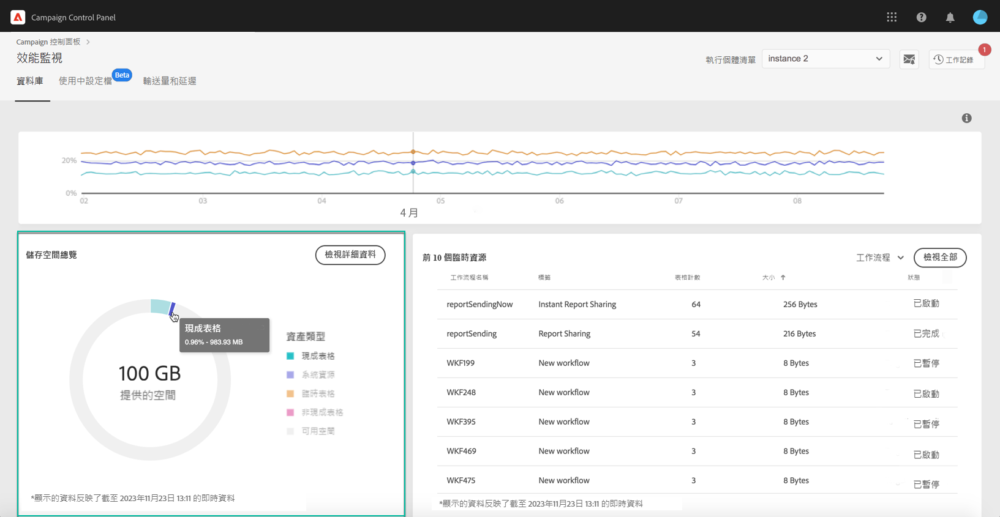
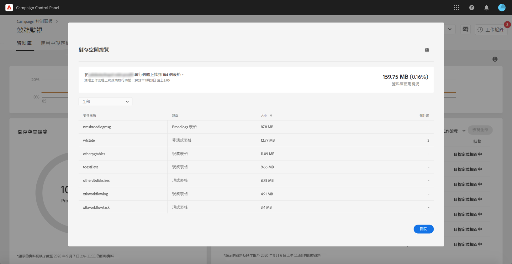
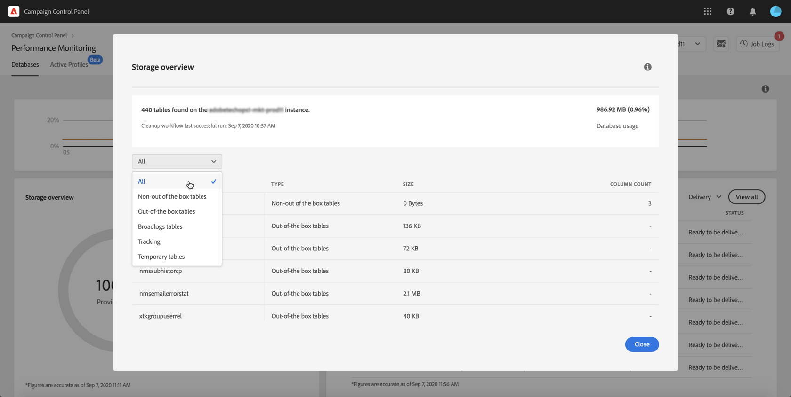

# 儲存空間概覽 {#storage-overview}

>[!CONTEXTUALHELP]
>id="cp_dbdetails_storagedetails"
>title="關於儲存概述"
>abstract="在此索引標籤中，您可以取得佔用資料庫空間的不同 Campaign 資源的詳細資訊。"

**[!UICONTROL Storage overview]** 區域以圖形呈現以下項目佔用的空間：

* **[!UICONTROL System resources]**

   請注意，如果系統資源耗用大部分的資料庫空間，我們建議您聯絡客戶服務。

* 您的 Campaign 執行個體預設提供的 **[!UICONTROL Out-of-the-box tables]**、
* 由工作流程和傳遞內容建立的 **[!UICONTROL Temporary tables]**、
* 在建立自訂資源後產生的 **[!UICONTROL Non-out of the box tables]**。

按一下 **[!UICONTROL View details]** 按鈕，以針對消耗資料庫空間的不同資產獲取更多詳細資訊。

使用篩選器可縮小搜尋範圍並顯示特定資產類型的表格。

