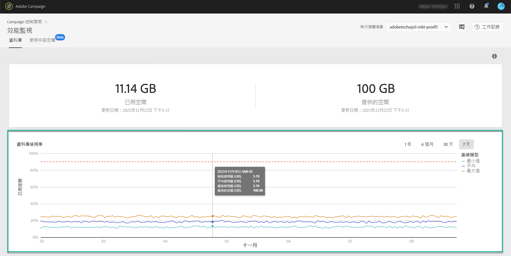

# 資料庫使用 {#database-utilization}

**[!UICONTROL Database utilization]** 區域以圖形呈現過去 7 天內最小、平均和最大資料庫使用率，以紅色虛線表示的 90% 資料庫使用率臨界值。

若要變更時間週期，請使用圖表右上角可用的篩選條件。

為了提高閱讀方便性，您也可以在圖形中強調一條或多條曲線。若要這麼做，請從 **[!UICONTROL Aggregation Type]** 圖例選取。

如需特定期間的詳細資訊，請將滑鼠游標暫留在圖表上，以顯示有關目前資料庫使用狀況的資訊。

