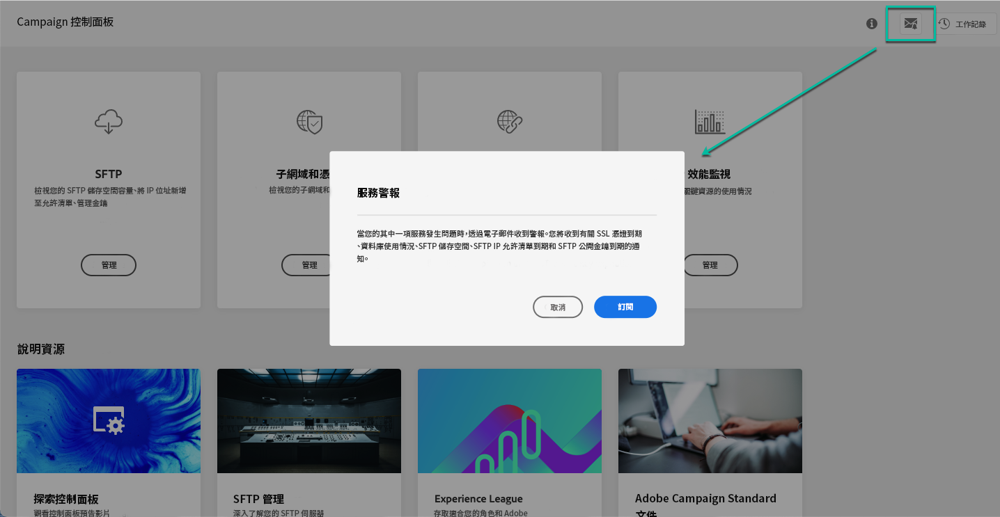

# 電子郵件警報 {#email-alerting}

為了對工作提供更靈活的彈性，「控制面板」具備即時電子郵件警報功能。

## 警報清單 {#list}

警報清單如下：

* **SFTP 儲存空間使用情況**：其中一個 SFTP 伺服器已達其容量的 80% 或以上。請參閱 [SFTP 儲存空間管理](../../sftp/using/sftp-storage-management.md)。

* **資料庫使用情況**：其中一個執行個體的資料庫已達到其容量的 80% 或以上。請參閱[資料庫監視](../../performance-monitoring/using/database-monitoring.md)。

* **SFTP IP 允許清單到期**：您定義的其中一個 IP 範圍已到期，或即將在 10 天內或更短的時間內到期。請參閱 [IP 範圍允許清單](../../sftp/using/ip-range-allow-listing.md)。

* **SFTP 公開金鑰到期**：您定義的其中一個公開金鑰已到期，或即將在 10 天內或更短的時間內到期。 請參閱[金鑰管理](../../sftp/using/key-management.md)。

* **SSL 憑證到期**：您的其中一個子網域的 SSL 憑證已到期，或即將在 30 天內或更短的時間內到期。 請參閱[監視子網域的 SSL 憑證](../../subdomains-certificates/using/monitoring-ssl-certificates.md)。

<!--* **Long running Queries**: A query has been running for more than 24 hours on one of your instances. See [Monitoring active queries](database-active-queries.md).-->

>[!NOTE]
>
>此外，「控制面板」可讓您&#x200B;**設定提醒**，以便在執行個體 (版本和服務審查) 發生事件之前透過電子郵件通知您。
>
>若要這樣做，您必須訂閱電子郵件竟是，並為想要的即將到來事件設定提醒。[了解如何為即將到來的事件設定提醒](../../service-events/service-events.md#reminders)

## 訂閱警報 {#subscribe}

若要訂閱這些警報，請依照下列步驟進行：

1. 按一下於「控制面板」任何位置提供的&#x200B;**[!UICONTROL 警報通知]**&#x200B;按鈕，然後按一下&#x200B;**[!UICONTROL 訂閱]**。

   

1. 隨即會傳送一封電子郵件以確認訂閱。

   

1. 訂閱後，「控制面板」會通知您發生的系統問題並建議要採取的動作。電子郵件警示的傳送對象為，對其身為管理員的&#x200B;**所有執行個體**&#x200B;申請訂閱的每個人員。

   
