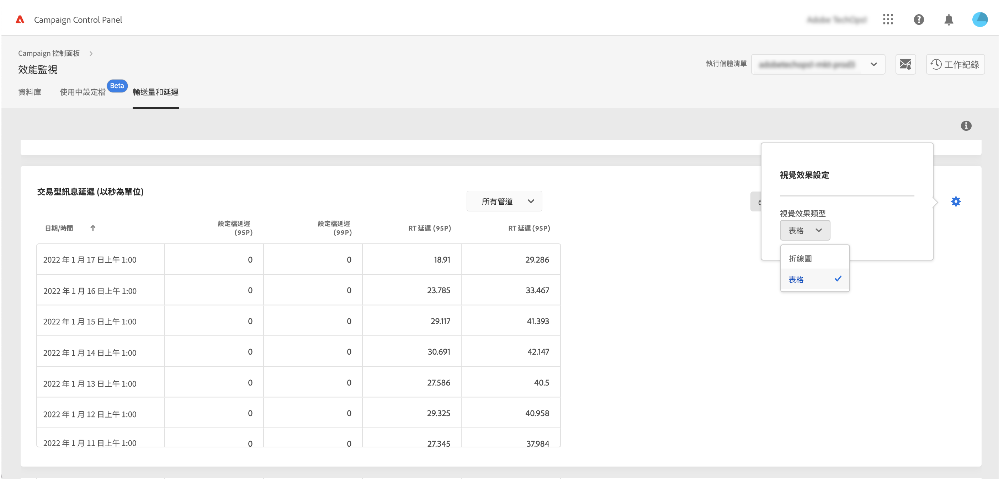

# 輸送量和延時監視 {#throughputs-latency-monitoring}

>[!CONTEXTUALHELP]
>id="cp_performancemonitoring_throughputslatencies"
>title="關於輸送量和延時監視 "
>abstract="在此標籤中，您可以監視執行個體的傳遞輸送量和延時在一段時間內的趨勢。"

監視一段時間內傳遞輸送量和延時趨勢如何是瞭解執行個體使用情況並確保其正常運作的關鍵。

此資訊可在「控制面板」中為中的每個市場活動實例提供 **[!UICONTROL Performance Monitoring]** 卡， **[!UICONTROL Throughputs & Latency]** 頁籤（請注意，顯示這些圖時，「控制面板」可能需要1小時。）

* **[!UICONTROL Throughput]** 區針對您有權存取的所有通訊頻道，提供每小時從選定 Campaign 執行個體傳送的訊息數。

* **[!UICONTROL Latency]** 區針對在傳送即時異動通訊時選定執行個體遇到的延時提供有關資訊。 以 95 和 99 百分位擷取並視覺化延時情況，這代表 95% 和 99% 的請求應比前述延時快。

>[!NOTE]
>
>本區顯示的所有數字皆為近似值，僅供參考。

在預設情況下，顯示當天的資料。 您可以使用 **[!UICONTROL 6 months]**、**[!UICONTROL 30 days]** 和 **[!UICONTROL 7 days]** 按鈕變更顯示的時間段。

您還可以使用可排序列（而不是圖形）以表格格式顯示資訊。 若要執行此操作，請按一下 **[!UICONTROL Visualization settings]** 按鈕，然後選取 **[!UICONTROL Table]**。

