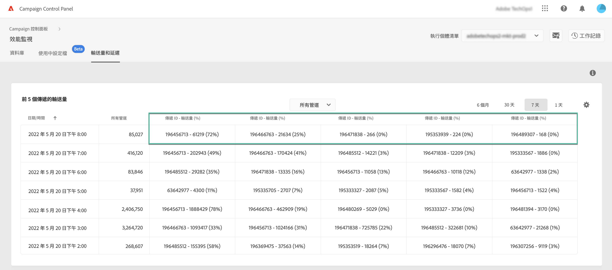

# 輸送量和延時監視 {#throughputs-latency-monitoring}

>[!CONTEXTUALHELP]
>id="cp_performancemonitoring_throughputslatencies"
>title="關於輸送量和延時監視 "
>abstract="在此標籤中，您可以監視執行個體的傳遞輸送量和延時在一段時間內的趨勢。有關影響吞吐量的交貨的資訊，請切換到表格視圖。"

控制面板可讓您監視每個執行個體的傳遞輸送量和延遲。

>[!IMPORTANT]
>
>此功能適用於所有 Campaign Standard 和 v8 客戶，以及版本編號為 9032、9330、9346 或 9349 且已具有[獨立](https://experienceleague.adobe.com/docs/campaign-classic/using/installing-campaign-classic/deployment-types-/standalone-deployment.html?lang=zh-Hant) 部署 (沒有任何中型執行個體) 的 Campaign v7 客戶。

監視一段時間內傳遞輸送量和延時趨勢如何，是瞭解執行個體使用情況並確保其正常運作的關鍵。

此資訊可在「控制面板」中為每個&#x200B;**[!UICONTROL Performance Monitoring]**&#x200B;卡片&#x200B;**[!UICONTROL Throughputs & Latency]**&#x200B;標籤中的 Campaign 執行個體提供 (請注意，「控制面板」可能需要最多 1 小時才能顯示這些圖)。

>[!NOTE]
>
>本區顯示的所有數字皆為近似值，僅供參考。

在預設情況下，顯示當天的資料。 您可以使用 **[!UICONTROL 6 months]**、**[!UICONTROL 30 days]** 和 **[!UICONTROL 7 days]** 按鈕變更顯示的時間段。將提供以下資料：
* 每小時1天7天視圖，
* 每小時6次，視圖為30天，
* 每天6個月。

您還可使用排序 (而非圖形) 以表格格式顯示此資訊。 若要執行此操作，請按一下 **[!UICONTROL Visualization settings]** 按鈕，然後選取 **[!UICONTROL Table]**。

## 監視思路 {#throughput}

**[!UICONTROL Throughput]** 區針對您有權存取的所有通訊頻道，提供每小時從選定 Campaign 執行個體傳送的訊息數目。

>[!NOTE]
>
>Campaig v7/v8 顯示的輸送量編號是從 MID (中間來源) 執行個體獲得的輸送量。對於獨立行銷 (MKT) 部署 (沒有任何 MID 執行個體)，則會顯示 MKT 執行個體的輸送量。

此外，「控制面板」還允許您識別在選定時間段內影響吞吐量的前5個交貨的ID。 此資訊僅在表格視圖中可用：

## 監視延遲 {#latency}

**[!UICONTROL Latency]** 區針對在傳送即時異動通訊時選定執行個體遇到的延時提供有關資訊。 

>[!NOTE]
>
>請注意與 **配置檔案延遲** 也可供 [!DNL Campaign Standard] 僅實例。

以 95 和 99 百分位擷取並視覺化延時情況，這代表 95% 和 99% 的請求應比前述延時快。

預設情況下，顯示所有通道的延遲。 您可以使用下拉清單直觀顯示特定通道的延遲。

>[!NOTE]
>
>渠道過濾僅適用於Campaign Classicv7/v8實例。
