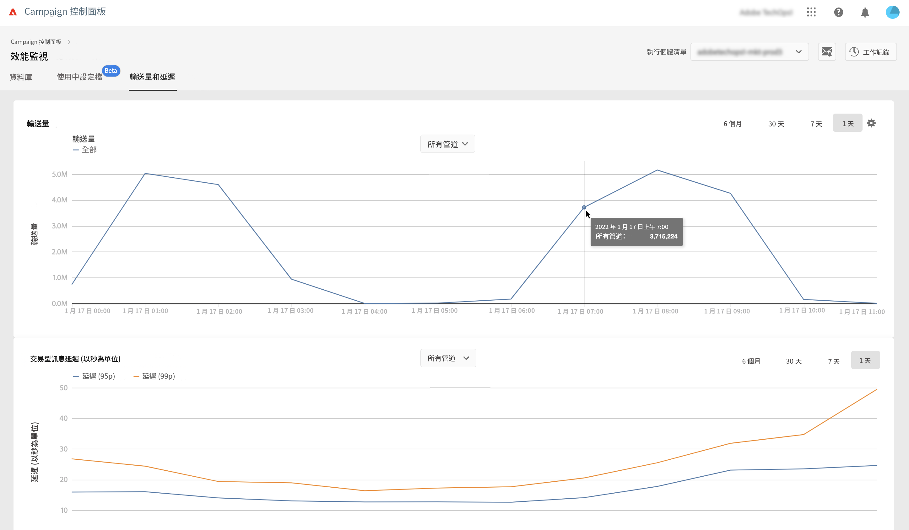

# 輸送量和延時監視 {#throughputs-latency-monitoring}

>[!CONTEXTUALHELP]
>id="cp_performancemonitoring_throughputslatencies"
>title="關於輸送量和延時監視 "
>abstract="在此標籤中，您可以監視執行個體的傳遞輸送量和延時在一段時間內的趨勢。有關影響輸送量的傳遞資訊，請切換到表格檢視。"

控制面板可讓您監視每個執行個體的傳遞輸送量及延遲。

>[!IMPORTANT]
>
>此功能適用於所有 Campaign Standard 和 v8 客戶，以及版本編號為 9032 或以上且具有[獨立部署](https://experienceleague.adobe.com/docs/campaign-classic/using/installing-campaign-classic/deployment-types-/standalone-deployment.html?lang=zh-Hant) (無任何中型執行個體) 的 Campaign v7 客戶。

監視一段時間內傳遞輸送量和延時趨勢如何，是瞭解執行個體使用情況並確保其正常運作的關鍵。

此資訊可在「控制面板」中為每個 Campaign 執行個體提供，具體見於&#x200B;**[!UICONTROL 輸送量和延時]**&#x200B;標籤中的&#x200B;**[!UICONTROL 效能監視]**&#x200B;卡片 (請注意，「控制面板」可能需要最多 1 小時才能顯示這些圖)。

>[!NOTE]
>
>本區顯示的所有數字皆為近似值，僅供參考。

在預設情況下，顯示當天的資料。 您可以使用 **[!UICONTROL 6 個月]**、**[!UICONTROL 30 天]**&#x200B;和 **[!UICONTROL 7 天]**&#x200B;按鈕變更顯示的期間。以下為提供資料：
* 為期 1 天和 7 天的每小時檢視，
* 為期 30 天每 6 小時的檢視，
* 為期 6 個月的每日檢視。

您還可以使用可排序欄 (而非圖表) 以表格格式顯示此資訊。 若要這麼做，請按一下&#x200B;**[!UICONTROL 視覺效果設定]**&#x200B;按鈕，然後選取&#x200B;**[!UICONTROL 表格]**。

## 監視輸送量 {#throughput}

**[!UICONTROL 輸送量]**&#x200B;區域針對您有權存取的所有通訊通道，提供每小時從選定 Campaign 執行個體傳送的訊息數目。

>[!NOTE]
>
>Campaig v7/v8 顯示的輸送量編號是從 MID (中間來源) 執行個體獲得的輸送量。對於獨立行銷 (MKT) 部署 (沒有任何 MID 執行個體)，則會顯示 MKT 執行個體的輸送量。

此外，在選定的時間區段，「控制面板」允許您識別前 5 筆對輸送量造成最大影響的傳遞 ID 。 此資訊僅見於表格檢視：

## 監視延遲 {#latency}

**[!UICONTROL 延遲]**&#x200B;區域針對在傳送即時交易通訊時選定執行個體遇到的延遲提供有關資訊。

>[!NOTE]
>
>請注意，**設定檔延遲** 的相關資訊也僅供 [!DNL Campaign Standard] 執行個體使用。

以 95 和 99 百分位擷取並視覺化延時情況，這代表 95% 和 99% 的請求應比前述延時快。

預設情況下，所有頻道皆會顯示延遲。 您可以使用下拉清單顯示特定頻道的延遲。

>[!NOTE]
>
>頻道篩選僅適用於 Campaign Classic v7/v8 例項。
