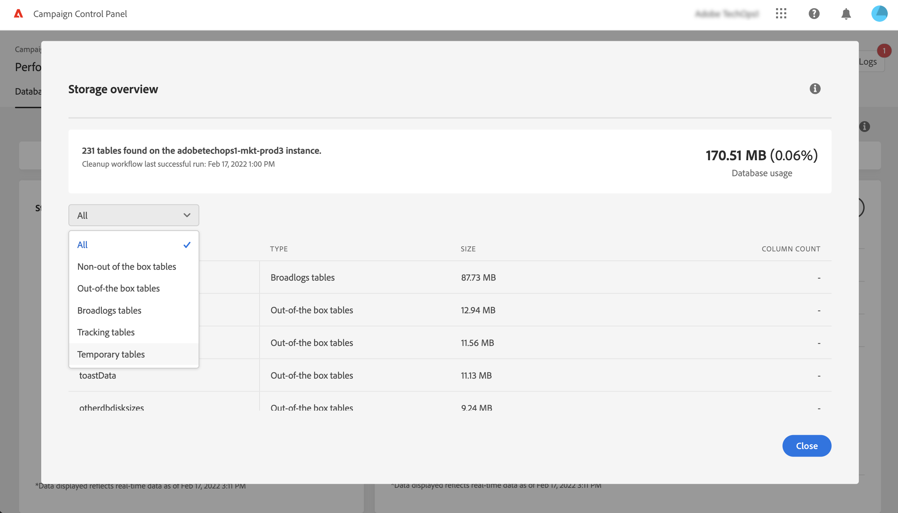
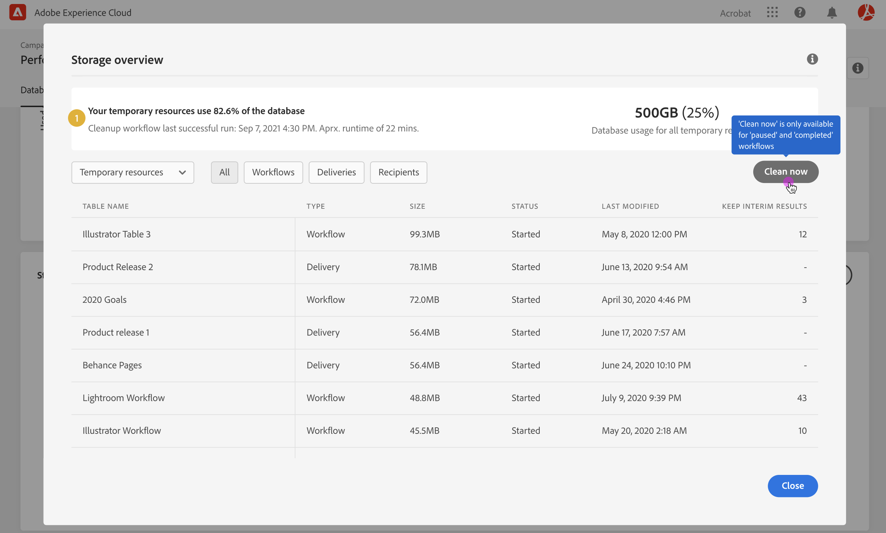
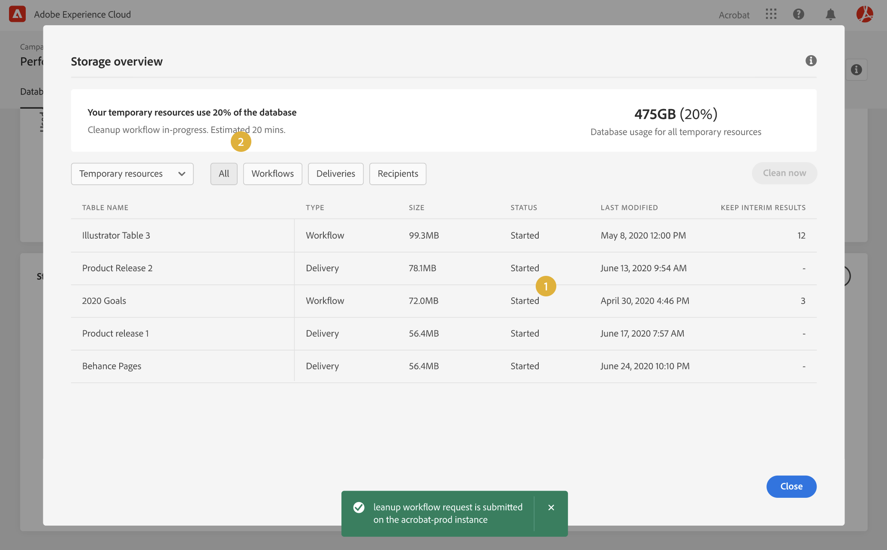
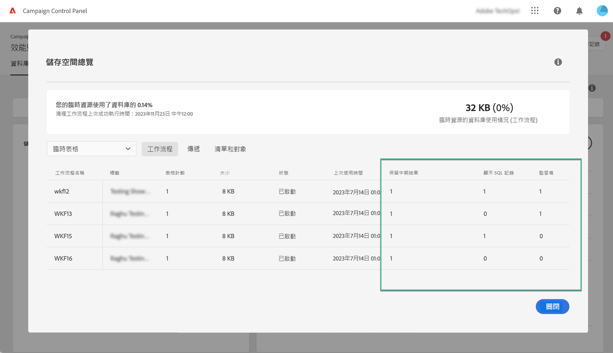
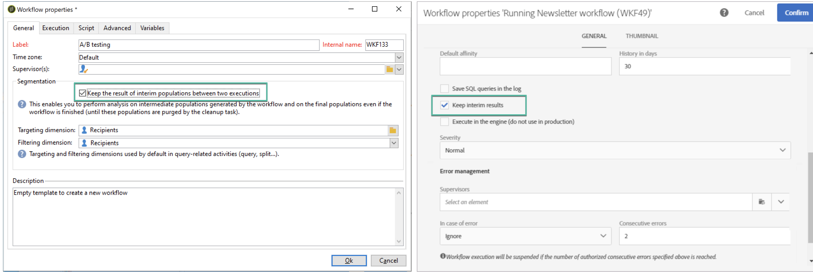
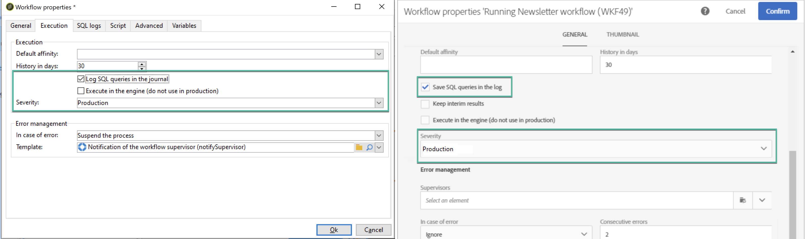
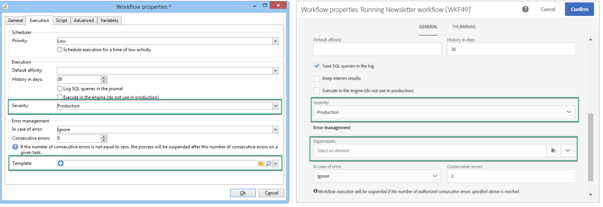

# 監視工作流程 {#monitor-workflows}

<!-- Clean paused and completed workflows

When [!DNL Adobe Campaign] workflows are paused or completed, they leave temporary tables on your instances database that consume space and can lead to performance issues.

Control Panel allows you to identify those workflows and clean the temporary resources generated on your instances.

>[!NOTE]
>
>Technically, this operation executes the **[!UICONTROL Database cleanup technical workflow]** that runs on your Campaign instance everyday (see [Campaign Standard](https://experienceleague.adobe.com/docs/campaign-standard/using/administrating/application-settings/technical-workflows.html?lang=zh-Hant#list-of-technical-workflows) and [Campaign Classic](https://experienceleague.adobe.com/docs/campaign-classic/using/monitoring-campaign-classic/data-processing/database-cleanup-workflow.html?lang=zh-Hant) documentation). 

To clean paused and completed workflows, follow these steps:

1. Navigate to the **[!UICONTROL Performance monitoring]** card.

1. In the **[!UICONTROL Databases]** tab, select the instance where you want to perform the operation.

1. Access the **[!UICONTROL Storage overview]** details, then filter the list on **[!UICONTROL Temporary tables]**. Learn more on **[!UICONTROL Storage overview]** in [this page](database-storage-overview.md).

    

1. All temporary tables generated on your instances by workflows and deliveries display. Click the **[!UICONTROL Clean now]** button to delete the resources generated by paused and completed workflows.

    

1. Once the operation is confirmed, you can track the estimated remaining time in the **[!UICONTROL Storage overview]** list.

    

Monitor workflow parameters -->

在 Adobe Campaign，某些工作流程參數可能需要特別注意，以避免在執行個體上出現任何問題。 您可藉由控制面板&#x200B;**[!UICONTROL 儲存空間概觀]**&#x200B;詳細資料，檢查是否為工作流程啟用這些選項中的任何一項。

## **[!UICONTROL 保留中期結果]** {#keep-results}

啟用 (值「1」) 後，此選項將儲存工作流程各活動之間轉換的結果。 於 [Campaign Standard](https://experienceleague.adobe.com/docs/campaign-standard/using/managing-processes-and-data/executing-a-workflow/managing-execution-options.html?lang=zh-Hant) 和 [Campaign Classic](https://experienceleague.adobe.com/docs/campaign-classic/using/automating-with-workflows/introduction/workflow-best-practices.html?lang=zh-Hant#logs) 文件中瞭解更多。

>[!IMPORTANT]
>
>在生產工作流程中，請勿勾選此選項。 它用於分析和測試，因此必須僅用於開發或中繼環境。 我們強烈建議在 Campaign 中將其關閉。

## **[!UICONTROL 顯示 SQL 記錄]** {#sql}

啟用此選項後，工作流程執行期間傳送到資料庫的 SQL 查詢將顯示在 Adobe Campaign 中。 於 [Campaign Standard](https://experienceleague.adobe.com/docs/campaign-standard/using/managing-processes-and-data/executing-a-workflow/managing-execution-options.html?lang=zh-Hant) 和 [Campaign Classic](https://experienceleague.adobe.com/docs/campaign-classic/using/automating-with-workflows/advanced-management/workflow-properties.html?lang=zh-Hant#execution) 文件中瞭解更多。

值「1」表示工作流程具有 **嚴重程度** 的欄位設定為「生產」，並且 SQL 查詢記錄選項已啟用。

>[!IMPORTANT]
>
>啟用此選項可能會影響效能並填入伺服器上的記錄檔案。 它只應用於分析和診斷。

## **[!UICONTROL 監督者]** {#supervisors}

您可藉由此欄位將運算元指派給工作流程。 如果工作流程失敗，將向關聯的運算元發出警示。 於 [Campaign Standard](https://experienceleague.adobe.com/docs/campaign-standard/using/managing-processes-and-data/executing-a-workflow/monitoring-workflow-execution.html?lang=zh-Hant#error-management) 和 [Campaign Classic](https://experienceleague.adobe.com/docs/campaign-classic/using/automating-with-workflows/advanced-management/workflow-properties.html?lang=zh-Hant#error-management) 文件瞭解更多。

值「1」表示工作流程具有 **嚴重程度** 的欄位設定為「生產」，且未將主管群組指派給工作流程。

