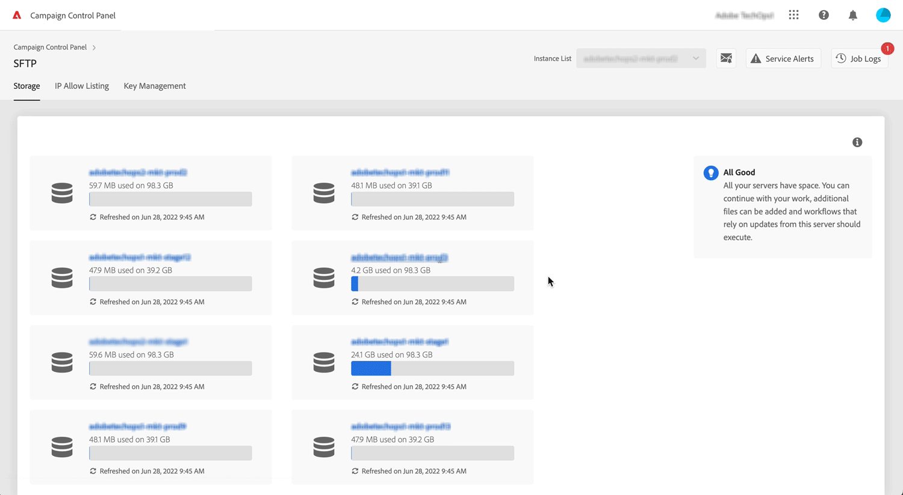
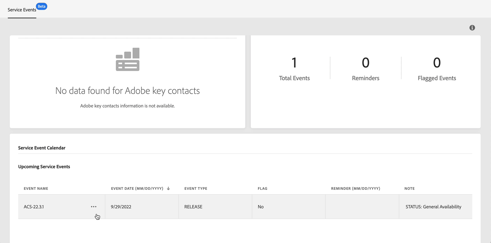

# 最新版本 {#control-panel-releases}

此頁列出了控制面板的所有新功能和改進。

## 2022 年 6 月 {#june-2022}

### 新增功能?

<table>
<thead>
<tr>
<th><strong>佔用SFTP伺服器空間的前10個檔案</strong> </th>
</tr>
</thead>
<tbody>
<tr>
<td>

現在，您可以識別SFTP伺服器上佔用空間最多的前10個檔案。 <a href="../sftp/using/sftp-storage-management.md">了解更多</a>

</td>
</tr>
</tbody>
</table>

<table>
<thead>
<tr>
<th><strong>服務日曆提醒</strong> </th>
</tr>
</thead>
<tbody>
<tr>
<td>

服務日曆現在允許您設定提醒，以便在實例上發生事件之前通過電子郵件通知您。 <a href="../instances-settings/using/external-accounts.md">了解更多</a>

</td>
</tr>
</tbody>
</table>

<table>
<thead>
<tr>
<th><strong>子域的CSR生成增強</strong> </th>
</tr>
</thead>
<tbody>
<tr>
<td>

對CSR的生成過程進行了一些改進。 <a href="../subdomains-certificates/using/renewing-subdomain-certificate.md">了解更多</a>
<ul><li>生成CSR時，現在可以選擇包含的子域之一作為「公用名稱」。</li><li>現在，在生成CSR之前，可以複製CSR摘要。</li><li>生成CSR後，可以從作業日誌中再次下載。 此功能不適用於此版本之前生成的證書。</li></ul>

</td>
</tr>
</tbody>
</table>

### 功能改進

**執行個體設定**

* 「Control Panel（控制面板）」中GPG鍵的最大數量已增加到60個鍵。 [了解更多](../instances-settings/using/gpg-keys-management.md)

## 2022 年 5 月 {#may-2022}

<table>
<thead>
<tr>
<th><strong>混合託管模型可使用控制面板的程度</strong> </th>
</tr>
</thead>
<tbody>
<tr>
<td>

控制面板現在可供混合託管模型的客戶使用。 這些客戶可以利用控制面板的功能，在控制面板的行銷執行個體提供他們的 MID/RT 執行個體 URL。 

有關詳細資訊，請參閱 <a href="../instances-settings/using/external-accounts.md">詳細文檔。</a>

</td>
</tr>
</tbody>
</table>

<table>
<thead>
<tr>
<th><strong>輸送量及延時監視更新</strong> </th>
</tr>
</thead>
<tbody>
<tr>
<td>

吞吐量和延遲監控功能已得到增強：<ul><li>您現在可以識別影響執行個體輸送量的前 5 個傳遞的 ID。</li><li>Campaign Classic v7/v8 客戶現在可以顯示特定頻道的延時。
</li>
有關詳細資訊，請參閱 <a href="../performance-monitoring/using/thoughputs-latencies.md">詳細文檔。</a>

</td>
</tr>
</tbody>
</table>

## 2022 年 4 月 {#april-2022}

<table>
<thead>
<tr>
<th><strong>監視執行個體上的主要聯絡人和事件</strong> </th>
</tr>
</thead>
<tbody>
<tr>
<td>

您現在可以監視執行個體上過去和即將發佈的版本和服務審查，並為某項請求或問題存取 Adobe 的主要聯絡人清單。 

有關詳細資訊，請參閱 <a href="../service-events/service-events.md">詳細文檔。</a>

</td>
</tr>
</tbody>
</table>

## 2022 年 3 月 {#march-2022}

<table>
<thead>
<tr>
<th><strong>吞吐量和延遲監視可用性</strong> </th>
</tr>
</thead>
<tbody>
<tr>
<td>

吞吐量和延遲監控現已適用於所有Campaign Standard和v8客戶，以及內部版本號為9032、9330、9346或9349的營銷活動V7客戶（沒有任何中間實例）。

有關詳細資訊，請參閱 <a href="../performance-monitoring/using/thoughputs-latencies.md">詳細文檔。</a>

</td>
</tr>
</tbody>
</table>

## 2022 年 2 月 {#february-2022}

<table>
<thead>
<tr>
<th><strong>工作流程參數監視</strong> </th>
</tr>
</thead>
<tbody>
<tr>
<td>

您現在可以監視可能需要特別注意的工作流程參數，以避免執行個體上出現任何問題。  

如需詳細資訊，請參閱<a href="../performance-monitoring/using/workflow-monitoring.md">詳細文件</a>以瞭解詳情。

</td>
</tr>
</tbody>
</table>

## 2022 年 1 月 {#january-2022}

<table>
<thead>
<tr>
<th><strong>使用中查詢監視</strong> </th>
</tr>
</thead>
<tbody>
<tr>
<td>

允許您可以藉由控制面板監視在執行個體上執行時間最長的查詢。 

如需詳細資訊，請參閱<a href="../performance-monitoring/using/database-active-queries.md">詳細文件</a>以瞭解詳情。

</td>
</tr>
</tbody>
</table>

<table>
<thead>
<tr>
<th><strong>輸送量和延時監視</strong> </th>
</tr>
</thead>
<tbody>
<tr>
<td>

您現在可以監視執行個體上一段時間內的傳遞輸送量和延時趨勢。 

如需詳細資訊，請參閱<a href="../performance-monitoring/using/thoughputs-latencies.md">詳細文件</a>以瞭解詳情。

</td>
</tr>
</tbody>
</table>

<table>
<thead>
<tr>
<th><strong>新子域上的SSL證書操作</strong> </th>
</tr>
</thead>
<tbody>
<tr>
<td>

現在，即使可交付性審核仍在進行中，也可以對新設定的子域執行SSL證書操作。

如需詳細資訊，請參閱<a href="../subdomains-certificates/using/renewing-subdomain-certificate.md">詳細文件</a>以瞭解詳情。

</td>
</tr>
</tbody>
</table>
