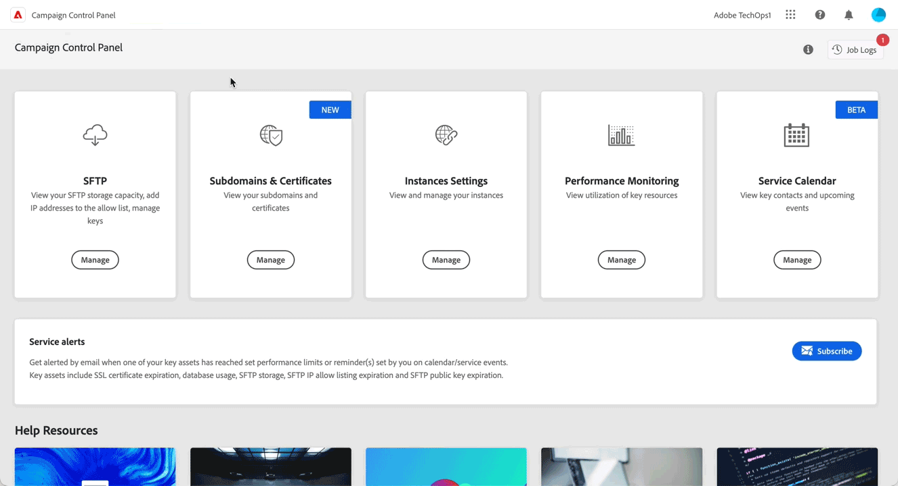
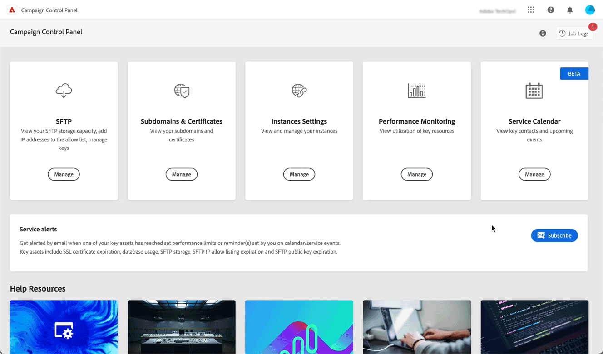

# 最新版本 {#control-panel-releases}

本頁面列出了「控制面板」的所有新功能和改善項目。

## 2023 年 2 月 {#february-2023}

**委派給Adobe的子網域的委派移除**

您現在可以移除已完全委派給Adobe的子網域委派。 [了解更多](../subdomains-certificates/using/remove-delegated-subdomains.md)

>[!NOTE]
>
>已使用CNAME設定的子網域目前無法使用委派移除功能。

**服務日曆**

服務日曆現在提供日曆檢視，以追蹤您執行個體上發生的重要事件。 此外，已新增傳送給訂閱「控制面板」警報之使用者之通知的相關資訊。 [了解更多](../service-events/service-events.md)

