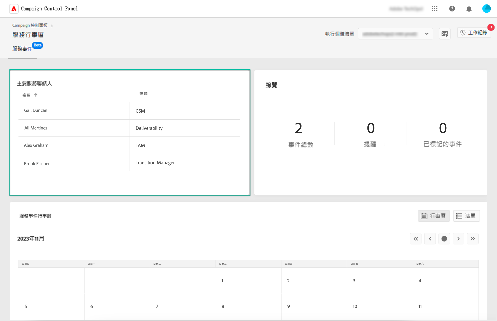
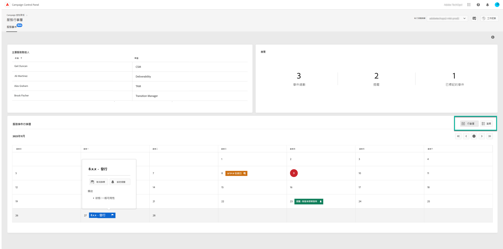
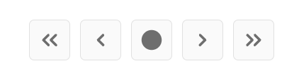
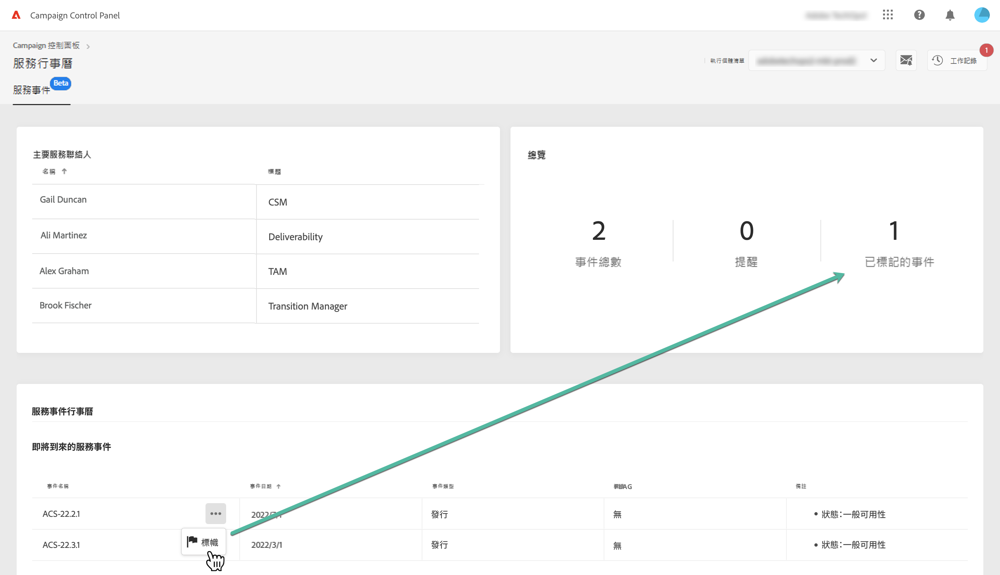
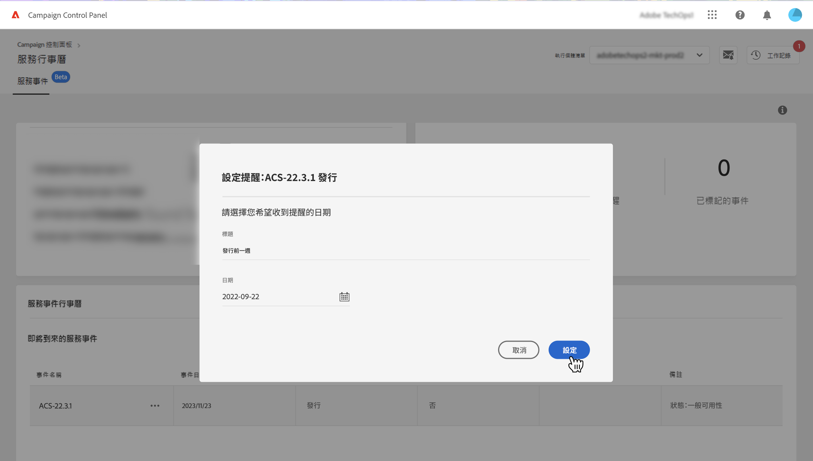

# 識別主要聯絡人與事件 {#keycontacts-events}

>[!CONTEXTUALHELP]
>id="cp_servicecalendar_serviceevents"
>title="服務行事曆"
>abstract="「主要聯絡人」區段列出了 Adobe 的聯絡窗口，您可藉此提出任何問題或有關執行個體的請求。在「服務事件行事曆」區段，您可識別選定執行個體過去/將來的版本與警示，並為指定事件設定提醒。"

>[!IMPORTANT]
>
>服務行事曆現在提供測試版，且可能會不時更新和修改，恕不另行通知。

若要有效監控您的 Campaign 執行個體，必須持續追蹤可能影響執行個體的重要事件。 「控制面板」可讓您識別各項事件，如新版本、升級、修補程式、Hotfix 等等 並提供任何請求或問題的 Adobe 重要聯絡人清單。

此資訊可從以下位置存取： **[!UICONTROL 服務行事曆]** 卡片於「控制面板」首頁。

## 主要聯絡人 {#key-contacts}

此 **[!UICONTROL 主要聯絡人]** 區段列出了Adobe的聯絡視窗，以便您提出任何有關執行個體上的請求或問題。

>[!NOTE]
>
>本區段僅顯示托管服務帳戶的資訊。

主要聯絡人包括以下角色：

* **[!UICONTROL TAM]**：技術客戶經理，
* **[!UICONTROL CSM]**：客戶成功經理，
* **[!UICONTROL 傳遞能力]**：傳遞作業的聯絡點，
* **[!UICONTROL 轉換管理員]**：Managed Services轉換經理(僅限Managed Services帳戶)、
* **[!UICONTROL 入門專家]**：指派給客戶的專家，可幫助您上手Campaign Classic(僅限Managed Services客戶)。

## 持續追蹤重要事件 {#events}

此 **[!UICONTROL 服務事件行事曆]** 區段顯示所有過去和即將發佈的版本，以及使用者在「控制面板」中訂閱的電子郵件警示。 此外，「控制面板」可讓使用者為選定的執行個體設定提醒並標幟相關事件，以便更妥善組織並提高效率。

事件會顯示在行事曆或清單。 您可以使用 **[!UICONTROL 行事曆]** 和 **[!UICONTROL 清單]** 區段右上角的按鈕。

<table><tr style="border: 0;">
<td>
</td><td>在行事曆檢視種，右上角提供導覽按鈕，可協助您瀏覽各個事件。 利用<b>雙箭頭</b>導覽至選定月份之後/之前出現的第一個事件，以及利用<b>單箭頭</b>逐月瀏覽。 按一下<b>圓形按鈕</b>回到本日檢視。</td>
</tr></table>

會顯示三種類型的事件：

* **提醒**&#x200B;由使用者設定，以便在事件發生之前收到通知。 會在行事曆檢視以綠色顯示。 [了解如何設定提醒](#reminders)
* **警示**&#x200B;由「控制面板」透過電子郵件傳送，通知使用者其執行個體出現的問題，例如儲存超過負荷或 SSL 憑證過期。 會在行事曆檢視以橘色顯示。 事件說明會指定是否傳送警示給登入使用者，具體取決於其電子郵件警示訂閱情況。 [進一步了解「控制面板」電子郵件警示功能](../performance-monitoring/using/email-alerting.md)

* **版本**&#x200B;指出執行個體過去與即將進行的部署，在行事曆檢視分別以灰色與藍色顯示。 事件詳細資料會指定與每個部署相關聯的版本類型：

   * **[!UICONTROL 全面發佈]**：最新可用的穩定版本。
   * **[!UICONTROL 可用性限制]**：僅限隨選部署。
   * **[!UICONTROL 候選版本]**：工程驗證。 等待生產校訂。 
   * **[!UICONTROL 搶鮮版]**：針對特定客戶需求的更早可用性。
   * **[!UICONTROL 不再提供]**：此版本雖無重大問題，仍有附加錯誤修正的新版可用。 需要更新。
   * **[!UICONTROL 已棄用]**：建立嵌入已知的回歸。 不再支援此版本。須更新。

您可為一個或多個即將發生的事件指派旗標，以追蹤這些事件。 若要執行此動作，請按一下事件名稱旁邊的按鈕。

## 設定提醒 {#reminders}

您可以使用服務行事曆設定提醒，以便在事件發生之前透過電子郵件通知您。

>[!NOTE]
>
>為了獲得有關即將發生的事件的通知，請確保您已在「控制面板」中訂閱了電子郵件警示。 [了解更多](../performance-monitoring/using/email-alerting.md)

設定事件警示，請執行以下步驟：

1. 將游標停留在您要提醒的事件上，或按一下清單檢視中的橢圓按鈕，然後選取 **[!UICONTROL 設定提醒]**.

1. 為提醒事項提供標題，並選取要在事件發生之前收到通知的日期。

   

   >[!NOTE]
   >
   >如果您尚未訂閱「控制面板」警示，會顯示一則訊息，允許您註冊接收電子郵件通知。

1. 現在已為所選的事件設定提醒。 您可以隨時將滑鼠游標停留在上面以顯示標題。

   

   >[!NOTE]
   >
   >您可以為同一事件設定 2 個提醒。

1. 在指定的提醒日期當天將傳送一封電子郵件，通知您即將發生的事件，並且該提醒會自動從 **[!UICONTROL 提醒]** 在[服務行事曆]功能表計數。
