# IP 範圍允許清單 {#ip-range-allow-listing}

>[!CONTEXTUALHELP]
>id="cp_ip_whitelist"
>title="關於 IP 允許清單"
>abstract="在此索引標籤中，您可以將 IP 範圍新增至允許清單，以建立與 SFTP 伺服器的連線。此處僅顯示您可存取的 SFTP 伺服器。請聯絡您的管理員以要求存取其他 SFTP 伺服器。"
>additional-url="https://images-tv.adobe.com/mpcv3/8a977e03-d76c-44d3-853c-95d0b799c870_1560205338.1920x1080at3000_h264.mp4#t=98" text="觀看示範影片"

SFTP 伺服器會受到保護。為了能夠訪問它們以查看檔案或編寫新檔案，您需要將訪問伺服器的系統或客戶端的公用IP地址添加到允許清單中。

利用 [Campaign Classic](https://experienceleague.adobe.com/docs/campaign-classic-learn/control-panel/sftp-management/adding-ip-range-to-allow-list.html#sftp-management) 或 [Campaign Standard](https://experienceleague.adobe.com/docs/campaign-standard-learn/control-panel/sftp-management/adding-ip-range-to-allow-list.html#sftp-management) 在影片中瞭解此功能

## 關於 CIDR 格式 {#about-cidr-format}

CIDR (無類別域間路由) 是使用「控制面板」介面新增 IP 範圍時支援的格式。

語法由 IP 位址、後面加上「/」字元和十進位數字組成。[本文](https://whatismyipaddress.com/cidr){target=&quot;_blank&quot;}中會詳細說明格式及其語法。

您可以在網際網路上搜尋免費線上工具，協助您將現有的IP範圍轉換為CIDR格式。

## 最佳實務 {#best-practices}

在「控制面板」上，將 IP 位址新增至允許清單，請務必遵循下列建議和限制。

* **將 IP 範圍新增至允許清單**，而不是使用單一 IP 位址。若要將單一 IP 位址新增至允許清單，請在 IP 位址附加「/32」以指出該範圍僅包含單一 IP。
* **請勿將非常寬的範圍新增至允許清單**，例如，包括 > 265 個 IP 位址。「控制面板」將會拒絕任何介於 /0 和 /23 之間的 CIDR 格式範圍。
* 只能將&#x200B;**公用 IP 位址**&#x200B;新增至允許清單。
* 請務必從允許清單中定期刪除您不再需要的IP位址&#x200B;**。**

## 將 IP 位址新增至允許清單 {#adding-ip-addresses-allow-list}

>[!CONTEXTUALHELP]
>id="cp_sftp_iprange_add"
>title="IP範圍設定"
>abstract="定義您要新增至允許清單的 IP 範圍，以便連線至您的 SFTP 伺服器。"

若要將 IP 範圍新增至允許清單，請執行下列步驟：

1. 開啟 **[!UICONTROL SFTP]** 卡片，然後選取 **[!UICONTROL IP Allow Listing]** 索引標籤。
1. 每個執行個體會顯示允許清單上的 IP 位址清單。從左側清單中選取所需的執行個體，然後按一下 **[!UICONTROL Add new IP range]**&#x200B;按鈕。

   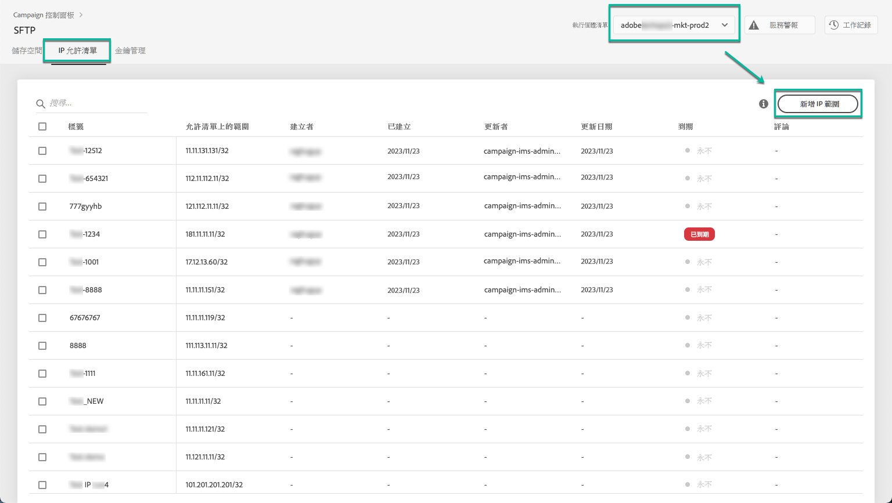

1. 定義您要新增至允許清單的IP範圍。 此欄位僅接受CIDR格式的IP範圍，例如&#x200B;*192.150.5.0/24*。

   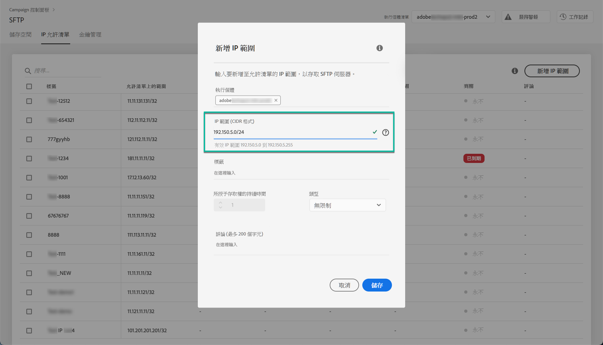

   >[!IMPORTANT]
   >
   >IP 範圍不能與允許清單上的現有範圍重疊。在該情況下，請先刪除包含重疊 IP 的範圍。

1. 您可以將範圍新增至允許清單，以供多個執行個體使用。 若要這麼做，請按下向下鍵或輸入所需執行個體的第一個字母，然後從建議清單中選取。

   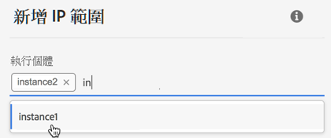

1. 定義要針對清單中的此IP範圍顯示的標籤。

   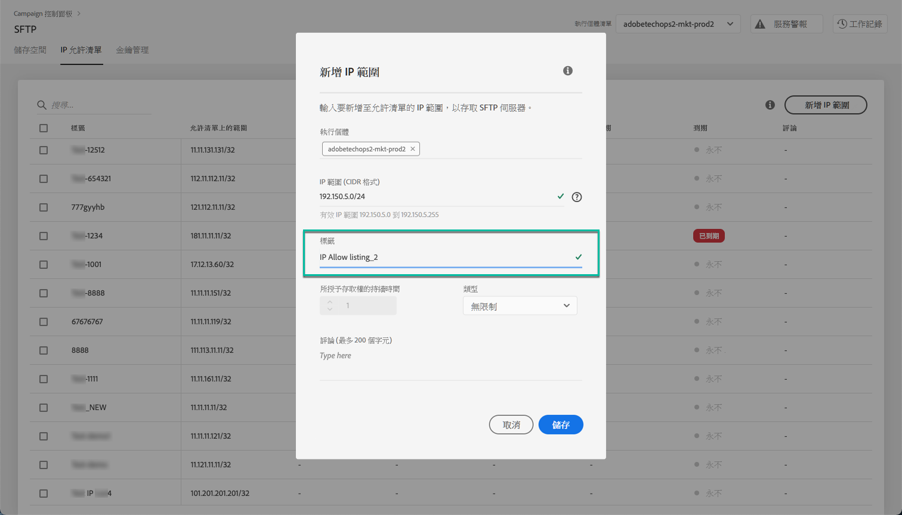

   >[!NOTE]
   >
   >**[!UICONTROL Label]**欄位中允許使用下列特殊字元：
   > `. _ - : / ( ) # , @ [ ] + = & ; { } ! $`

1. 若要更妥善地管理IP允許清單，您可以設定每個IP範圍可用性的持續時間。 要執行此操作，請在&#x200B;**[!UICONTROL Type]**&#x200B;下拉式清單中選取單位，並在對應欄位中定義持續時間。 如需IP範圍過期的詳細資訊，請參閱[此區段](#expiry)。

   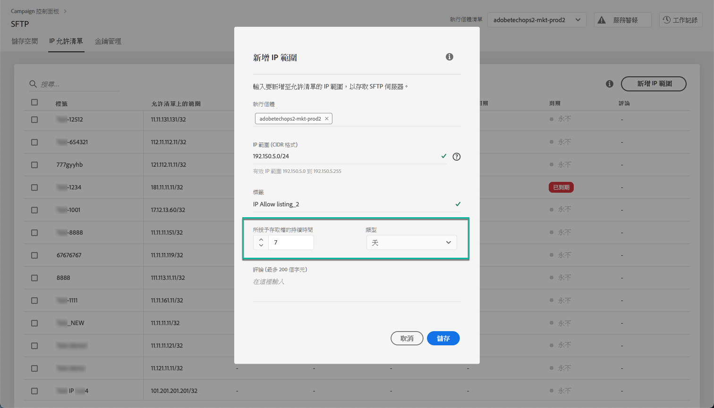

   >[!NOTE]
   >
   >預設情況下， **[!UICONTROL Type]**&#x200B;欄位設為&#x200B;**[!UICONTROL Unlimited]** ，這表示IP範圍永不過期。

1. 在&#x200B;**[!UICONTROL Comment]**&#x200B;欄位中，您可以指出允許此IP範圍的原因（原因、對象等）。

1. 按一下 **[!UICONTROL Save]** 按鈕。新增至允許清單的IP範圍會顯示為&#x200B;**[!UICONTROL Pending]**，直到完全處理請求為止，這隻需幾秒鐘。

   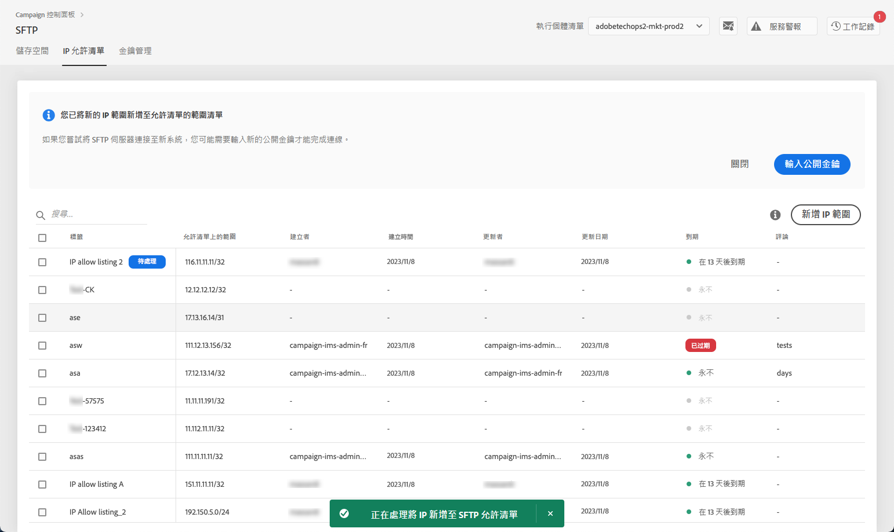

>[!IMPORTANT]
>
>如果您嘗試將SFTP伺服器連線至新系統，並因此將新IP範圍新增至允許清單，則可能需要輸入新的公開金鑰才能完成連線。 如需詳細資訊，請參閱[本節](key-management.md)。

## 管理IP範圍 {#managing-ip-ranges}

您建立的IP範圍會顯示在&#x200B;**[!UICONTROL IP Allow Listing]**&#x200B;標籤中。

您可以根據建立日期或版本日期、建立或編輯項目的使用者，以及IP範圍到期日來排序項目。

您也可以開始輸入標籤、範圍、名稱或註解，以搜尋IP範圍。

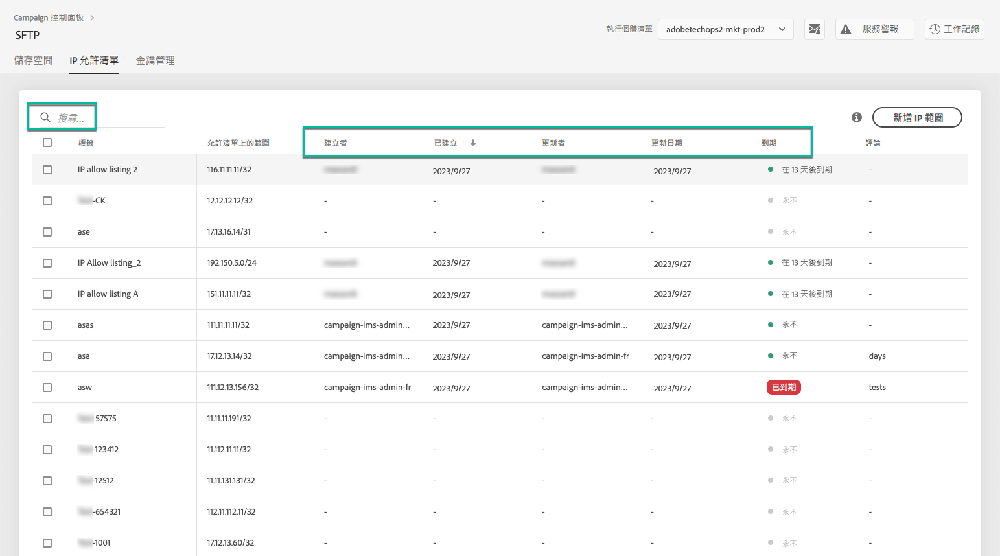

若要編輯一或多個IP範圍，請參閱[此區段](#editing-ip-ranges)。

若要從允許清單中刪除一或多個IP範圍，請選取範圍，然後按一下&#x200B;**[!UICONTROL Delete IP range]**&#x200B;按鈕。

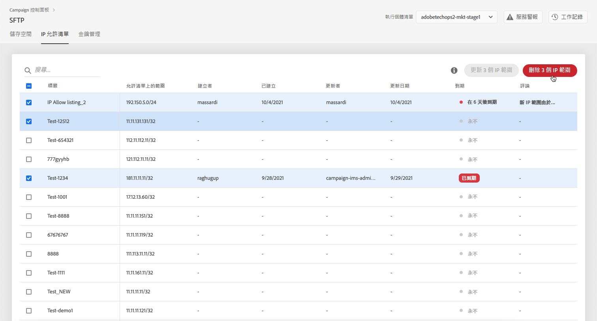

### 過期 {#expiry}

**[!UICONTROL Expires]**&#x200B;欄顯示在IP範圍過期之前還剩多少天。

如果您訂閱[電子郵件警報](../../performance-monitoring/using/email-alerting.md)，您會在IP範圍過期的10天和5天前，以及到期的當天，以電子郵件方式收到通知。 收到警報時，您可以[編輯IP範圍](#editing-ip-ranges)以視需要延長其有效期。

過期的IP範圍會在7天後自動刪除。 在&#x200B;**[!UICONTROL Expires]**&#x200B;欄中顯示為&#x200B;**[!UICONTROL Expired]**。 在此7天期間內：

* 過期的IP範圍無法再用來存取SFTP伺服器。

* 您無法建立與過期範圍重疊的其他IP範圍。 您必須先刪除過期的IP範圍，才能建立新的範圍。

* 您可以[編輯](#editing-ip-ranges)過期的IP範圍，並更新其持續時間，使其可再次使用。

* 您可以從允許清單中刪除它。

## 編輯IP範圍 {#editing-ip-ranges}

>[!CONTEXTUALHELP]
>id="cp_sftp_iprange_update"
>title="更新IP範圍"
>abstract="更新允許連線至SFTP伺服器的選取IP範圍。"

若要編輯IP範圍，請遵循下列步驟。

>[!NOTE]
>
>您只能編輯自「控制面板」 2021年10月發行版本以來建立的IP範圍。

<!--Edition is not available for IP ranges that have been created before the Control Panel October 2021 release.-->

1. 從&#x200B;**[!UICONTROL IP Allow Listing]**&#x200B;清單中選取一或多個IP範圍。

1. 按一下 **[!UICONTROL Update IP range]** 按鈕。

   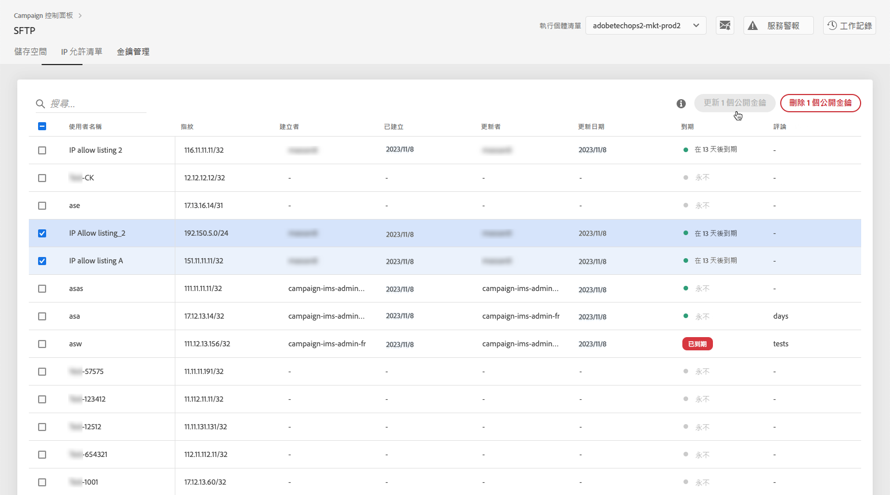

1. 您只能編輯IP範圍過期和/或新增註解。

   >[!NOTE]
   >
   >若要修改CIDR格式、其標籤或編輯相關執行個體，您必須先刪除IP範圍，並建立符合您需求的新範圍。

   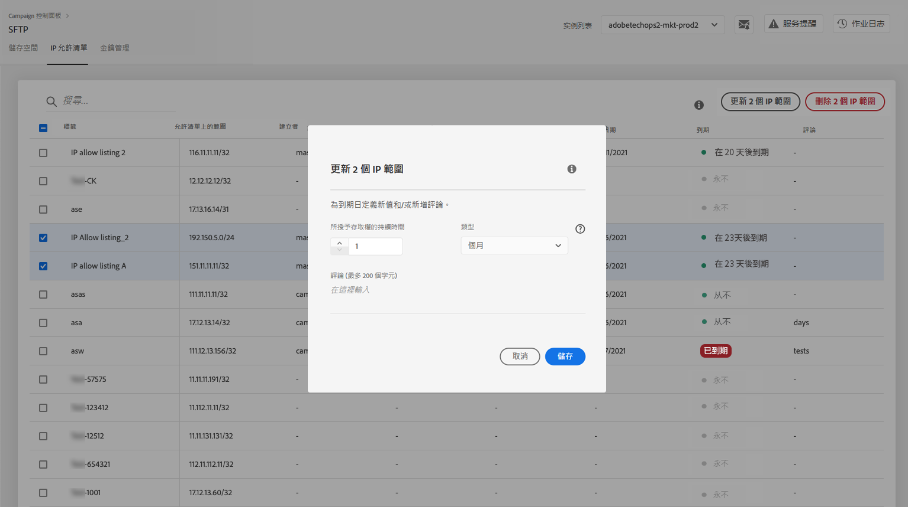

1. 儲存您的變更。

## 監視變更 {#monitoring-changes}

「控制面板」首頁的&#x200B;**[!UICONTROL Job Logs]**&#x200B;可讓您追蹤並監視對清單上IP位址所做的所有變更。

如需「控制面板」介面的詳細資訊，請參閱[本章節](../../discover/using/discovering-the-interface.md)。

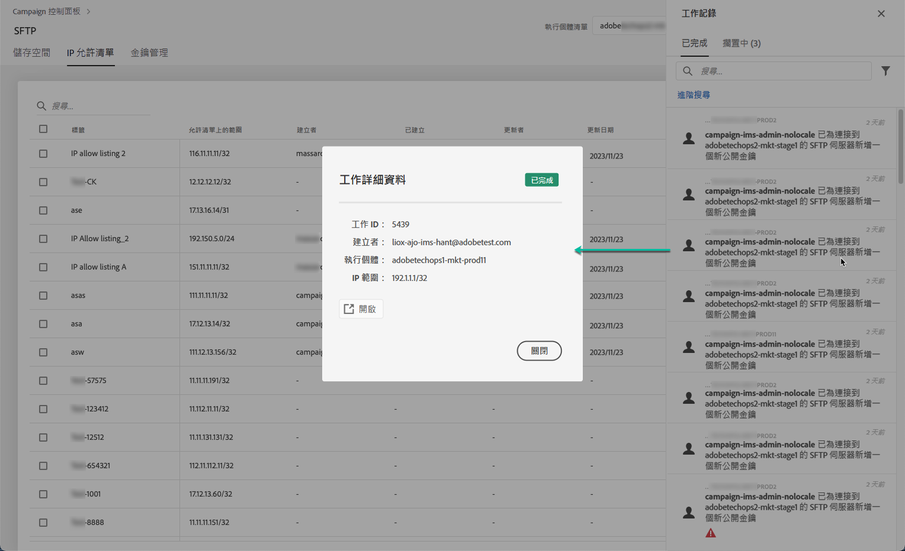
