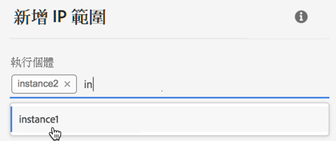

# IP範圍白名單 {#ip-range-whitelisting}

>[!CONTEXTUALHELP]
>id=&quot;cp_ip_whitelist&quot;
>title=&quot;關於IP白名單&quot;
>abstract=&quot;在此標籤中，您可以將IP範圍列入白名單，以建立與SFTP伺服器的連線。 此處僅顯示您可存取的SFTP伺服器。 請連絡您的管理員以要求存取其他SFTP伺服器。」
>additional-url=&quot;https://images-tv.adobe.com/mpcv3/8a977e03-d76c-44d3-853c-95d0b799c870_1560205338.1920x1080at3000_h264.mp4#t=98&quot; text=&quot;Watch demo video&quot;

SFTP伺服器受到保護。 為了能夠訪問這些檔案或編寫新檔案，您需要將訪問伺服器的系統或客戶端的公共IP地址列入白名單。

## 關於CIDR格式 {#about-cidr-format}

CIDR（無類域間路由）是使用控制面板介面添加IP範圍時支援的格式。

語法由IP位址、後接&#39;/&#39;字元和十進位數字組成。 本文對其格式及語法作了 [詳細說明](https://whatismyipaddress.com/cidr)。

您可以在Internet上搜索免費的聯機工具，這些工具將幫助您將現有的IP範圍轉換為CIDR格式。

## 最佳作法 {#best-practices}

在「控制面板」中將IP位址加入白名單時，請務必遵循下列建議和限制。

* **白名單IP範圍** ，而非單一IP位址。 若要將單一IP位址加入白名單，請附加&#39;/32&#39;以指出該範圍僅包含單一IP。
* **請勿將非常廣的範圍列入白名單**，例如，包括> 265個IP位址。 控制面板將拒絕任何介於/0和/23之間的CIDR格式範圍。
* 只有 **公用IP位址** ，才能列入白名單。
* 請務必定 **期刪除您不再需要的白名單** IP位址。

## 白名單IP位址 {#whitelisting-ip-addresses}

>[!CONTEXTUALHELP]
>id=&quot;cp_sftp_iprange_add&quot;
>title=&quot;Add New Ip Range&quot;
>abstract=&quot;定義您要將IP範圍列入白名單以連接至SFTP伺服器。&quot;

要將IP範圍列入白名單，請執行以下步驟：

1. 開啟資 **[!UICONTROL SFTP]** 訊卡，然後選取標 **[!UICONTROL IP Whistelisting]** 簽。
1. 會針對每個例項顯示白名單IP位址清單。 從左側清單中選取所要的例項，然後按一下按 **[!UICONTROL Add new IP range]** 鈕。

   

1. 以CIDR格式定義要列入白名單的IP範圍，然後定義將在清單中顯示的標籤。

   >[!NOTE]
   >
   >「標籤」欄位中允許使用下列特殊字元：
   > `. _ - : / ( ) # , @ [ ] + = & ; { } ! $`

   

   >[!IMPORTANT]
   >
   >IP範圍不能與現有白名單範圍重疊。 在這種情況下，請先刪除包含重疊IP的範圍。
   >
   >您可以將多個例項的範圍列入白名單。 若要這麼做，請按下箭頭鍵或輸入所要之例項的首字母，然後從建議清單中選取。

   

1. Click the **[!UICONTROL Save]** button. IP白名單新增項目將顯示為「待定」，直到完全處理請求為止。 這隻需要幾秒鐘。

若要刪除白名單的IP範圍，請選取範圍，然後按一下 **[!UICONTROL Delete IP range]** 按鈕。

>[!NOTE]
>
>目前無法編輯白名單範圍。 若要修改IP範圍，請加以刪除，然後建立與您的需求對應的範圍。

## 監控更改 {#monitoring-changes}

「控 **[!UICONTROL Job Logs]** 制面板」首頁中的「控制面板」可讓您監控對列入白名單的IP位址所做的所有變更。

有關「Control Panel（控制面板）」介面的詳細資訊，請參 [閱本節](../../discover/using/discovering-the-interface.md)。

