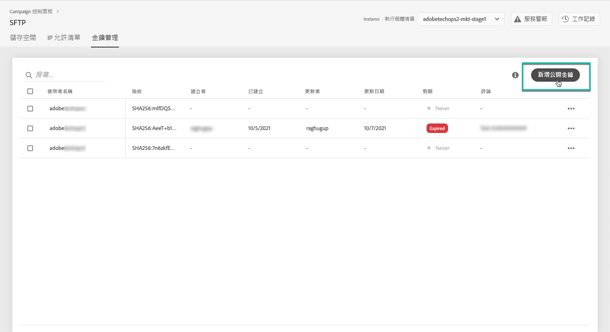
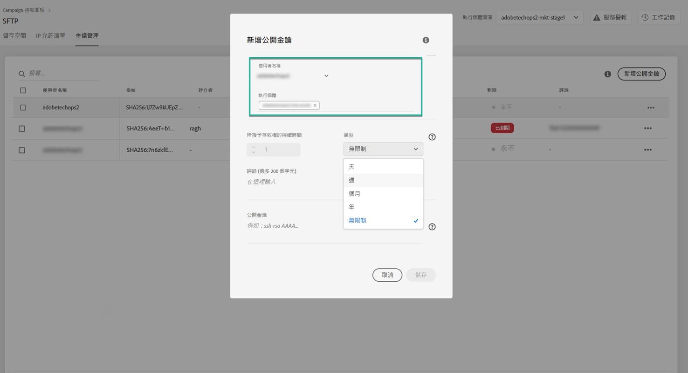
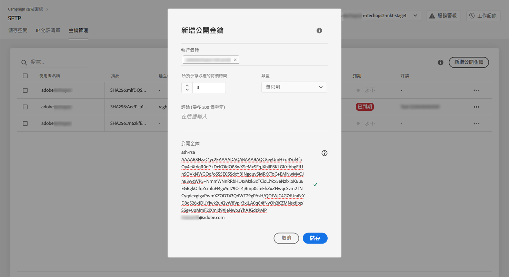
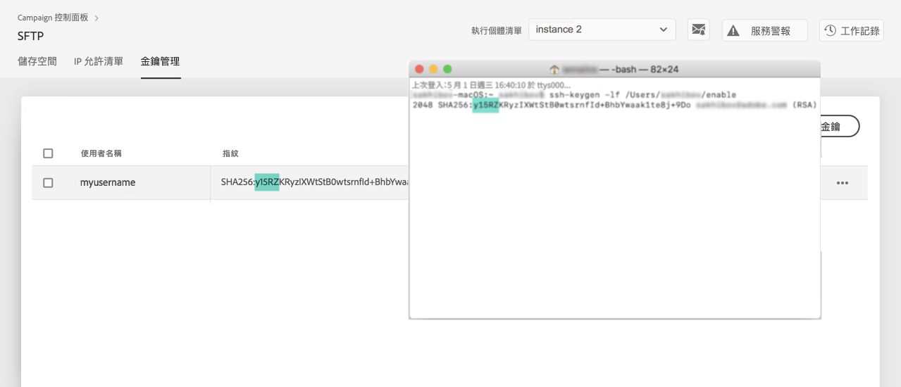
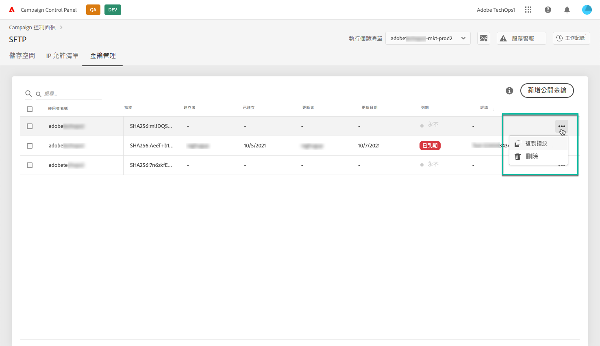

# 金鑰管理{#key-management}

>[!CONTEXTUALHELP]
>id="cp_key_management"
>title="關於金鑰管理"
>abstract="在此標籤中，您可以管理公開金鑰。"
>additional-url="https://images-tv.adobe.com/mpcv3/8a977e03-d76c-44d3-853c-95d0b799c870_1560205338.1920x1080at3000_h264.mp4#t=166" text="觀看示範影片"

Adobe 建議所有客戶使用&#x200B;**公開和私密金鑰組**&#x200B;建立與其 SFTP 伺服器的連線。

以下說明了產生公開 SSH 金鑰以及新增金鑰以存取 SFTP 伺服器的步驟，還有身份驗證相關的建議。

Once access to the server is set up, remember to **add the IP addresses that will require access to the server to the allow list** so that you can connect to it. 如需詳細資訊，請參閱[本章節](../../instances-settings/using/ip-whitelisting-instance-access.md)。

>[!NOTE]
>
>您目前無法刪除 SSH 公開金鑰。

## 最佳實務{#best-practices}

**關於公開 SSH 金鑰**

請確定您一律使用相同的驗證來連線至伺服器，並且使用支援的金鑰格式。

**API 與使用者名稱和密碼的整合**

在極少數的情況下，某些 SFTP 伺服器會啟用密碼驗證。Adobe 建議您使用金鑰式驗證，因為此方法更有效且更安全。您可以聯絡客戶服務，以要求切換至金鑰式驗證。

>[!IMPORTANT]
>
>如果您的密碼過期，即使系統上已安裝金鑰，您也無法登入 SFTP 帳戶。

## 安裝 SSH 金鑰{#installing-ssh-key}

>[!CONTEXTUALHELP]
>id="cp_sftp_publickey_add"
>title="新增公開金鑰"
>abstract="新增執行個體的公開金鑰"

>[!IMPORTANT]
>
>以下步驟只是 SSH 金鑰建立的範例，請依照貴組織關於 SSH 金鑰方針。以下只是如何進行此作業的範例，這可做為您向團隊或內部網路群組溝通需求時的有用參考。

1. 導覽至「**[!UICONTROL Key Management]**」標籤，然後按一下 **[!UICONTROL Add new public key]** 按鈕。

   

1. 在開啟的對話框中，選取想要建立公開金鑰的使用者名稱，以及您想要啟用金鑰的伺服器。

   >[!NOTE]
   >
   >介面會檢查指定的使用者名稱是否在指定的執行個體上有效，並為您提供在一或多個執行個體上啟用金鑰的選項。
   >
   >您可以為每位使用者新增一或多個公開 SSH 金鑰。

   

1. 複製並貼上公開 SSH 金鑰。若要產生公開金鑰，請依照下列與您的作業系統對應的步驟執行：

   >[!NOTE]
   >
   >公開 SSH 金鑰的大小應為 **2048 位元**。

   **Linux 和 Mac：**

   使用「終端機」產生公開和私密金鑰組：
   1. 輸入以下命令：`ssh-keygen -m pem -t rsa -b 2048 -C "your_email@example.com"`。
   1. 在提示出現時提供您金鑰的名稱。如果 .ssh 目錄不存在，系統將會為您建立一個目錄。
   1. 在提示出現時輸入複雜密碼，然後再輸入一次。您也可保留空白。
   1. 系統會建立「name」和「name.pub」金鑰組。搜尋「name.pub」檔案並開啟，其中應包含英數字串，結尾應為您指定的電子郵件地址。
   **Windows：**

   您可能需要安裝協力廠商工具，協助您以相同格式「name.pub」產生私密/公開金鑰組。

1. 開啟 .pub 檔案，然後複製以「ssh...」開頭的整個字串並貼到「控制面板」中。

   

1. 按一下&#x200B;**[!UICONTROL Save]**&#x200B;按鈕以建立金鑰。「控制面板」會儲存公開金鑰及其相關聯的指紋，並使用 SHA256 格式加密。

您可以使用指紋來比對儲存在電腦上的私密金鑰與儲存在「控制面板」中的對應公開金鑰。

「**...**」按鈕可讓您刪除現有的金鑰，或將其相關聯的指紋複製到剪貼簿中。

