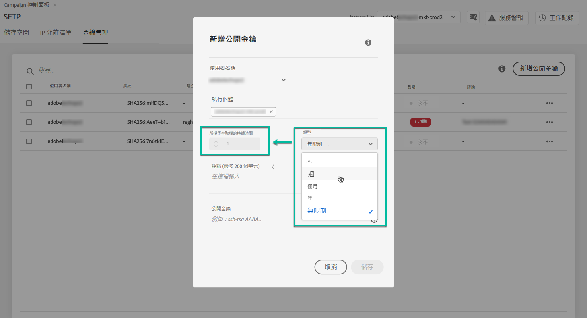
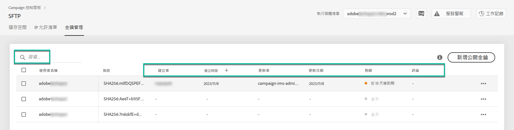
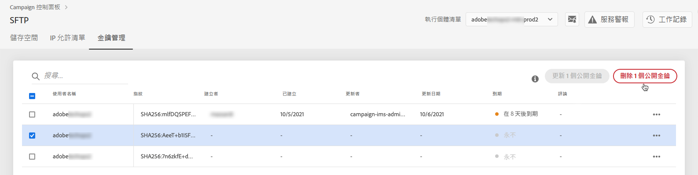
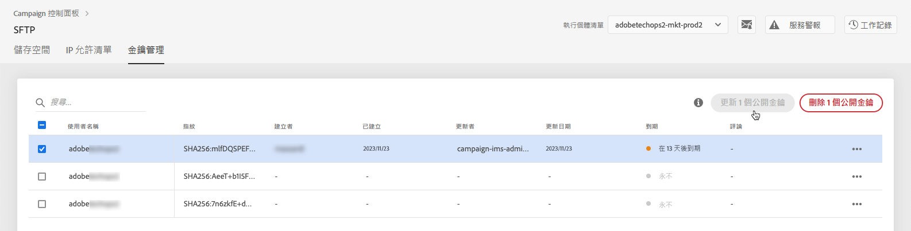

# 金鑰管理 {#key-management}

>[!CONTEXTUALHELP]
>id="cp_key_management"
>title="關於公開金鑰管理"
>abstract="在此索引標籤中，建立、管理和編輯您的公開金鑰。"
>additional-url="https://images-tv.adobe.com/mpcv3/8a977e03-d76c-44d3-853c-95d0b799c870_1560205338.1920x1080at3000_h264.mp4#t=166" text="觀看示範影片"

Adobe 建議所有客戶使用&#x200B;**公開和私密金鑰組**&#x200B;建立與其 SFTP 伺服器的連線。

以下說明了產生公開 SSH 金鑰以及新增金鑰以存取 SFTP 伺服器的步驟，還有身分驗證相關的建議。

設定了伺服器的存取權限後，請記得&#x200B;**將存取伺服器所需的 IP 位址新增至允許清單**，如此您才能連線至伺服器。如需詳細資訊，請參閱[本章節](../../instances-settings/using/ip-allow-listing-instance-access.md)。

在利用 [Campaign v7/v8](https://experienceleague.adobe.com/docs/campaign-classic-learn/control-panel/sftp-management/generate-ssh-key.html?lang=zh-Hant#sftp-management) 或 [Campaign Standard](https://experienceleague.adobe.com/docs/campaign-standard-learn/control-panel/sftp-management/generate-ssh-key.html?lang=zh-Hant#sftp-management) 的影片中瞭解此功能

## 最佳實務 {#best-practices}

**關於公開 SSH 金鑰**

請確定您一律使用相同的驗證來連線至伺服器，並且使用支援的金鑰格式。

**API 與使用者名稱和密碼的整合**

在極少數的情況下，某些 SFTP 伺服器會啟用密碼式驗證。Adobe 建議您使用金鑰式驗證，因為此方法更有效且更安全。您可以聯絡客戶服務，以要求切換至金鑰式驗證。

>[!IMPORTANT]
>
>如果您的密碼到期，即使系統上已安裝金鑰，您也無法登入 SFTP 帳戶。

## 安裝 SSH 金鑰 {#installing-ssh-key}

>[!CONTEXTUALHELP]
>id="cp_sftp_publickey_add"
>title="公開金鑰新增"
>abstract="產生執行個體的公開 SSH 金鑰並將其新增到控制面板以存取 SFTP 伺服器。"

>[!IMPORTANT]
>
>關於 SSH 金鑰，您必須始終遵循組織方針。以下只是如何建立 SSH 金鑰的範例，這可做為您向團隊或內部網路群組溝通需求時的有用參考。

1. 導覽至&#x200B;**[!UICONTROL 金鑰管理]**&#x200B;標籤，然後按一下&#x200B;**[!UICONTROL 新增公開金鑰]**&#x200B;按鈕。

   

1. 在開啟的對話方塊中，選取想要建立公開金鑰的使用者名稱，以及您想要啟用金鑰的伺服器。

   

   >[!NOTE]
   >
   >控制面板會檢查指定的使用者名稱是否在指定的執行個體上有效，並為您提供在一或多個執行個體上啟用金鑰的選項。
   >
   >您可以為每位使用者新增一或多個公開 SSH 金鑰。

1. 為了更好地管理您的公開金鑰，您可以設定每個金鑰的可用期間。若要這麼做，請選取&#x200B;**[!UICONTROL 類型]**&#x200B;下拉式清單，並在對應欄位中定義持續時間。 如需公開金鑰到期的詳細資訊，請參閱[本節](#expiry)。

   

   >[!NOTE]
   >
   >預設情況下，**[!UICONTROL 類型]**&#x200B;欄位已設為&#x200B;**[!UICONTROL 無限制]**，這表示公開金鑰永不到期。

1. 在&#x200B;**[!UICONTROL 註解]**&#x200B;欄位，您可以指出新增此公開金鑰的原因 (原因、對象等)。

1. 為了能夠填寫&#x200B;**[!UICONTROL 公開金鑰]**&#x200B;欄位，您必須產生公開 SSH 金鑰。 根據您的作業系統，請遵循下列步驟。

   **Linux 和 Mac：**

   使用「終端機」產生公開和私密金鑰組：
   1. 輸入以下命令：`ssh-keygen -m pem -t rsa -b 2048 -C "your_email@example.com"`。
   1. 在提示出現時提供您金鑰的名稱。如果 .ssh 目錄不存在，系統將會為您建立一個目錄。
   1. 在提示出現時輸入複雜密碼，然後再輸入一次。您也可保留空白。
   1. 系統會建立「name」和「name.pub」金鑰組。搜尋「name.pub」檔案並開啟，其中應包含英數字串，結尾應為您指定的電子郵件地址。

   **Windows：**

   您可能需要安裝第三方工具，協助您以相同格式「name.pub」產生私密/公開金鑰配對。

1. 開啟 .pub 檔案，然後複製以「ssh...」開頭的整個字串並貼到「控制面板」中。

   

   >[!NOTE]
   >
   >此&#x200B;**[!UICONTROL 公開金鑰]**&#x200B;欄位僅接受 OpenSSH 格式。 公開 SSH 金鑰的大小應為 **2048 位元**。

1. 按一下&#x200B;**[!UICONTROL 儲存]**&#x200B;按鈕以建立金鑰。「控制面板」會儲存公開金鑰及其相關聯的指紋，並使用 SHA256 格式加密。

>[!IMPORTANT]
>
>如果您建立的金鑰是用來與先前從未連線至所選 SFTP 伺服器的系統建立連線，則您必須將該系統的公開 IP 新增至允許清單，然後才能將此系統與 SFTP 伺服器搭配使用。請參閱[本節](ip-range-allow-listing.md)。

您可以使用指紋，比對儲存在電腦上的私密金鑰與儲存在「控制面板」中的對應公開金鑰。

「**...**」按鈕可讓您刪除現有的金鑰，或將其相關聯的指紋複製到剪貼簿中。

## 管理公開金鑰 {#managing-public-keys}

您建立的公開金鑰會顯示在&#x200B;**[!UICONTROL 金鑰管理]**&#x200B;標籤中。

您可以根據建立日期或編輯日期、建立或編輯的使用者，以及 IP 範圍到期日來排序項目。

您也可以開始輸入名稱或註解，來搜尋公開金鑰。

若要編輯一或多個 IP 範圍，請參閱[本章節](#editing-public-keys)。

若要刪除清單中的一或多個公開金鑰，請選取這些金鑰，然後按一下&#x200B;**[!UICONTROL 刪除公開金鑰]**&#x200B;按鈕。

### 到期日 {#expiry}

此&#x200B;**[!UICONTROL 到期]**&#x200B;欄會顯示公開金鑰到期前的剩餘天數。

如果您訂閱[電子郵件警示](../../performance-monitoring/using/email-alerting.md)，您會在公開金鑰即將到期的 10 天及 5 天前，以及到期的當天，收到電子郵件通知。 收到警示後，您可以[編輯公開金鑰](#editing-public-keys)，以視需要延長其有效期間。

已到期的公開金鑰會在 7 天後自動刪除。 其會在&#x200B;**[!UICONTROL 到期]**&#x200B;欄顯示為&#x200B;**[!UICONTROL 已到期]**。 這 7 天的期間內：

* 已到期的公開金鑰無法再用來連線至 SFTP 伺服器。

* 您可以[編輯](#editing-public-keys)已到期的公開金鑰，並更新其期間，予以再次使用。

* 您可以從清單中加以刪除。

## 編輯公開金鑰 {#editing-public-keys}

>[!CONTEXTUALHELP]
>id="cp_sftp_publickey_update"
>title="編輯公開金鑰"
>abstract="更新選取的公開金鑰以存取您的 SFTP 伺服器。"

若要編輯公開金鑰，請依照下列步驟進行。

>[!NOTE]
>
>您只能編輯自「控制面板」2021 年 10 月發行版本以來建立的公開金鑰。

1. 從&#x200B;**[!UICONTROL 金鑰管理]**&#x200B;清單中選取一或多個項目。
1. 按一下&#x200B;**[!UICONTROL 更新公開金鑰]**&#x200B;按鈕。

   

1. 您只能編輯公開金鑰到期日和/或新增註解。

   >[!NOTE]
   >
   >若要修改使用者名稱、執行個體和 OpenSSH 格式的公開金鑰，請刪除公開金鑰，並根據您的需求建立新的公開金鑰。

1. 儲存您的變更。
