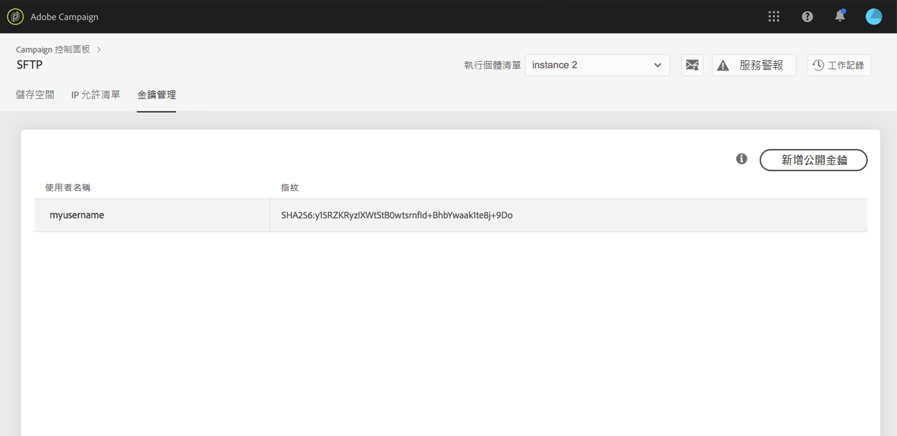

# 登入您的 SFTP 伺服器 {#logging-into-sft-server}

下列步驟詳細說明如何透過 SFTP 用戶端應用程式連線 SFTP 伺服器。

在[影片](https://video.tv.adobe.com/v/27263?quality=12)中探索此功能

登入伺服器之前，請確定：

* **由 Adobe 託管** SFTP 伺服器。
* 已為伺服器設定您的&#x200B;**使用者名稱**。您可以在「控制面板」中，前往「SFTP 卡片」的&#x200B;**金鑰管理**&#x200B;標籤直接查看這項資訊。
* 您有&#x200B;**私密與公開金鑰配對**，可以登入 SFTP 伺服器。 請參閱[本章節](../../sftp/using/key-management.md)，以進一步了解如何新增 SSH 金鑰。
* 已在 SFTP 伺服器上&#x200B;**將公開 IP 位址新增至允許清單**。若非如此，請參閱[本章節](../../sftp/using/ip-range-allow-listing.md)，以進一步了解如何將 IP 範圍新增至允許清單。
* 您有存取&#x200B;**SFTP 用戶端軟體**&#x200B;的權限。您可以向 IT 部門洽詢其建議使用的 SFTP 用戶端應用程式，或搜尋網際網路上的應用程式 (如果公司政策允許的話)。

若要連線至 SFTP 伺服器，請依照下列步驟進行：

1. 啟動「控制面板」，然後選取 **[!UICONTROL SFTP]** 卡片中的&#x200B;**[!UICONTROL 金鑰管理]**&#x200B;標籤。

   

1. 啟動 SFTP 用戶端應用程式，從「控制面板」複製並貼上伺服器位址，後面接著「campaign.adobe.com」，然後填寫您的使用者名稱。

   

1. 在 **[!UICONTROL SSH 私密金鑰]**&#x200B;欄位中，選取儲存在電腦中的私密金鑰檔案。 其對應至與公開金鑰同名的文字檔案，不含「.pub」副檔名 (例如「enable」)。

   

   此&#x200B;**[!UICONTROL 密碼]**&#x200B;欄位會自動填入該檔案中的私密金鑰。

   

   您可以比較私密或公開金鑰的指紋與 SFTP 卡片的「金鑰管理」標籤中顯示的金鑰指紋，檢查嘗試使用的金鑰是否儲存在「控制面板」中。

   

   >[!NOTE]
   >
   >如果您使用 Mac 電腦，可以執行此命令來檢視儲存在電腦中的私密金鑰指紋：
   >
   >`ssh-keygen -lf <path of the privatekey>`

1. 填入所有資訊後，按一下&#x200B;**[!UICONTROL 連線]**&#x200B;以登入 SFTP 伺服器。

   
