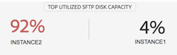
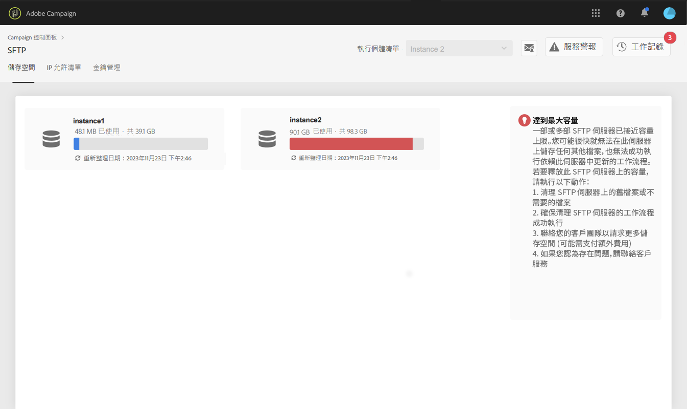

# SFTP儲存管理 {#sftp-storage-management}

根據您的合約條款，您的SFTP伺服器上可能會布建不同的儲存容量。

您必須定期監控每個SFTP伺服器的可用空間。 否則，您可能無法再在伺服器上儲存任何其他檔案，或無法成功執行依賴此伺服器更新的工作流程。

**相關主題：**

* [Campaign standard教學課程影片](https://docs.adobe.com/content/help/en/campaign-learn/campaign-standard-tutorials/administrating/control-panel/monitoring-server-capacity-whitelisting-adding-ssh-key.html)
* [Campaign Classic教學課程影片](https://docs.adobe.com/content/help/en/campaign-learn/campaign-classic-tutorials/administrating/control-panel-acc/managing-sftp-servers.html)

## 訪問儲存容量資訊 {#accessing-storage-capacity-information}

標題 **[!UICONTROL Top utilized SFTP disk capacity]**中的區段包含前三個最常使用的伺服器，這些伺服器會附加至您具有管理員存取權的例項。 此資訊可在SFTP卡的每個標籤中取用。

SFTP卡的標籤中提供您有權存取的所有執行個體所使用之 **[!UICONTROL Storage]**空間的相關資訊。 每次重新整理頁面時都會更新。

對於每個實例，可視警報可讓您知道其儲存容量何時超過：

* **橙色**:案件量超過了80%,
* **紅色**:這次的比賽超過了90%的產能。

此外，您還可取得其他提示，以協助您瞭解如何在伺服器接近容量時繼續作業。

## 儲存容量用完時的最佳做法 {#best-practices-when-capacity-runs-out}

1. **從舊的或不必要的檔案清除SFTP伺服器**。 有關如何訪問SFTP伺服器資料夾的詳細資訊，請參 [閱本節](../../sftp/using/logging-into-sftp-server.md)。
1. 請確定清除 **SFTP伺服器** 的工作流程正在成功執行。 如需Adobe Campaign技術工作流程的詳細資訊，請參閱專屬的 [Campaign Classic](https://docs.campaign.adobe.com/doc/AC/en/WKF__General_operation_Building_a_workflow.html#Technical_workflows) 和 [Campaign Standard檔案](https://helpx.adobe.com/campaign/standard/administration/using/technical-workflows.html) 。
1. 請洽詢您的客戶團隊，以索 **取更多儲存空間** （可能需支付額外費用）。
1. 如果您認為有問題，請聯繫&#x200B;**客戶服務**。
