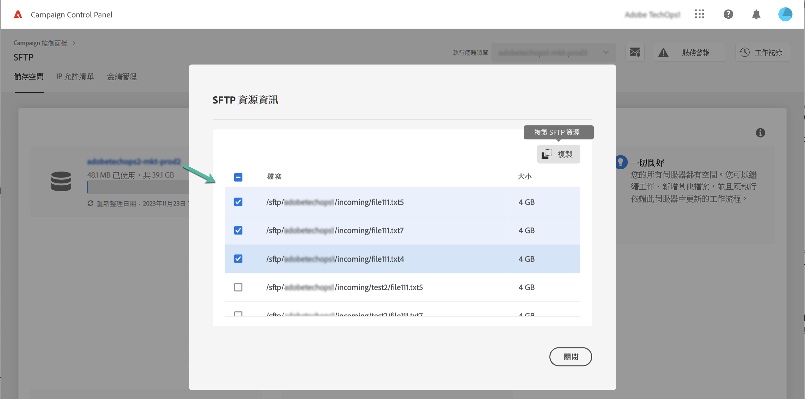

# SFTP 儲存空間管理 {#sftp-storage-management}

>[!CONTEXTUALHELP]
>id="cp_storage"
>title="關於儲存容量"
>abstract="在此索引標籤中，您可以檢視 SFTP 伺服器的儲存容量和使用率資訊。您還可以按一下 SFTP 伺服器名稱，列出 SFTP 伺服器上佔用最多空間的前 10 個檔案。 此處僅顯示您可存取的 SFTP 伺服器。請聯絡您的管理員以要求存取其他 SFTP 伺服器。"
>additional-url="https://images-tv.adobe.com/mpcv3/8a977e03-d76c-44d3-853c-95d0b799c870_1560205338.1920x1080at3000_h264.mp4" text="觀看示範影片"

視您的合約條款而定，您的 SFTP 伺服器上可能會佈建不同的儲存容量。

您必須定期監視每個 SFTP 伺服器的可用空間，否則，您可能無法再在伺服器上儲存任何其他檔案，或是無法成功執行須依賴此伺服器更新的工作流程。

利用 [Campaign v7/v8](https://experienceleague.adobe.com/docs/campaign-classic-learn/control-panel/sftp-management/monitoring-server-capacity.html?lang=zh-Hant) 或 [Campaign Standard](https://experienceleague.adobe.com/docs/campaign-standard-learn/control-panel/sftp-management/monitoring-server-capacity.html?lang=zh-Hant) 在影片中瞭解此功能

## 存取儲存容量資訊 {#accessing-storage-capacity-information}

SFTP 卡片 **[!UICONTROL Storage]** 索引標籤中會提供關於您有權存取之所有執行個體使用的空間資訊。每次重新整理頁面時都會更新。

每個執行個體都會提供視覺化的警報，在執行個體的儲存空間超過其容量時通知您：

* **橙色**：執行個體已超出其容量的 80%。
* **紅色**：執行個體已超出其容量的 90%。

您還可以按一下 SFTP 伺服器名稱，識別 SFTP 伺服器上佔用最多空間的前 10 個檔案。

此外，我們還提供其他提示，協助您瞭解在伺服器達到其容量上限時應如何處理。

## 儲存容量耗盡時的最佳實務 {#best-practices-when-capacity-runs-out}

1. **從舊有或不必要的檔案清除 SFTP 伺服器**。如需進一步瞭解如何存取您的 SFTP 伺服器資料夾，請參閱[本章節](../../sftp/using/logging-into-sftp-server.md)。
1. 請確定清除 SFTP 伺服器的&#x200B;**工作流程**&#x200B;成功執行。如需 Adobe Campaign 技術工作流程的詳細資訊，請參閱專屬的 [Campaign v7/v8](https://experienceleague.adobe.com/docs/campaign-classic/using/automating-with-workflows/advanced-management/about-technical-workflows.html?lang=zh-Hant) 和 [Campaign Standard](https://experienceleague.adobe.com/docs/campaign-standard/using/administrating/application-settings/technical-workflows.html?lang=zh-Hant) 文件。
1. 請聯繫您的客戶團隊，以&#x200B;**要求取更多儲存空間** (可能需支付額外費用)。
1. 如果您認為有問題，請聯繫&#x200B;**客戶服務**。
