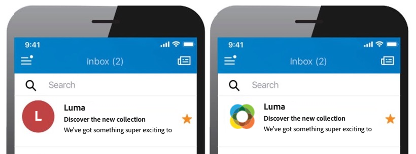
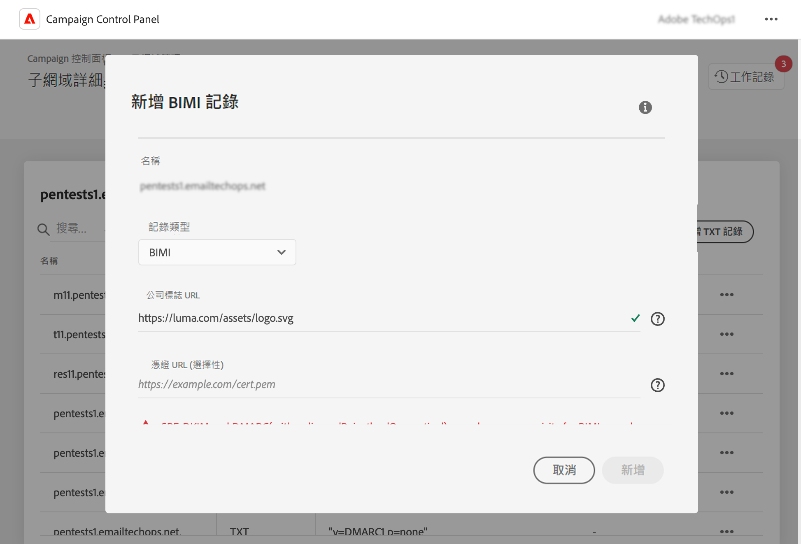

# 新增 BIMI 記錄 {#dmarc}

## 關於 BIMI 記錄 {#about}

訊息識別品牌指標(BIMI)是一種產業標準，允許在信箱提供者的收件匣中寄件者的電子郵件旁邊顯示核准的標誌，以增強品牌認知度和信任。

有關 BIMI 實作的詳細資訊，請參閱 [Adobe 傳遞能力最佳實務指南](https://experienceleague.adobe.com/docs/deliverability-learn/deliverability-best-practice-guide/additional-resources/technotes/implement-bimi.html?lang=zh-Hant)

{width="70%" align="center"}

## 限制和先決條件 {#limitations}

* SPF、DKIM 和 DMARC 記錄是建立 BIMI 記錄的必要條件

* BIMI記錄需要在DNS中發佈，對於完全委派網域，這是可以透過「控制面板」進行。 [進一步瞭解子網域設定方法](subdomains-branding.md#subdomain-delegation-methods)

* DMARC 記錄的先決條件：

   * 組織網域的記錄原則型別必須設定為「隔離」或「拒絕」。 DMARC 原則類型設為「無」時，無法建立 BIMI 記錄。
   * 套用 DMARC 原則的電子郵件百分比必須為 100%。 BIMI 不支援將此百分比設定為小於 100% 的 DMARC 原則。

[瞭解如何設定 DMARC 記錄](dmarc.md)

## 為子網域新增 BIMI 記錄 {#add}

若要新增子網域的 BIMI 記錄，請遵循下列步驟：

1. 從子網域清單中，按一下所需子網域旁的省略符號按鈕，然後選取&#x200B;**[!UICONTROL 子網域詳細資訊]**。

1. 按一下&#x200B;**[!UICONTROL 新增 TXT 記錄]**&#x200B;按鈕，然後從&#x200B;**[!UICONTROL 記錄類型]**&#x200B;下拉式清單中選擇 **[!UICONTROL BIMI]**。

   

1. **[!UICONTROL 選擇器]**&#x200B;欄位可讓您為記錄指定 BIMI 選擇器。BIMI 選擇器是您可以指派給 BIMI 記錄的唯一識別碼。這可讓您為特定子網域定義多個標誌。 目前信箱提供者不支援此功能。

1. 在&#x200B;**[!UICONTROL 公司標誌 URL]** 中，指定包含貴公司標誌 SVG 檔案的 URL。

1. 雖然&#x200B;**[!UICONTROL 憑證URL]**&#x200B;是選擇性的，但某些信箱提供者(如Gmail和Apple)需要它。 因此，建議您取得經過認證的標籤憑證 (VMC)，以確實善用 BIMI。

   +++如何取得 VMC？

   取得 VMC 的主要步驟如下：

   1. 在 VMC 發行者認可的智慧財產辦公室註冊您的品牌標誌為商標。 如果您有法務團隊，建議您與其合作以取得商標標誌，或確認商標已註冊。 

   1. 確認標誌已註冊為商標後，請連絡 DigiCert 或 Entrust 憑證授權單位 (CA) 請求 VMC。

   1. 您的 VMC 獲得核准後，您將會收到實體憑證 Privacy Enhanced Mail (PEM) 檔案。 將您從 CA 取得的任何其他中繼憑證附加至此 PEM 檔案。 上傳 PEM 檔案 (連同附加的檔案) 至您的公開 Web 伺服器，並記下 PEM 檔案 URL。 您會在 BIMI TXT 記錄中使用該 URL。

   1. 一旦特定子網域的子網域詳細資訊頁面中顯示 BIMI 記錄，您就可以使用[此處](https://bimigroup.org/bimi-generator/)提供的 BIMI 檢測器來檢查 BIMI 記錄是否正常運作。

   有關 BIMI 實作的詳細資訊，請參閱 [BIMI 標準文件](https://bimigroup.org/implementation-guide/)
+++

1. 按一下&#x200B;**[!UICONTROL 新增]**&#x200B;以確認建立 BIMI 記錄。

建立 BIMI 記錄之後 (大約 5 分鐘)，它就會顯示在子網域的詳細資訊畫面中。 [瞭解如何監視子網域的 TXT 記錄](gs-txt-records.md#monitor)
