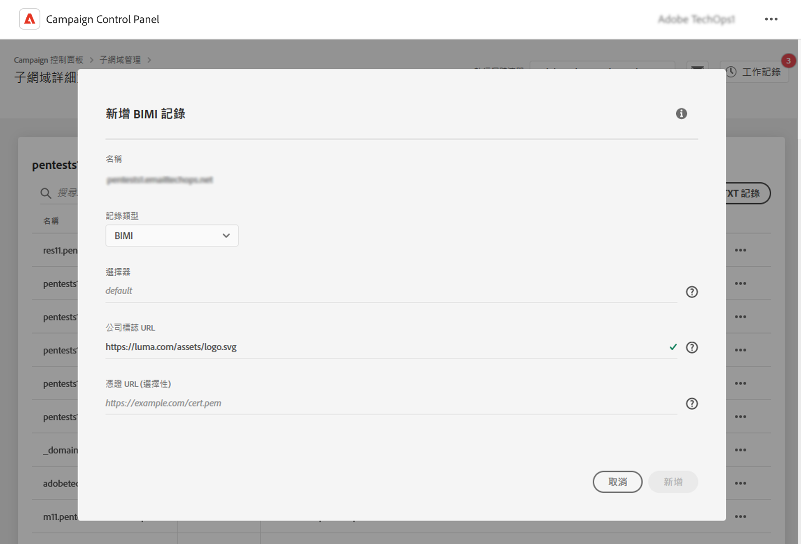

# 新增BIMI記錄 {#dmarc}

## 關於BIMI記錄 {#about}

訊息識別品牌指標(BIMI)是一種產業標準，允許在信箱提供者的收件匣中寄件者的電子郵件旁邊顯示核准的標誌，以增強品牌認知度和信任。 它透過DMARC驗證寄件者的身分，有助於防止電子郵件詐騙和網路釣魚，讓惡意行為者更難以在電子郵件中模擬合法品牌。

有關BIMI實作的詳細資訊，請參閱 [Adobe傳遞性最佳實務指南](https://experienceleague.adobe.com/docs/deliverability-learn/deliverability-best-practice-guide/additional-resources/technotes/implement-bimi.html)

{width="70%" align="center"}

## 限制和必要條件 {#limitations}

* SPF、DKIM和DMARC記錄是建立BIMI記錄的先決條件。
* 只能使用完整子網域委派的子網域新增BIMI記錄。 [進一步瞭解子網域設定方法](subdomains-branding.md#subdomain-delegation-methods)
* DMARC記錄的必要條件：

   * 子網域的記錄原則型別必須設為「隔離」或「拒絕」。 DMARC原則型別設為「無」時，無法建立BIMI記錄。
   * 套用DMARC原則的電子郵件百分比必須為100%。 BIMI不支援將此百分比設定為小於100%的DMARC政策。

[瞭解如何設定DMARC記錄](dmarc.md)

## 為子網域新增BIMI記錄 {#add}

若要新增子網域的BIMI記錄，請遵循下列步驟：

1. 從子網域清單中，按一下所需子網域旁的省略符號按鈕，然後選取 **[!UICONTROL Subdomain details]**.

1. 按一下 **[!UICONTROL Add TXT record]** 按鈕，然後選擇 **[!UICONTROL BIMI]** 從 **[!UICONTROL Record type]** 下拉式清單。

   

1. 在 **[!UICONTROL Company Logo URL]**，指定包含您標誌之SVG檔案的URL。

1. 不過 **[!UICONTROL Certificate URL]** 這是選用專案，因此某些信箱供應商(例如Gmail和Apple)需要此專案，這些供應商涵蓋信箱市場的80%。 因此，建議您取得認證的標籤憑證(VMC)，以確實運用BIMI。

   +++如何取得VMC？

   取得VMC的主要步驟如下：

   1. 在VMC發行者認可的智慧財產辦公室註冊您的品牌圖志為商標。 如果您有法務團隊，建議您與法務團隊合作，取得商標標誌，或確認商標已註冊。

   1. 確認標誌已商標後，請連絡DigiCert或Entrust憑證授權單位(CA)要求VMC。

   1. 您的VMC獲得核准後，您將會收到實體憑證Privacy Enhanced Mail (PEM)檔案。 將您從CA取得的任何其他中繼憑證附加至此PEM檔案。 上傳PEM檔案（連同附加的檔案）至您的公用Web伺服器，並記下PEM檔案URL。 您會在BIMI TXT記錄中使用URL。

   1. 一旦特定子網域的子網域詳細資訊頁面中顯示BIMI記錄，您就可以使用可用的BIMI檢測器 [此處](https://bimigroup.org/bimi-generator/) 檢查BIMI記錄是否正常運作。

   有關BIMI實作的詳細資訊，請參閱 [BIMI標準檔案](https://bimigroup.org/implementation-guide/)
+++

1. 按一下 **[!UICONTROL Add]** 以確認BIMI記錄建立。

處理BIMI記錄建立作業之後（大約5分鐘），就會顯示在子網域的詳細資訊畫面中。 [瞭解如何監視子網域的TXT記錄](gs-txt-records.md#monitor)
