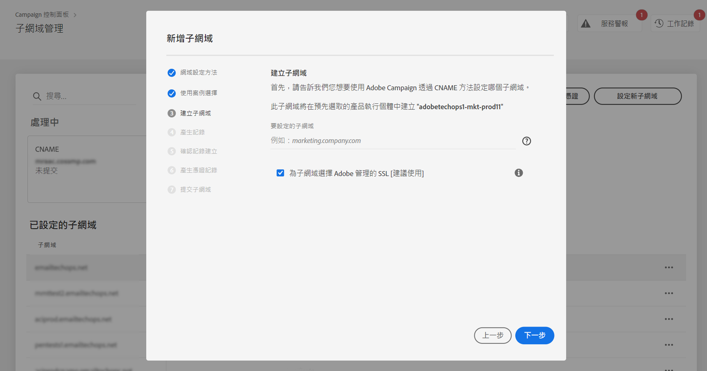
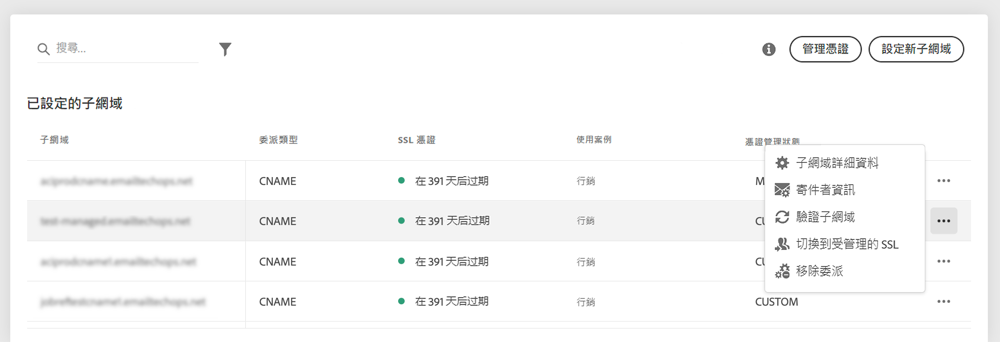
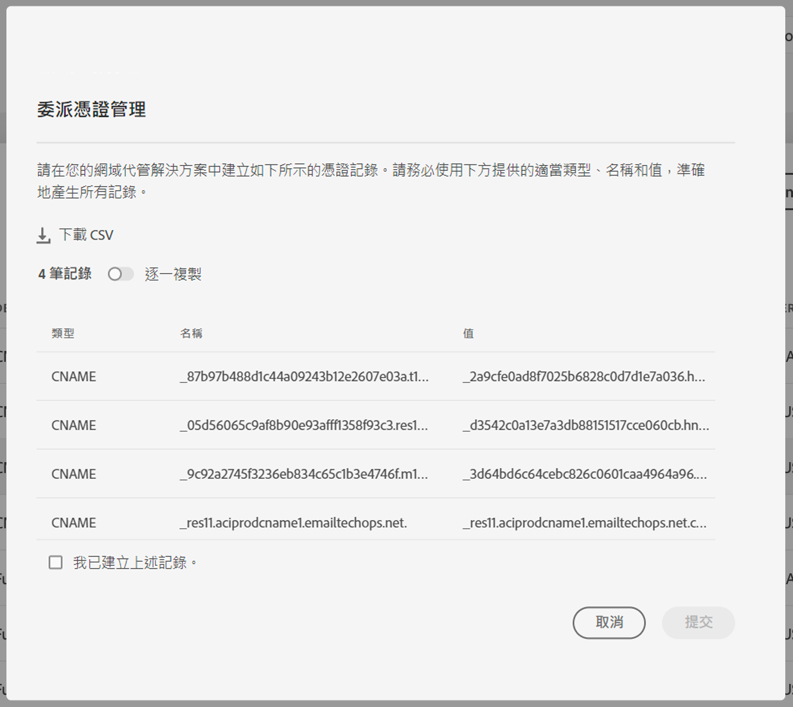

# 將子網域的 SSL 憑證委派給 Adobe {#delegate-ssl-certificates}

>[!CONTEXTUALHELP]
>id="cp_managed_ssl"
>title="將子網域的 SSL 憑證委派給 Adobe"
>abstract="控制面板可讓您將子網域的 SSL 憑證交由 Adobe 管理。如果您是使用 CNAME 設定子網域，就會自動產生和提供憑證記錄，以便在您的網域託管解決方案中產生憑證。"

強烈建議將子網域的 SSL 憑證委派給 Adobe 管理，因為 Adobe 每年都會在憑證過期前，自動建立並更新憑證。

如果您使用 CNAME 來設定子網域委派，Adobe 將提供憑證記錄，以用於網域託管解決方案來產生憑證。

設定新的子網域時，或針對已委派的子網域，都可以執行將 SSL 憑證委派給 Adobe。

>[!NOTE]
>
>Adobe 受管理 SSL 是免費提供給使用者的功能。將子網域的憑證委派給 Adobe 是透明的，對您的行銷活動和傳遞能力沒有影響。 [了解更多 SSL 憑證管理相關資訊](monitoring-ssl-certificates.md#management)

## 委派新子網域的 SSL 憑證 {#new}

若要在設定新子網域時委派SSL憑證，請啟用 **[!UICONTROL 子網域選擇使用Adobe管理的SSL]** 子網域設定精靈的選項。 稍後會在設定精靈中提供要複製到託管解決方案的憑證記錄。 詳細步驟記錄於[此章節](setting-up-new-subdomain.md)。

{width="70%" align="left"}

## 針對已委派的子網域委派 SSL 憑證 {#delegated}

若要委派已委派子網域的SSL憑證，請按一下所需子網域旁的省略符號按鈕，然後按一下 **[!UICONTROL 切換到受管理的SSL]**.

{width="70%" align="left"}

隨即顯示對話方塊，其中包含 Adobe 自動產生的憑證記錄。 逐一複製這些記錄，或下載 CSV 檔案，然後瀏覽至網域託管解決方案，以產生相符的憑證。

請確定已在網域託管解決方案中產生所有憑證記錄。 如果所有專案都已正確設定，請確認記錄建立，然後按一下 **[!UICONTROL 提交]**.

{width="70%" align="left"}
