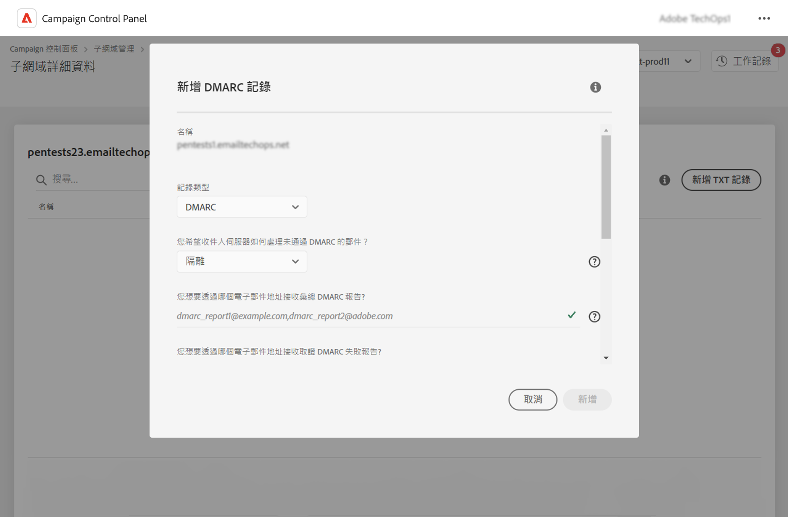
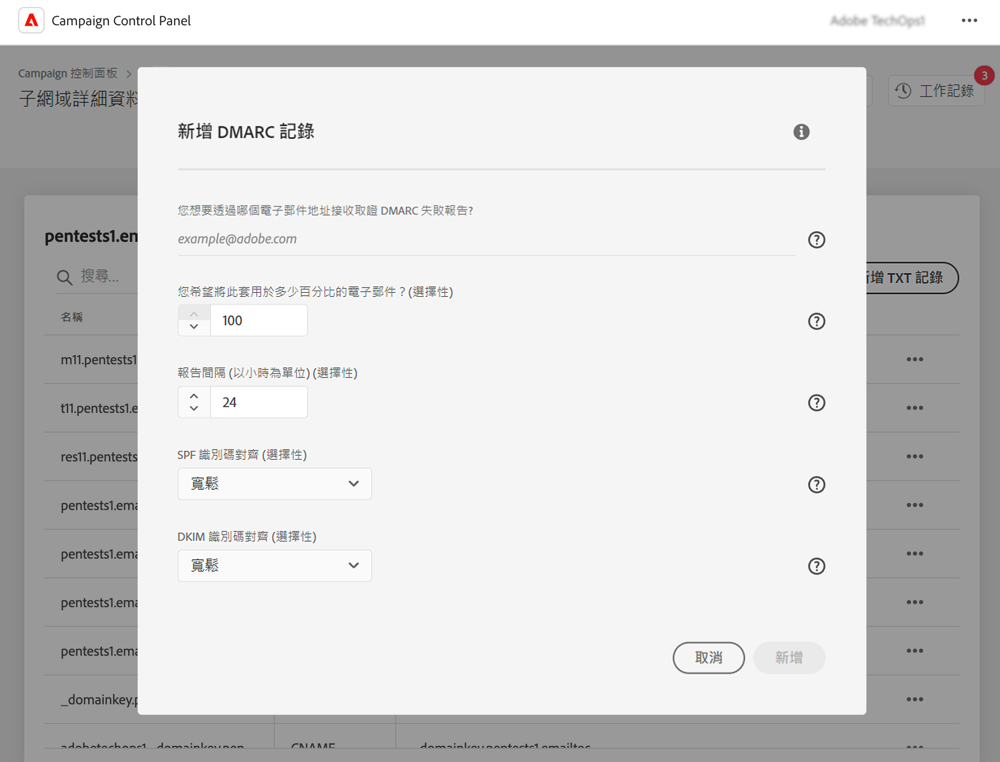

# 新增DMARC記錄 {#dmarc}

## 關於DMARC記錄 {#about}

網域型訊息驗證、報告及一致性(DMARC)是一種電子郵件驗證通訊協定標準，可協助組織保護其電子郵件網域免受網路釣魚和詐騙攻擊。 它可讓您決定信箱提供者應如何處理未通過SPF和DKIM檢查的電子郵件，提供驗證傳送者網域的方式，並防止未經授權而惡意使用網域。

有關DMARC實施的詳細資訊，請參閱 [Adobe傳遞性最佳實務指南](https://experienceleague.adobe.com/docs/deliverability-learn/deliverability-best-practice-guide/additional-resources/technotes/implement-dmarc.html)

## 限制和必要條件 {#limitations}

* SPF和DKIM記錄是建立DMARC記錄的先決條件。
* 只能使用完整子網域委派的子網域新增DMARC記錄。 [進一步瞭解子網域設定方法](subdomains-branding.md#subdomain-delegation-methods)

## 為子網域新增DMARC記錄 {#add}

若要為子網域新增DMARC記錄，請遵循下列步驟：

1. 從子網域清單中，按一下所需子網域旁的省略符號按鈕，然後選取 **[!UICONTROL Subdomain details]**.

1. 按一下 **[!UICONTROL Add TXT record]** 按鈕，然後選擇 **[!UICONTROL DMARC]** 從 **[!UICONTROL Record Type]** 下拉式清單。

   

1. 選擇 **[!UICONTROL Policy Type]** 當您的其中一封電子郵件失敗時，收件者伺服器應該遵循的規則。 可用的原則型別為：

   * **[!UICONTROL None]**，
   * **[!UICONTROL Quarantine]** （垃圾郵件資料夾位置），
   * **[!UICONTROL Reject]** （封鎖電子郵件）。

   依據最佳做法的要求，建議您逐步推出DMARC實作，將DMARC原則從p=none提升至p=quarantine，再提升至p=reject，讓DMARC瞭解DMARC的潛在影響。

   * **步驟1：** 分析您收到並使用的意見回饋(p=none)，這會告知接收者，對於驗證失敗的訊息不執行任何動作，但仍會傳送電子郵件報告給寄件者。 此外，如果合法訊息驗證失敗，請檢閱並修正SPF/DKIM的問題。

   * **步驟2：** 判斷SPF和DKIM是否一致，並通過所有合法電子郵件的驗證，然後將原則移至(p=quarantine)，這會通知接收電子郵件伺服器隔離驗證失敗的電子郵件（這通常意味著將這些郵件放在垃圾郵件資料夾中）。 如果原則設定為隔離，其建議您從一小部分電子郵件開始。

   * **步驟3：** 將原則調整為（p=拒絕）。 注意：請謹慎使用此原則，並判斷其是否適合您的組織。 p=拒絕原則會告訴接收者，對於驗證失敗的網域，要完全拒絕（退回）任何電子郵件。 啟用此原則後，只有經過網域驗證為100%驗證的電子郵件才有機會放置收件匣。

   >[!NOTE]
   >
   > DMARC記錄原則型別設為「無」時，無法建立BIMI記錄。

1. 填寫應接收DMARC報表的電子郵件地址。 當您的其中一封電子郵件失敗時，DMARC報告會自動傳送至您選擇的電子郵件地址：

   * 彙總DMARC報表可提供高階資訊，例如在指定期間內失敗的電子郵件數量。
   * 取證DMARC失敗報告會提供詳細資訊，例如失敗的電子郵件來自哪個IP位址。

1. 如果DMARC原則設為「無」，請輸入套用至100%電子郵件的百分比。

   如果原則設定為「拒絕」或「隔離」，建議您從一小部分電子郵件開始。 由於來自您網域的電子郵件較多，且已通過接收伺服器的驗證，因此請使用較高的百分比緩慢更新您的記錄。

   >[!NOTE]
   >
   >如果您的網域使用BIMI，您的DMARC原則必須具有百分比值100%。 BIMI不支援這個值設定為小於100%的DMARC原則。

   

1. DMARC報告每24小時傳送一次。 您可以在以下位置變更報表傳送頻率： **[!UICONTROL Reporting Interval]** 欄位。 最小授權間隔為1小時，而最大授權值為2190小時（即3個月）。

1. 在 **SPF** 和 **[!UICONTROL DKIM Identifier Alignment]** 欄位，指定在檢查電子郵件的SPF和DKIM驗證時，收件者伺服器的嚴格程度。

   * **[!UICONTROL Relaxed]** 模式：即使電子郵件是從子網域傳送，伺服器仍接受驗證，
   * **[!UICONTROL Strict]** 只有當傳送者網域與SPF和DKIM網域完全相符時，模式才會接受驗證。

   假設我們正在使用 `http://www.luma.com` 網域。 在「寬鬆」模式中，來自 `marketing.luma.com` 子網域將由伺服器授權，但在「嚴格」模式下將會遭到拒絕。

1. 按一下 **[!UICONTROL Add]** 以確認建立DMARC記錄。

處理DMARC記錄建立作業之後（大約5分鐘），就會顯示在子網域的詳細資訊畫面中。 [瞭解如何監視子網域的TXT記錄](gs-txt-records.md#monitor)
