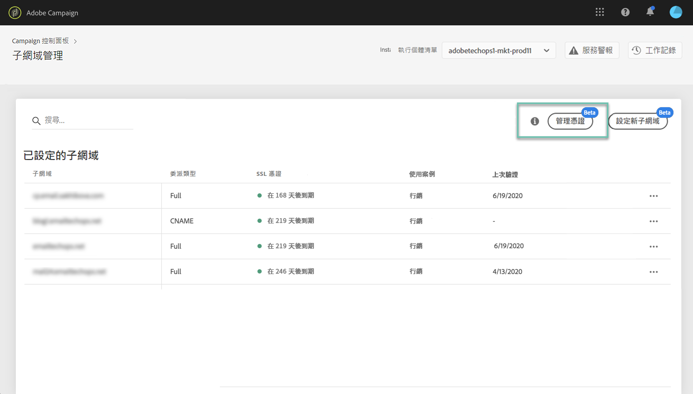
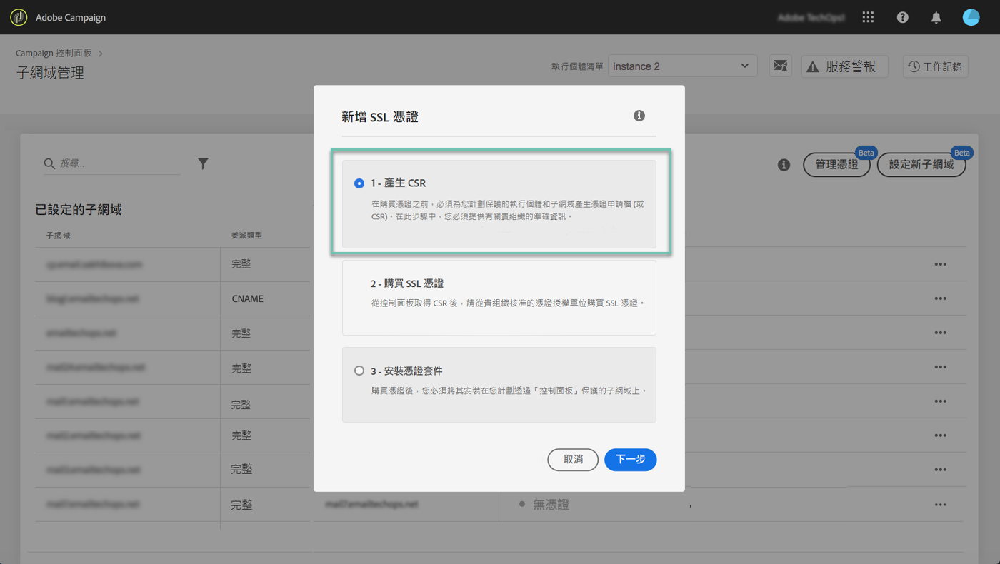
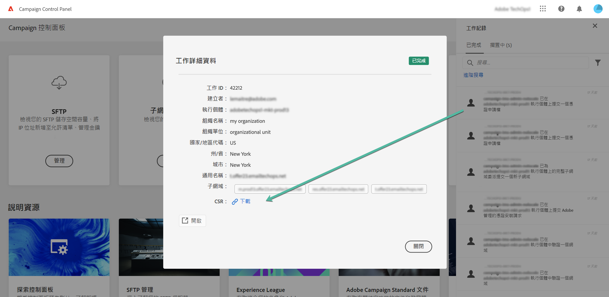

# 產生 CSR {#generating-csr}

>[!CONTEXTUALHELP]
>id="cp_generate_csr"
>title="CSR 產生"
>abstract="您必須在購買憑證之前，先針對您打算保護的執行個體和子網域產生憑證簽署要求。"

>[!CONTEXTUALHELP]
>id="cp_select_subdomains"
>title="選擇 CSR 的子網域"
>abstract="您可以選擇將所有或僅特定子網域納入您的憑證簽署請求。只有選取的子網域才會透過購買的 SSL 憑證取得認證。"
>additional-url="https://experienceleague.adobe.com/docs/control-panel/using/subdomains-and-certificates/subdomains-branding.html?lang=zh-Hant" text="關於子網域名稱"

## 產生 CSR {#generate}

若要產生憑證簽署要求 (CSR)，請執行下列步驟：

1. 在「**[!UICONTROL Subdomains & Certificates]**」卡片中，選取所需的執行個體，再按一下 **[!UICONTROL Manage Certificate]** 按鈕。

   

1. 選取「**[!UICONTROL 1 - Generate a CSR]**」，然後按一下「**[!UICONTROL Next]**」以啟動精靈，引導您完成 CSR 產生流程。

   

1. 隨即會顯示表格，其中包含產生 CSR 所需的所有詳細資訊。

   請確定您完整且正確地填妥要求的資訊，否則不會續約憑證 (若有需要，請聯絡您的內部團隊、安全性和 IT 團隊)，然後按一下「**[!UICONTROL Next]**」。

   * **[!UICONTROL Organization]**：正式組織名稱。
   * **[!UICONTROL Organization Unit]**：連結至子網域的單位 (範例：行銷、IT)。
   * **[!UICONTROL Instance]**(預填)：與子網域相關聯之 Campaign 執行個體的 URL。
   * **[!UICONTROL Common name]**:預設會選取通用名稱，您可以視需要選取其中一個子網域。

   

1. 選取要包含在 CSR 中的子網域，然後按一下「**[!UICONTROL OK]**」。

   

1. 選取的子網域會顯示在清單中。選取每個要包含的子網域，然後按一下「**[!UICONTROL Next]**」。

   

1. 隨即顯示包含在 CSR 的子網域摘要。按一下「**[!UICONTROL Submit]**」下以確認您的請求。

   

   >[!NOTE]
   >
   >此 **[!UICONTROL Copy CSR content]** 按鈕可讓您複製與CSR相關的所有資訊（組織ID、例項、組織名稱、通用名稱、包含的子網域等）

1. 系統會自動產生並下載與您選取範圍相應的 .csr 檔案。您現在可以用它透過貴公司核准的憑證機構購買 SSL 憑證。如果您需要再次下載CSR，請依照 [本節](#download).

產生並下載CSR後，您就可以使用CSR從貴組織核准的憑證機構購買SSL憑證。

購買SSL憑證後，您就能將它安裝在執行個體上，以保護您的子網域。 [了解更多](install-ssl-certificate.md)

## 下載CSR {#download}

若要購買SSL憑證，您必須先下載憑證簽署要求。 CSR在產生後會自動下載。 您也可以隨時從「工作記錄」重新下載：

1. 在 **[!UICONTROL Job Logs]**，請選取 **[!UICONTROL Finished]** ，然後篩選清單以顯示與子網域管理相關的作業。

   

1. 開啟與產生CSR對應的工作，然後按一下 **[!UICONTROL Downbload]** 連結以取得.csr檔案。

   
