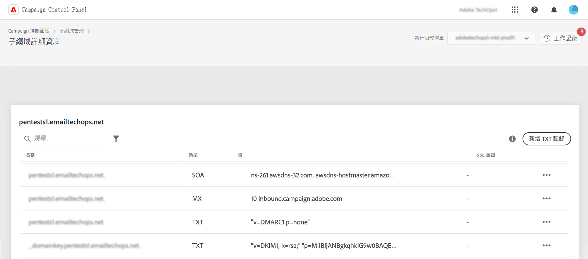

# 開始使用TXT記錄 {#managing-txt-records}

>[!CONTEXTUALHELP]
>id="cp_siteverification_add"
>title="管理 TXT 記錄"
>abstract="TXT 記錄是一種 DNS 記錄，用於提供關於網域的文字資訊，可由外部來源讀取。控制面板可讓您為子網域新增三種類型的記錄：Google 網站驗證、DMARC 和 BIMI 記錄。"

## 關於 TXT 記錄 {#about}

TXT 記錄是一種 DNS 記錄，用於提供關於網域的文字資訊，可由外部來源讀取。「控制面板」可讓您將三種記錄型別新增至子網域：

* **Google TXT記錄** 可讓您驗證您擁有您的網域，確保高收件匣率和低垃圾郵件率。 [瞭解如何新增Google TXT記錄](managing-txt-records.md)
* **DMARC記錄** 提供驗證傳送者網域的方式，並防止未經授權而惡意使用網域。 [瞭解如何新增DMARC記錄](dmarc.md)
* **BIMI記錄** 可讓您在信箱提供者的收件匣中，於您的電子郵件旁邊顯示核准的標誌，以提升品牌認知度和信任度。 [瞭解如何新增BIMI記錄](bimi.md)

## 監視子網域的記錄 {#monitor}

您可以存取子網域的詳細資訊，以監視已為每個子網域新增的所有TXT記錄。

在此畫面中，所選子網域的所有TXT型別記錄都會顯示，並在其設定的「值」欄中顯示資訊。 若要刪除Google TXT、DMARC或BIMI記錄，請按一下省略符號按鈕，然後選取「刪除」。 如有必要，您也可以編輯DMARC和BIMI記錄。

