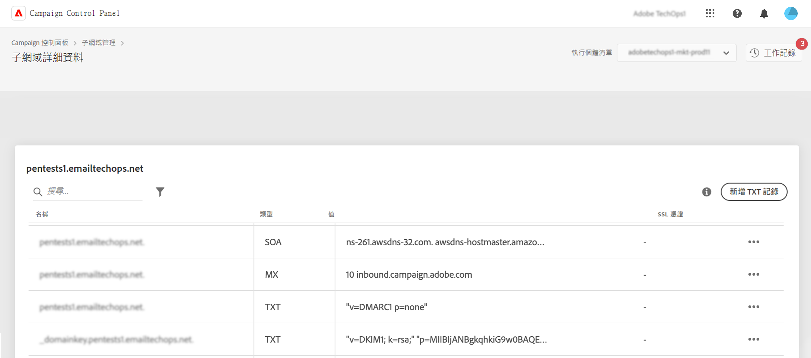

# 開始使用 TXT 記錄 {#managing-txt-records}

>[!CONTEXTUALHELP]
>id="cp_siteverification_add"
>title="管理 TXT 記錄"
>abstract="TXT 記錄是一種 DNS 記錄，用於提供關於網域的文字資訊，可由外部來源讀取。 控制面板可讓您為子網域新增三種類型的記錄：Google 網站驗證、DMARC 和 BIMI 記錄。"

## 關於 TXT 記錄 {#about}

TXT 記錄是一種 DNS 記錄，用於提供關於網域的文字資訊，可由外部來源讀取。 「控制面板」可讓您將三種記錄類型新增至子網域：

* **GoogleTXT記錄**&#x200B;允許您證明您擁有域，確保電子郵件的收件箱率高且垃圾郵件率低。[瞭解如何添加GoogleTXT記錄](managing-txt-records.md)
* **DMARC記錄**&#x200B;提供了驗證發件人域並防止出於惡意目的未經授權使用域的方法。[瞭解如何添加DMARC記錄](dmarc.md)
* **BIMI記錄**&#x200B;允許您在郵箱提供商收件箱中的電子郵件旁顯示已批准的徽標，以增強品牌認知和信任。[瞭解如何添加BIMI記錄](bimi.md)

## 監視子網域的記錄 {#monitor}

您可以存取子網域的詳細資訊，以監視已為每個子網域新增的所有 TXT 記錄。

在此畫面中，所選子網域的所有 TXT 類型記錄都會顯示，並在其設定的「值」欄中顯示資訊。 若要刪除 Google TXT、DMARC 或 BIMI 記錄，請按一下省略符號按鈕，然後選取「刪除」。 如有必要，您也可以編輯 DMARC 和 BIMI 記錄。

