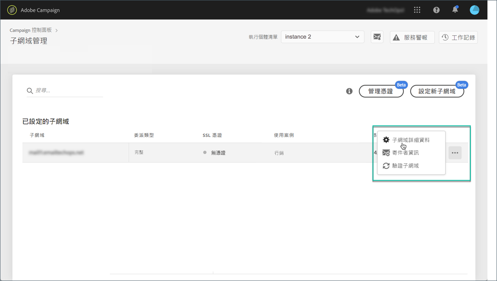
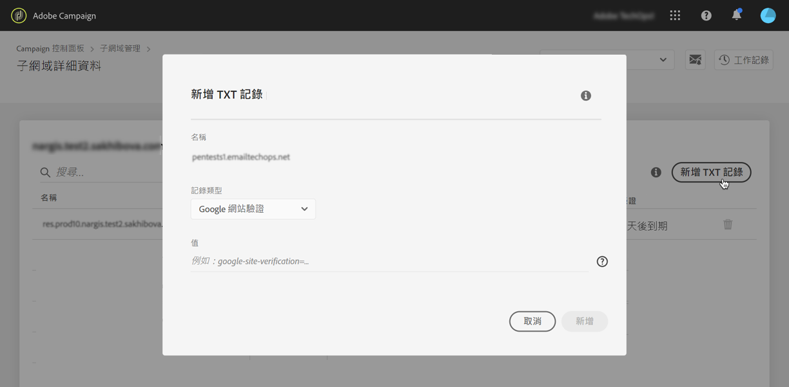
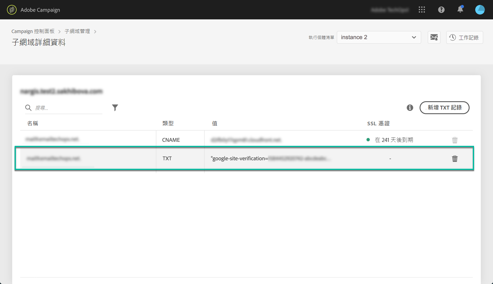

# 管理 TXT 記錄 {#managing-txt-records}

>[!CONTEXTUALHELP]
>id="cp_siteverification_add"
>title="管理 TXT 記錄"
>abstract="部分服務 (例如 Google) 會要求您在網域設定中新增 TXT 記錄，以驗證您擁有該網域。"

## 關於 TXT 記錄 {#about-txt-records}

>[!AVAILABILITY]
>
>此功能不適用於Campaign v8。

TXT 記錄是一種 DNS 記錄，用於提供關於網域的文字資訊，可由外部來源讀取。

為了確保達到高郵件到達率和低垃圾郵件率，Google 這類服務會要求您在網域設定中新增 TXT 記錄，以驗證您擁有該網域。

Gmail 是目前最受歡迎的電子郵件地址供應商之一。為了確保良好的傳遞率，並且成功傳送至 Gmail 地址，Adobe Campaign 可讓您在子網域中新增特殊的 Google 網站驗證 TXT 記錄，以確保其經過驗證。

利用 [Campaign Classic](https://experienceleague.adobe.com/docs/campaign-classic-learn/control-panel/subdomains-and-certificates/google-txt-record-management.html?lang=en#subdomains-and-certificates) 或 [Campaign Standard](https://experienceleague.adobe.com/docs/campaign-standard-learn/control-panel/subdomains-and-certificates/google-txt-record-management.html?lang=en#subdomains-and-certificates) 在影片中瞭解此功能

## 新增子網域的 Google TXT 記錄 {#adding-a-google-txt-record}

若要將 Google TXT 記錄新增至您用來傳送電子郵件至 Gmail 地址的子網域，請執行下列步驟：

1. 導覽至「**[!UICONTROL Subdomain and Certificates]**」資訊。

1. 選取執行個體，然後開啟要新增 DNS 記錄的子網域的詳細資訊。

   

1. 按一下&#x200B;**[!UICONTROL Add TXT record]**&#x200B;按鈕，然後輸入 G Suite 管理工具中產生的值。如需詳細資訊，請參閱 [G Suite 管理員說明](https://support.google.com/a/answer/183895)。

   

1. 按一下 **[!UICONTROL Add]**&#x200B;按鈕以確認。

   

新增 TXT 記錄後，該記錄必須獲得 Google 驗證。若要這麼做，請導覽至 G Suite 管理工具，然後啟動驗證步驟 (請參閱 [G Suite 管理員說明](https://support.google.com/a/answer/183895))。

若要刪除記錄，請從記錄清單中選取該記錄，然後按一下移除按鈕。

>[!NOTE]
>
>您只能從 DNS 記錄中刪除您先前新增的記錄 (在此情況中，即為 TXT 記錄)。
