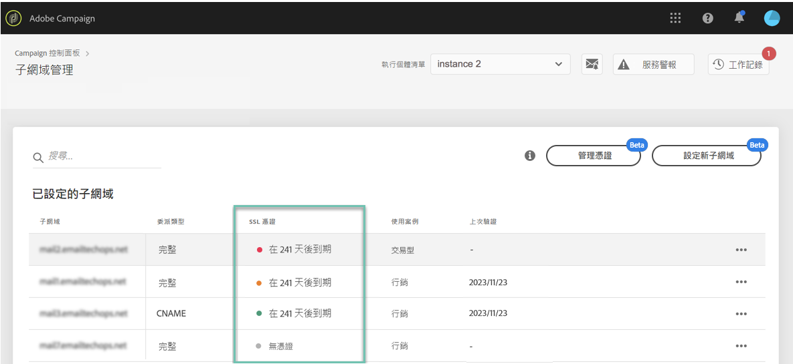
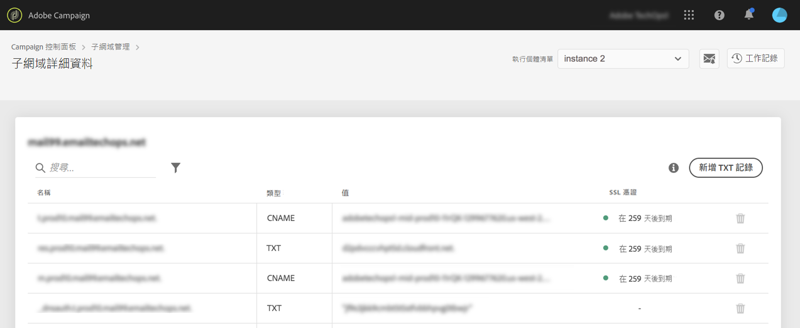

# 監視子網域的 SSL 憑證 {#monitoring-ssl-certificates}

## 關於 SSL 憑證 {#about-ssl-certificates}

Adobe Campaign 建議您保護託管登陸頁面之子網域的安全，尤其是收集客戶敏感資訊的子網域。

**SSL (安全通訊端層) 加密**&#x200B;可確保您設定要與 Adobe 搭配使用的子網域安全無虞。當您的客戶填寫網頁表格或造訪 Adobe Campaign 託管的登陸頁面時，系統會依預設透過非安全通訊協定 (HTTP) 傳送資訊。為確保多一層安全性，請使用 HTTPS 通訊協定來保護傳送的資訊。舉例來說，您的「http://info.mywebsite.com/」子網域位址現在會成為「https://info.mywebsite.com/」。

**所設定子網域本身並不會安裝 SSL 憑證**。它們會安裝在相關聯的子網域上，主要是託管登陸頁面、資源頁面等子網域。

**在特定時間內提供 SSL 憑證** (1年、60 天等等)。憑證過期後，您在存取登陸頁面或使用子網域的資源時，就可能會遇到問題。為避免出現此問題，「控制面板」可讓您監視子網域的 SSL 憑證，並啟動其續約流程。

## SSL 憑證管理 {#management}

SSL 憑證監視是確保子網域安全無虞的關鍵。 使用「控制面板」，您可以自行直接安裝和更新子網域的 SSL 憑證，或將其委派給 Adobe，以便自動執行此程序，而不需要您採取任何動作。

強烈建議將子網域的 SSL 憑證委派給 Adobe 管理，因為 Adobe 每年都會在憑證到期前，自動建立並更新憑證。這可在手動管理憑證時降低可能發生錯誤的風險。 [了解如何將子網域的 SSL 憑證委派給 Adobe](delegate-ssl.md)

您可在下方找到手動憑證管理相關影響的完整清單 (與將此作業委派給 Adobe 對照)：

|       | 客戶管理的憑證 | Adobe 管理的憑證 |
|  ---  |  ---  |  ---  |
| 憑證提供者 | 第三方憑證授權單位 | Adobe 透過 AWS Certificate Manager |
| 手動步驟 | 產生 CSR、購買和安裝憑證 | 無 |
| 更新程序 | 客戶自行負責 | 自動由 Adobe 管理 |
| 子網域安全性 | 除非您在安裝/更新憑證，否則網域可能會有不安全的子網域 (追蹤、鏡像和解析)。 | 每個新網域 (如果選擇由 Adobe 管理) 的所有子網域預設都受到保護。 |
| 憑證成本 | 客戶需承擔憑證成本 | 可用 |

## 監視 SSL 憑證 {#monitoring-certificates}

>[!CONTEXTUALHELP]
>id="cp_subdomain_details"
>title="子網域詳細資訊"
>abstract="擷取有關子網域的 SSL 憑證的資訊。"

選取&#x200B;**[!UICONTROL 子網域和憑證]**&#x200B;卡片時，您可以直接從子網域清單中取得子網域 SSL 憑證的狀態。

子網域會依 SSL 憑證的最近到期日排序，並提供過期的視覺化資訊 (以天為單位)：

* **綠色**：子網域在未來 60 天內沒有到期的憑證。
* **橙色**：一或多個子網域有一個會在未來 60 天內到期的憑證。
* **紅色**：一或多個子網域有一個會在未來 30 天內到期的憑證
* **灰色**：未為子網域安裝任何憑證。

若要取得子網域的詳細資料，請按一下&#x200B;**[!UICONTROL 子網域詳細資料]**按鈕。
隨即顯示所有相關子網域的清單。這通常會包括登陸頁面、資源頁面等等的子網域。

**[!UICONTROL 寄件者資訊]**&#x200B;標籤提供有關已設定收件匣的資訊 (寄件人、回覆、錯誤電子郵件)。

如果子網域的其中一個 SSL 憑證即將到期，您可以直接從「控制面板」續約。如需更多資訊，請參閱本節：[續約子網域的 SSL 憑證](../../subdomains-certificates/using/renewing-subdomain-certificate.md)。

**相關主題：**

* [續約子網域的 SSL 憑證](../../subdomains-certificates/using/renewing-subdomain-certificate.md)
* [子網域品牌化](../../subdomains-certificates/using/subdomains-branding.md)
