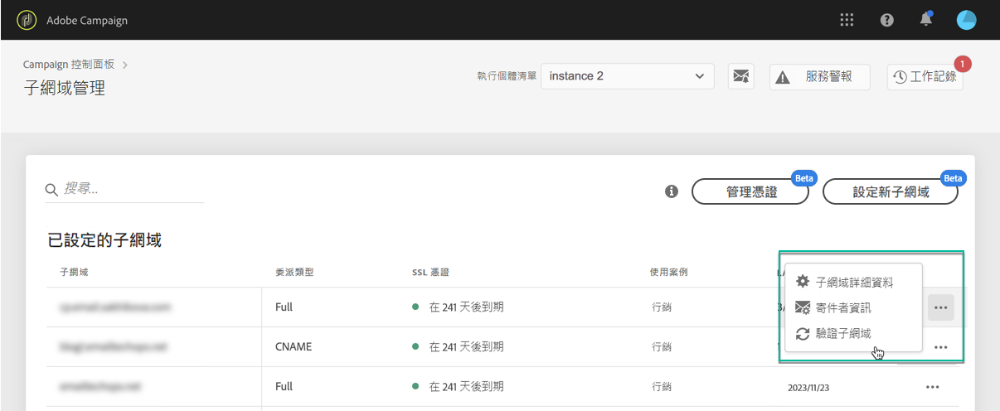

# 監控子網域 {#monitoring-subdomains}

您必須監控子網域，以確保所有子網域皆已正確設定，以搭配Adobe Campaign運作。

選取卡片時，可直接存取每個生產例項的子網域清 **[!UICONTROL Subdomains & Certificates]**單。

該 **[!UICONTROL Last verification]**列指示上次驗證子域的時間。** 您隨時都可以按一下…… **./按**[!UICONTROL Verify subdomain]** 鈕。

>[!CAUTION]
>
>Adobe不建議使用沒有憑證日期的子網域，因為這可能表示這些子網域可能有某些傳送能力問題。

啟動驗證時，會執行數個操作以檢查子網域的設定是否正確（例項租用戶檢查、電子郵件傳送測試等）

如果子網域的驗證失敗，請聯絡Adobe客戶服務以進一步調查。

**相關主題：**

* [新增SSL憑證（教學課程影片）](https://docs.adobe.com/content/help/en/campaign-learn/campaign-standard-tutorials/administrating/control-panel/adding-ssl-certificates.html)
* [續約子網域的SSL憑證](../..help/subdomains-certificates/using/renewing-subdomain-certificate.md)
* [子網域品牌](../../subdomains-certificates/using/subdomains-branding.md)
