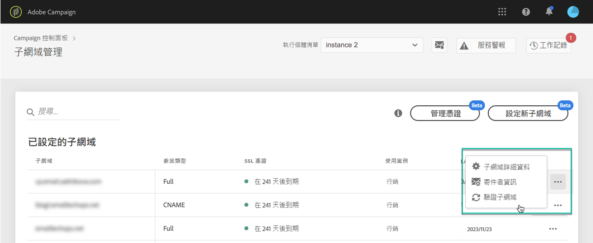

# 監視您的子網域 {#monitoring-subdomains}

務必要監視子網域，以確保全部皆已正確設定為與 Adobe Campaign 搭配使用。

選取&#x200B;**[!UICONTROL 子網域和憑證]**&#x200B;卡片時，可直接存取每個生產執行個體的子網域清單。

**[!UICONTROL 上次驗證]**&#x200B;欄指出上次驗證子網域的時間。 您可以隨時按一下 **...** / **[!UICONTROL 驗證子網域]**&#x200B;按鈕來啟動驗證。

>[!IMPORTANT]
>
>Adobe 不建議使用沒有憑證日期的子網域，因為這可能表示這些子網域可能有一些傳遞能力問題。

啟動驗證時，會執行數個操作來檢查子網域是否已正確設定（例項租使用者檢查、電子郵件傳送測試等） 如果子網域驗證失敗，請聯絡Adobe客戶服務以進一步調查。

**相關主題：**

* [續約子網域的 SSL 憑證](../../subdomains-certificates/using/renewing-subdomain-certificate.md)
* [子網域品牌化](../../subdomains-certificates/using/subdomains-branding.md)
