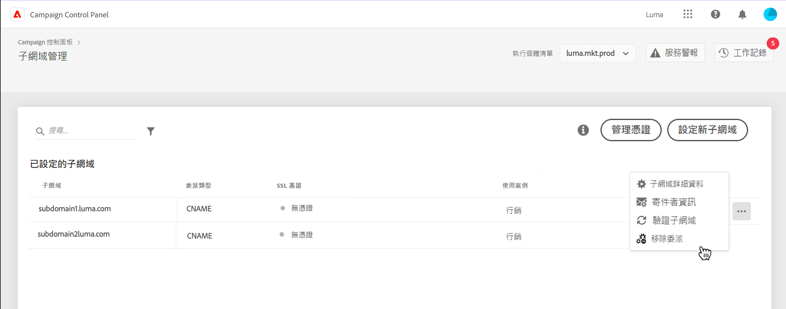
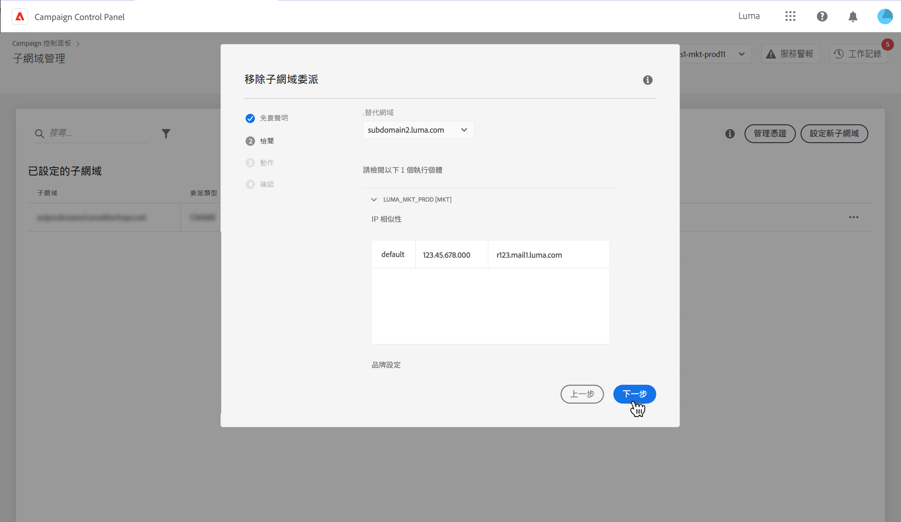
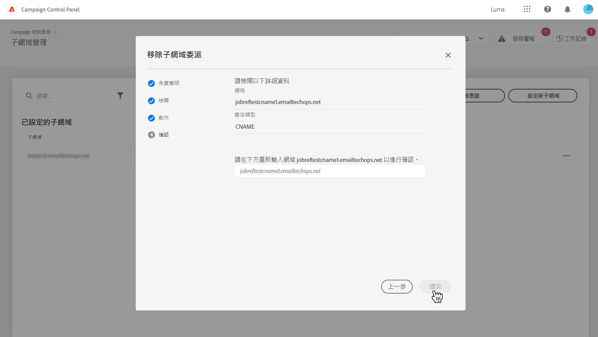
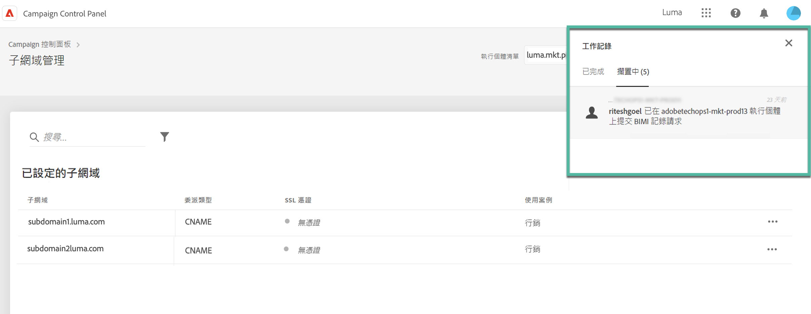
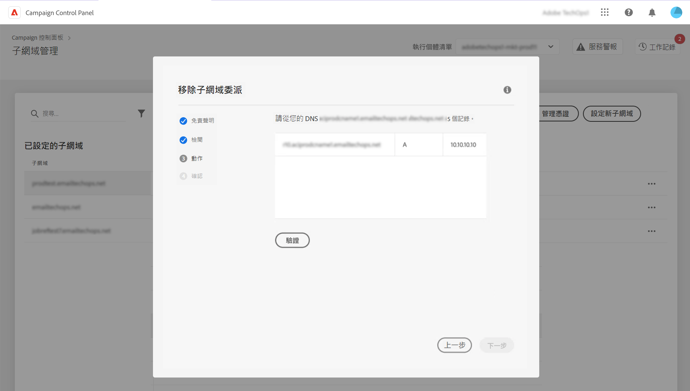

# 移除給 Adobe 的子網域委派 {#remove-delegated--subdomains}

>[!CONTEXTUALHELP]
>id="cp_subdomain_undelegate"
>title="移除子網域委派"
>abstract="此畫面可讓您移除給 Adobe 的子網域委派。 請記住，此流程無法取消，且必須等到執行完成之後才能復原。  如果您嘗試移除選定執行個體的主要網域委派，系統會要求您選擇取代的網域。"

「控制面板」可讓您移除已委派給 Adobe 或由 CNAME 委派的子網域委派。

## 重要備註 {#important}

在繼續操作之前，請仔細考慮一旦觸發移除流程會發生的影響：

* 一旦觸發流程，子網域委派移除作業將無法取消，且在流程執行完成之前無法復原。
* 當另一子網域正在進行類似流程時，無法移除其他子網域委派。
* 在移除子網域委派之後，必須等到移除 3 天之後，才能重新委派。

## 移除子網域委派 {#steps}

若要移除給 Adobe 的子網域委派，請執行下列步驟：

1. 按一下您要移除的網域委派旁邊的省略符號按鈕，然後選取 **[!UICONTROL 移除委派]**.

   

1. 檢閱免責聲明並確認移除給 Adobe 的網域委派。

1. 檢閱與子網域相關聯執行個體的資訊，包括相關 IP 相關性與品牌設定。

   如果您要移除所選執行個體的主要網域委派，則需要選擇將使用取代它的網域 **[!UICONTROL 替代網域]** 清單。

   按一下 **[!UICONTROL 下一個]** 以繼續進行移除。

   

1. 如果您移除CNAME型別的委派，或如果您將主要網域取代為使用CNAME委派的網域，則額外的 **[!UICONTROL 動作]** 顯示管理DNS記錄的步驟。 [在本節了解更多資訊](#dns)

1. 檢閱顯示的摘要。 若要確認移除，請輸入您要移除其委派之網域的URL，然後按一下 **[!UICONTROL 提交]**.

   

在委派移除開始之後，待處理作業會顯示在作業記錄，直到完成為止。

## DNS 記錄管理 {#dns}

若要由 CNAME 設定網域委派，「控制面板」需要您在 DNS 伺服器新增特定記錄。 [了解如何使用 CNAME 設定子網域](setting-up-new-subdomain.md#use-cnames)

於移除 CNAME 類型委派時，您需要&#x200B;**移除這些 DNS 記錄**&#x200B;以避免任何問題。 此外，如果您想要移除主要子網域委派，並將其取代為由 CNAME 委派的網域，您可能需要&#x200B;**新增 DNS 記錄** ，視子網域設定的 IP 相關性而定。

下表列出要執行的操作，具體取決於要刪除的委派類型以及用於設定替換網域的委派類型。

| 已移除委派 | 替代網域委派 | 需要的動作 |
|  ---  |  ---  |  ---  |
| CNAME | 無替換網域 | 刪除 DNS 記錄 |
| CNAME | CNAME | 刪除 DNS 記錄 加入 DNS 記錄&#x200B;*(視 IP 相關性而定，選用)* |
| CNAME | 完整 | 刪除 DNS 記錄 |
| 完整 | 無替換網域 | 無需任何動作 |
| 完整 | CNAME | 加入 DNS 記錄&#x200B;*(視 IP 相關性而定，選用)* |
| 完整 | 完整 | 無需任何動作 |

{style="table-layout:auto"}

如需要執行其中一項動作來移除委派，則會在確認移除委派之前顯示額外的 **[!DNL Action]** 步驟。此畫面會根據內容列出要移除或新增的 DNS 記錄。

### 刪除 DNS 記錄

1. 導覽至您的 DNS 伺服器，並移除「控制面板」列出的記錄。
1. 返回「控制面板」，然後按一下 **[!UICONTROL 下一個]** 以繼續移除委派。

### 新增 DNS 記錄

1. 導覽至您的 DNS 伺服器，並新增「控制面板」列出的記錄。
1. 等待新增的 DNS 生效。
1. 返回「控制面板」，然後按一下 **[!UICONTROL 驗證]**.
1. 成功驗證新增的記錄後，請按一下 **[!UICONTROL 下一個]** 以繼續移除委派。

## 錯誤代碼 {#FAQ}

本區段列出錯誤訊息，在嘗試移除子網域委派時，您可能會遇見該訊息：

| 錯誤代碼 | 訊息 | 說明 |
|  ---  |  ---  |  ---  |
| 8002 | 無法處理請求的委派網域移除，因為正在進行類似的重疊請求，請在 3 天後再試一次 | 已在進行選定執行個體的子網域委派移除作業。 請等待 3 天再開始新的移除作業。 |
| 8003 | 此執行個體不支援請求的委派網域移除。 | 由於技術問題，選定子網域不支援委派移除，請聯絡客戶服務部門。 |
| 8004 | 不允許請求的委派網域移除，因為此執行個體中只有一個網域。 | 選定執行個體僅委派單一子網域。 不允許移除委派。 |
| 8005 | 此設定不支援請求的委派網域移除。 | 由於技術問題，選定子網域不支援委派移除，請聯絡客戶服務部門。 |
| 8006 | 由於未知原因，不允許請求的委派網域移除。請聯絡客戶服務。 | 由於未知問題，選定執行個體不支援移除委派，請聯絡客戶服務部門。 |
