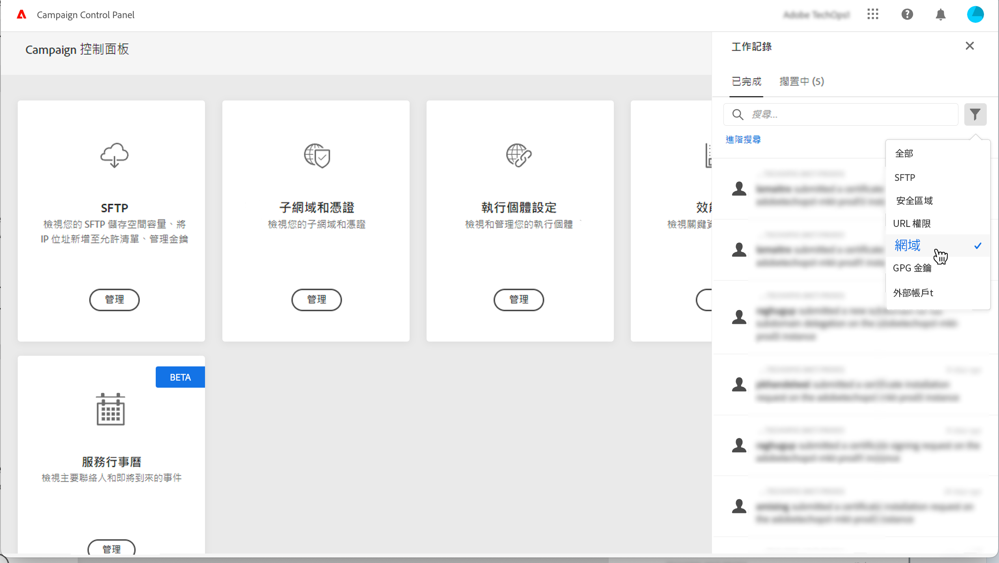
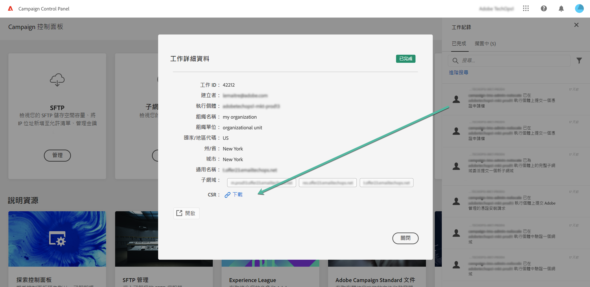

# 續約 SSL 憑證 {#renewing-subdomains-ssl-certificates}

>[!CONTEXTUALHELP]
>id="cp_add_ssl_certificate"
>title="SSL 憑證續約"
>abstract="若要續約 SSL 憑證，您必須產生 CSR、購買子網域的 SSL 憑證並安裝憑證套裝。只有在您選擇手動管理憑證而不是將其委託給 Adobe 時，才需要執行此操作。 "

>[!NOTE]
>
>只有當您選擇自行管理憑證，而非將此程序委派給 Adobe 時，才需要更新子網域的 SSL 憑證。 強烈建議將子網域的 SSL 憑證委派給 Adobe 管理，因為 Adobe 每年都會在憑證過期前，自動建立並更新憑證。[了解更多 SSL 憑證管理相關資訊](monitoring-ssl-certificates.md#management)

SSL 憑證續約流程包含 3 個步驟：

1. **產生憑證申請檔 (CSR)**

   您必須在購買憑證之前，先針對您打算保護的執行個體和子網域產生憑證申請檔。您需要提供產生 CSR 所需的一些資訊 (例如通用名稱、組織名稱和地址等等)。[了解更多](#generate)

1. **購買 SSL 憑證**

   產生 CSR 後，您可以使用它從貴公司核准的憑證機構購買的 SSL 憑證。

1. **安裝 SSL 憑證**

   安裝購買的 SSL 憑證到所需的子網域上以保護它們。 [了解更多](#install)

利用 [Campaign v7/v8](https://experienceleague.adobe.com/docs/campaign-classic-learn/control-panel/subdomains-and-certificates/adding-ssl-certificates.html?lang=zh-Hant) 或 [Campaign Standard](https://experienceleague.adobe.com/docs/campaign-standard-learn/control-panel/subdomains-and-certificates/adding-ssl-certificates.html?lang=zh-Hant) 在影片中瞭解此功能

**相關主題：**

* [傳遞能力最佳實務指南 — Adobe Campaign 的 SSL 憑證請求流程](https://experienceleague.adobe.com/docs/deliverability-learn/deliverability-best-practice-guide/additional-resources/campaign/ac-ssl-certificate-request.html?lang=zh-Hant)
* [子網域品牌化](../../subdomains-certificates/using/subdomains-branding.md)
* [監視子網域](../../subdomains-certificates/using/monitoring-subdomains.md)

## 產生 CSR {#generate}

>[!CONTEXTUALHELP]
>id="cp_generate_csr"
>title="CSR 產生"
>abstract="您必須在購買憑證之前，先針對您打算保護的執行個體和子網域產生憑證簽署要求。"

>[!CONTEXTUALHELP]
>id="cp_select_subdomains"
>title="選擇 CSR 的子網域"
>abstract="您可以選擇將所有或僅特定子網域納入您的憑證簽署請求。只有選取的子網域才會透過購買的 SSL 憑證取得認證。"

若要產生憑證申請檔 (CSR)，請執行下列步驟：

1. 在&#x200B;**[!UICONTROL 子網域和憑證]**&#x200B;卡片，選取所需的執行個體，然後按一下&#x200B;**[!UICONTROL 管理憑證]** 按鈕。

   

1. 選取 **[!UICONTROL 1 - 產生 CSR]**，然後按一下&#x200B;**[!UICONTROL 下一步]**&#x200B;以啟動精靈，引導您完成 CSR 產生流程。

   

1. 隨即會顯示表格，其中包含產生 CSR 所需的所有詳細資訊。

   請確定您完整且正確地填妥要求的資訊，否則不會續約憑證 (若有需要，請聯絡您的內部團隊，包括安全和 IT 團隊)，然後按一下&#x200B;**[!UICONTROL 下一步]**。

   * **[!UICONTROL 組織]**：正式組織名稱。
   * **[!UICONTROL 組織單位]**：連結至子網域的單位 (範例：行銷、IT)。
   * **[!UICONTROL 執行個體]** (預填)：與子網域相關聯之 Campaign 執行個體的 URL。
   * **[!UICONTROL 一般名稱]**：預設會選取一般名稱，您可以在必要時選取其中一個子網域。

   

1. 選取要包含在 CSR 中的子網域，然後按一下&#x200B;**[!UICONTROL 確定]**。

   

1. 選取的子網域會顯示在清單中。選取每個要包含的子網域，然後按一下&#x200B;**[!UICONTROL 下一步]**。

   

1. 隨即顯示包含在 CSR 的子網域摘要。按一下&#x200B;**[!UICONTROL 提交]**&#x200B;以確認您的請求。

   

   >[!NOTE]
   >
   >**[!UICONTROL 複製 CSR 內容]**&#x200B;按鈕可讓您複製與 CSR 相關的所有資訊 (組織 ID、執行個體、組織名稱、一般名稱、包含的子網域等)

1. 系統會自動產生並下載與您選取範圍相應的 .csr 檔案。您現在可以用它透過貴公司核准的憑證機構購買 SSL 憑證。如果您需要再次下載 CSR，請按照[本章節](#download)詳述的步驟操作。

產生並下載 CSR 後，您就可以用來從貴組織核准的憑證授權單位購買 SSL 憑證。

購買 SSL 憑證後，您就能在執行個體上安裝該憑證，以保護子網域。 [了解更多](#install)

## 下載 CSR {#download}

若要購買 SSL 憑證，您必須先下載憑證申請檔。 CSR 會在產生後自動下載。 您也可以隨時從工作記錄再次下載：

1. 在&#x200B;**[!UICONTROL 工作記錄]**&#x200B;中，選取&#x200B;**[!UICONTROL 已完成]**&#x200B;標籤，然後篩選清單以顯示與子網域管理相關的工作。

   

1. 開啟與 CSR 產生相對應的工作，然後按一下&#x200B;**[!UICONTROL 下載]**&#x200B;連結以取得 .csr 檔案。

   

## 安裝 SSL 憑證 {#install}

>[!CONTEXTUALHELP]
>id="cp_install_ssl_certificate"
>title="SSL 憑證安裝"
>abstract="安裝您從貴組織核准的憑證機構購買的 SSL 憑證。"

購買 SSL 憑證後，您就可以將它安裝在您的執行個體上。繼續操作之前，請確定您已瞭解下列必要條件：

* 憑證簽署要求 (CSR) 必須從「控制面板」產生。否則，您將無法從「控制面板」安裝憑證。
* 憑證申請檔 (CSR) 應符合已設定為要配合 Adobe 使用的子網域。 例如，其亦不能包含已設定的子網域。
* 憑證應具有目前日期。您不能安裝具有未來日期的憑證，也不應安裝過期的應憑證 (即有效的開始日期和結束日期)。
* 憑證應由受信任的憑證機構 (CA) 核發，例如 Comodo、DigiCert、GoDaddy 等等。
* 憑證大小應為 2048 位元，演算法應為 RSA。
* 憑證應為 X.509 PEM 格式。
* 支援 SAN 憑證。
* 不支援萬用字元憑證。
* ZIP 檔案或憑證不應受密碼保護。
* ZIP 檔案應在個別檔案中只包含下列內容：
   * 終端實體憑證。
   * 中繼憑證鏈 (依適當順序排列)。
   * 根憑證 (選填)。

請依照下列步驟以安裝憑證：

1. 在&#x200B;**[!UICONTROL 子網域和憑證]**&#x200B;卡片中，選取所需的執行個體，然後按一下&#x200B;**[!UICONTROL 管理憑證]**&#x200B;按鈕。

   

1. 選取 **[!UICONTROL 3 - 安裝憑證套件]**，然後按一下&#x200B;**[!UICONTROL 下一步]**&#x200B;以啟動精靈，引導您完成憑證安裝流程。

   

1. 選取包含要安裝憑證的 .zip 檔案，然後按一下&#x200B;**[!UICONTROL 提交]**。

   

>[!NOTE]
>
>此憑證將會安裝在 CSR 中包含的所有網域/子網域上。憑證中出現的任何其他網域/子網域都不會考慮在內。

安裝 SSL 憑證後，憑證的到期日和狀態圖示會隨之更新。
