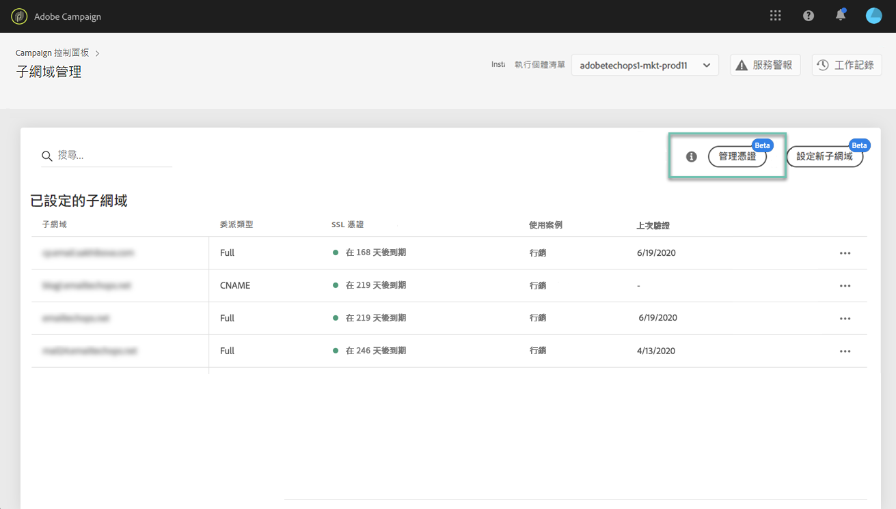
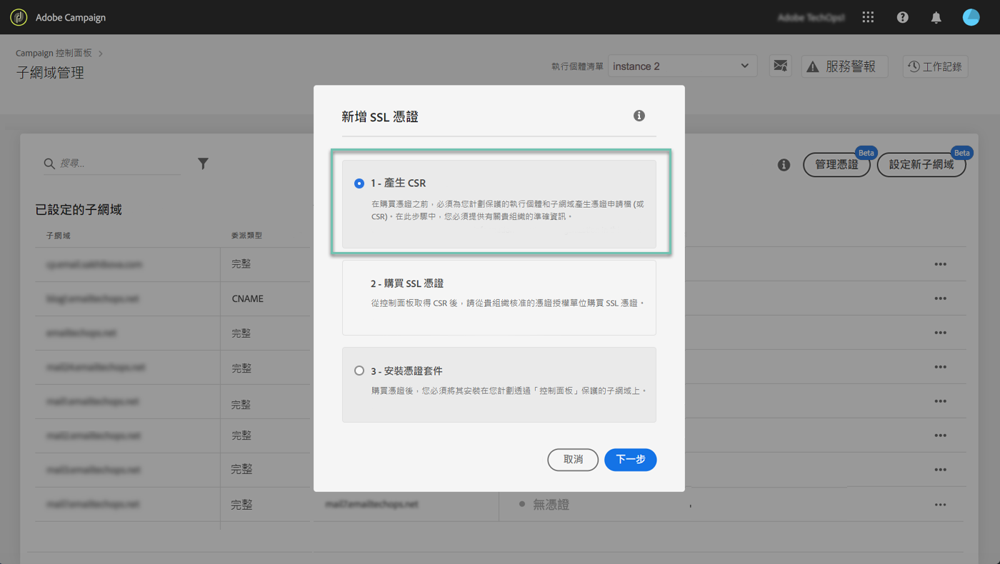
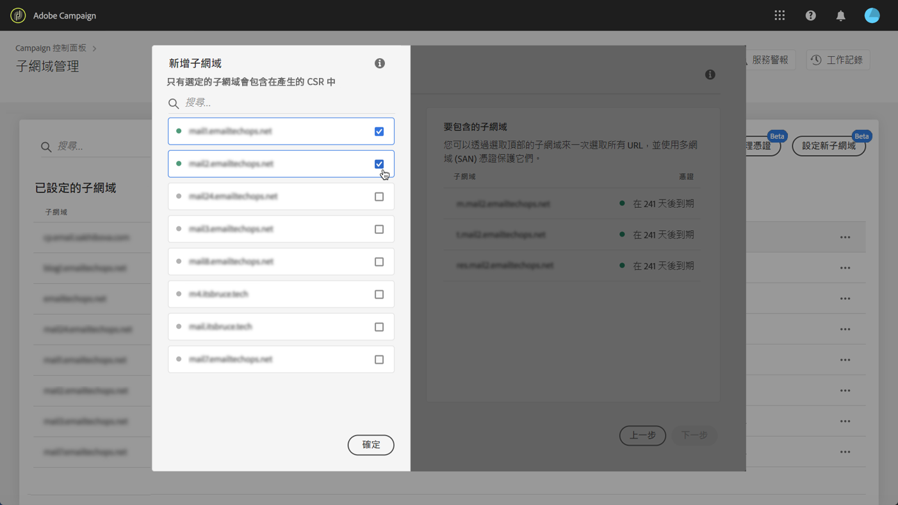
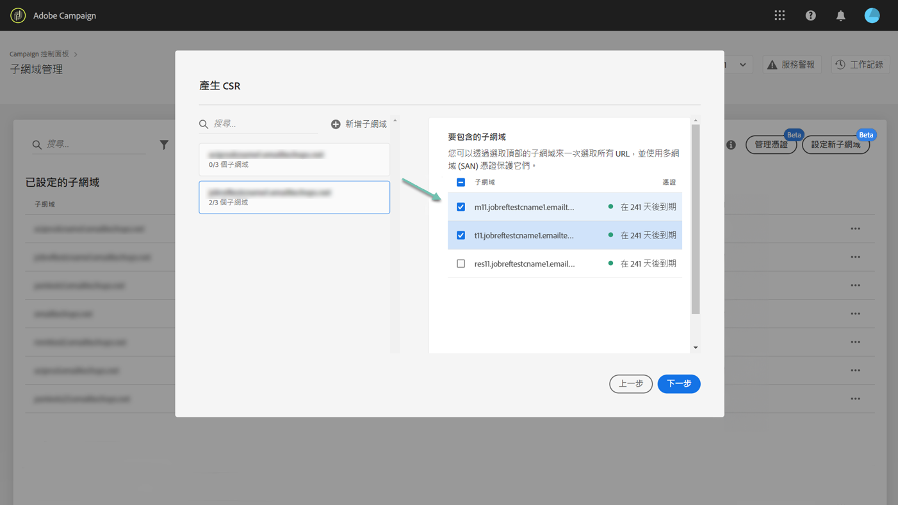
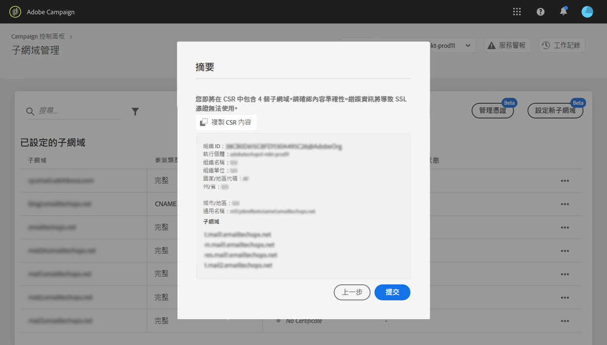
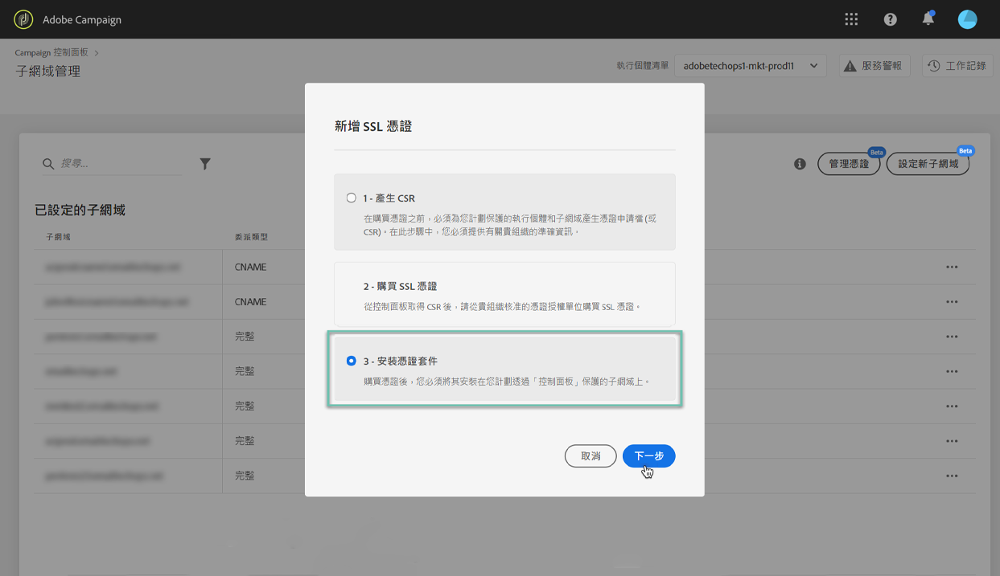
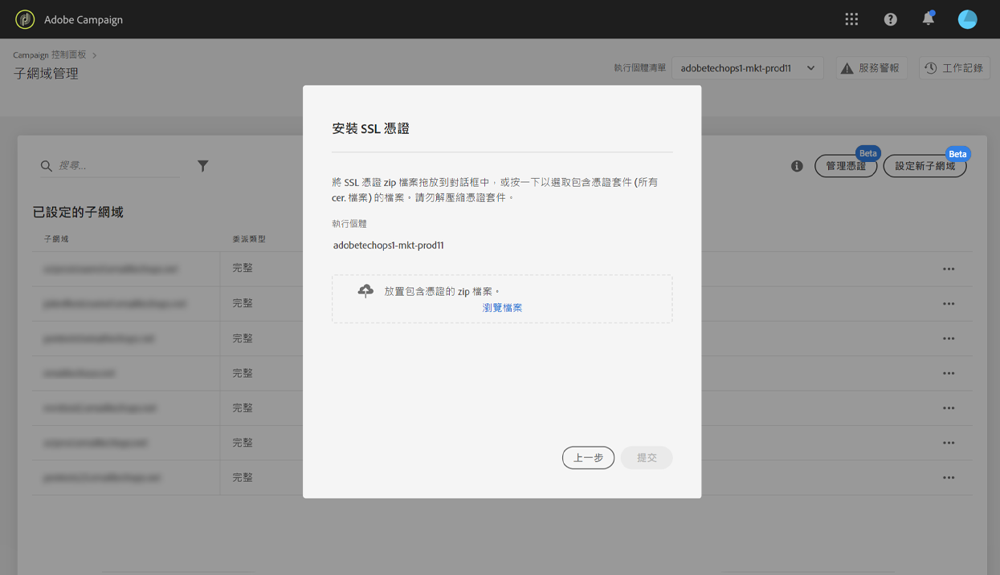

# 續約子網域的 SSL 憑證 {#renewing-subdomains-ssl-certificates}

>[!CONTEXTUALHELP]
>id="cp_add_ssl_certificate"
>title="SSL憑證續約"
>abstract="若要續約SSL憑證，您需要產生CSR、購買子網域的SSL憑證，然後安裝憑證套件。"
>additional-url="https://experienceleague.adobe.com/docs/control-panel/using/subdomains-and-certificates/renewing-subdomain-certificate.html#generating-csr" text="產生憑證簽署要求 (CSR)"
>additional-url="https://experienceleague.adobe.com/docs/control-panel/using/subdomains-and-certificates/renewing-subdomain-certificate.html#installing-ssl-certificate" text="安裝SSL憑證"

## 關於憑證續約 {#about-certificate-renewal-process}

>[!IMPORTANT]
>
>測試版提供從「控制面板」設定子網域的功能，且會不定期更新和修改，恕不另行通知。

SSL 憑證續約流程包含 3 個步驟：

1. **產生憑證簽署要求 (CSR)**
Adobe 客戶服務產生您的 CSR。您需要提供產生 CSR 所需的一些資訊 (例如通用名稱、組織名稱和地址等等)。
1. **購買 SSL 憑證**
產生 CSR 後，您就可以下載 CSR，並使用它從您公司核准的憑證授權中購買 SSL 憑證。
1. **安裝 SSL 憑證**
購買 SSL 憑證後，您就可以將它安裝在所需的子網域上。

利用 [Campaign Classic](https://experienceleague.adobe.com/docs/campaign-classic-learn/control-panel/subdomains-and-certificates/adding-ssl-certificates.html#subdomains-and-certificates) 或 [Campaign Standard](https://experienceleague.adobe.com/docs/campaign-standard-learn/control-panel/subdomains-and-certificates/adding-ssl-certificates.html#adding-ssl-certificates) 在影片中瞭解此功能

## 產生憑證簽署要求 (CSR) {#generating-csr}

>[!CONTEXTUALHELP]
>id="cp_generate_csr"
>title="CSR產生"
>abstract="您必須在購買憑證之前，先針對您打算保護的執行個體和子網域產生憑證簽署要求。"

>[!CONTEXTUALHELP]
>id="cp_select_subdomains"
>title="選擇 CSR 的子網域"
>abstract="您可以選擇將所有或僅特定子網域納入您的憑證簽署請求。只有選取的子網域才會透過購買的 SSL 憑證取得認證。"
>additional-url="https://experienceleague.adobe.com/docs/control-panel/using/subdomains-and-certificates/subdomains-branding.html?lang=zh-Hant" text="關於子網域名稱"

若要產生憑證簽署要求 (CSR)，請執行下列步驟：

1. 在「**[!UICONTROL Subdomains & Certificates]**」卡片中，選取所需的執行個體，再按一下 **[!UICONTROL Manage Certificate]** 按鈕。

   

1. 選取「**[!UICONTROL 1 - Generate a CSR]**」，然後按一下「**[!UICONTROL Next]**」以啟動精靈，引導您完成 CSR 產生流程。

   

1. 隨即會顯示表格，其中包含產生 CSR 所需的所有詳細資訊。

   請確定您完整且正確地填妥要求的資訊，否則不會續約憑證 (若有需要，請聯絡您的內部團隊、安全性和 IT 團隊)，然後按一下「**[!UICONTROL Next]**」。

   * **[!UICONTROL Organization]**：正式組織名稱。
   * **[!UICONTROL Organization Unit]**：連結至子網域的單位 (範例：行銷、IT)。
   * **[!UICONTROL Instance]**(預填)：與子網域相關聯之 Campaign 執行個體的 URL。

   

1. 選取要包含在 CSR 中的子網域，然後按一下「**[!UICONTROL OK]**」。

   

1. 選取的子網域會顯示在清單中。選取每個要包含的子網域，然後按一下「**[!UICONTROL Next]**」。

   

1. 隨即顯示包含在 CSR 的子網域摘要。按一下「**[!UICONTROL Submit]**」下以確認您的請求。

   

1. 系統會自動產生並下載與您選取範圍相應的 .csr 檔案。您現在可以用它透過貴公司核准的憑證機構購買 SSL 憑證。

   >[!NOTE]
   >
   >如果 CSR 並未儲存/下載，CSR 則會遺失，且您必須重新產生 CSR。

## 與 CSR 購買憑證 {#purchasing-certificate}

從「控制面板」取得「憑證簽署要求 CSR」後，請向貴組織核准的憑證機構購買 SSL 憑證。

## 安裝 SSL 憑證 {#installing-ssl-certificate}

>[!CONTEXTUALHELP]
>id="cp_install_ssl_certificate"
>title="SSL憑證安裝"
>abstract="安裝您從貴組織核准的憑證機構購買的 SSL 憑證。"
>additional-url="https://experienceleague.adobe.com/docs/control-panel/using/subdomains-and-certificates/subdomains-branding.html" text="關於子網域名稱"

購買 SSL 憑證後，您就可以將它安裝在您的執行個體上。繼續操作之前，請確定您已瞭解下列必要條件：

* 憑證簽署要求 (CSR) 必須從「控制面板」產生。否則，您將無法從「控制面板」安裝憑證。
* 憑證簽署要求(CSR)應符合已設定為可搭配Adobe使用的子網域。 例如，它不能包含已設定的子網域。
* 憑證應具有目前日期。您不能安裝具有未來日期的憑證，也不應安裝過期的應憑證 (即有效的開始日期和結束日期)。
* 憑證應由受信任的憑證機構 (CA) 核發，例如 Comodo、DigiCert、GoDaddy 等等。
* 憑證大小應為 2048 位元，演算法應為 RSA。
* 憑證應為 X.509 PEM 格式。
* 支援 SAN 憑證。
* 不支援萬用字元憑證。
* ZIP 檔案或憑證不應受密碼保護。
* ZIP 檔案應在個別檔案中只包含下列內容：
   * 終端實體憑證。
   * 中繼憑證鏈 (依適當順序排列)。
   * 根憑證 (選填)。

請依照下列步驟以安裝憑證：

1. 在「**[!UICONTROL Subdomains & Certificates]**」卡片中，選取所需的執行個體，再按一下 **[!UICONTROL Manage Certificate]** 按鈕。

   

1. 選取「**[!UICONTROL 3 - Install Certificate Bundle]**」，然後按一下「**[!UICONTROL Next]**」以啟動精靈，引導您完成憑證安裝流程。

   

1. 選取包含要安裝之憑證的 .zip 檔案，然後按一下「**[!UICONTROL Submit]**」。

   

>[!NOTE]
>
>此憑證將會安裝在 CSR 中包含的所有網域/子網域上。憑證中出現的任何其他網域/子網域都不會考慮在內。

安裝 SSL 憑證後，憑證的到期日和狀態圖示會隨之更新。

**相關主題：**

* [子網域名稱](../../subdomains-certificates/using/subdomains-branding.md)
* [監視子網域](../../subdomains-certificates/using/monitoring-subdomains.md)
