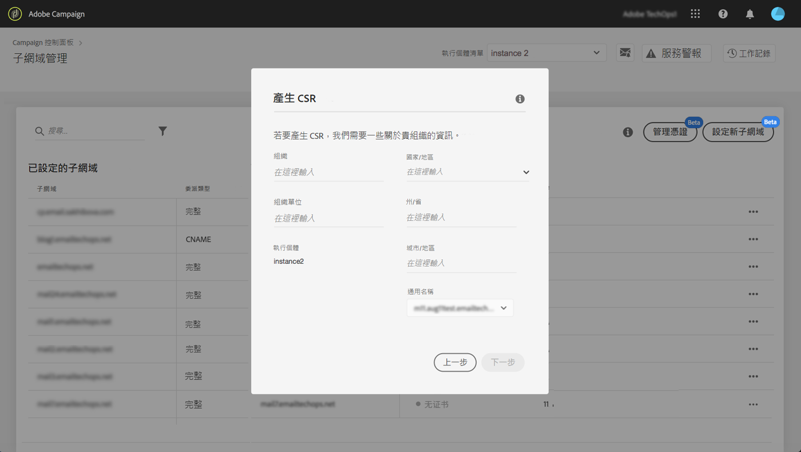

# 續約子網域的SSL憑證 {#renewing-subdomains-ssl-certificates}

## 關於憑證續約 {#about-certificate-renewal-process}

SSL憑證續約程式包含3個步驟，這些步驟都直接從「控制面板」執行：

1. **產生憑證簽署要求(CSR)** Adobe客戶服務會為您產生CSR。 您需要提供產生CSR所需的一些資訊（例如公用名稱、組織名稱和地址等）。
1. **購買SSL憑證**&#x200B;當產生CSR後，您就可以下載CSR，並使用它從您公司核准的認證機構購買SSL憑證。
1. **安裝SSL憑證**&#x200B;購買SSL憑證後，即可將它安裝在所需的子網域上。

## 產生憑證簽署要求(CSR) {#generating-csr}

若要產生憑證簽署要求(CSR)，請遵循下列步驟：

1. 在資訊 **[!UICONTROL Subdomains & Certificates]**卡中，選取所要的例項，然後按一下**[!UICONTROL Manage Certificate]** 按鈕。

   

1. 選 **[!UICONTROL Generate a CSR]**擇，然**[!UICONTROL Next]** 後按一下啟動嚮導，引導您完成CSR生成過程。

   

1. 此時會顯示表單，其中包含產生CSR所需的所有詳細資訊。

   請確定您完整且正確地填寫所要求的資訊（如有必要，請連絡您的內部團隊、安全性和IT團隊），然後按一下 **[!UICONTROL Next]**。

   * **[!UICONTROL Organization]**:
   * **[!UICONTROL Organization Unit]**:
   * **[!UICONTROL Instance]**:與子網域相關聯之促銷活動例項的URL。
   

1. 選擇要包含在CSR中的子域，然後按一下 **[!UICONTROL OK]**。

   

1. 選定的子網域會顯示在清單中。 針對每個子網域，選取要包含的子網域，然後按一下 **[!UICONTROL Next]**。

   

1. 將顯示要包括在CSR中的子域的概要。 按一 **[!UICONTROL Submit]**下以確認您的請求。

   

1. 系統會自動產生並下載與您選取範圍對應的。csr檔案。 您現在可以使用它，從您公司核准的認證機構購買SSL憑證。

## 向CSR購買證書 {#purchasing-certificate}

從「控制面板」取得「認證簽署要求CSR」後，請向貴組織核准的認證機構購買SSL憑證。

## 安裝SSL憑證 {#installing-ssl-certificate}

購買SSL憑證後，請依照下列步驟將它安裝在您的例項上。

1. 在資訊 **[!UICONTROL Subdomains & Certificates]**卡中，選取所要的例項，然後按一下**[!UICONTROL Manage Certificate]** 按鈕。

   

1. 按一 **[!UICONTROL Install SSL Certificate]**下，**[!UICONTROL Next]** 然後啟動精靈，引導您完成憑證安裝程式。

   

1. 選取包含要安裝之憑證的。zip檔案，然後按一下 **[!UICONTROL Submit]**。

   
