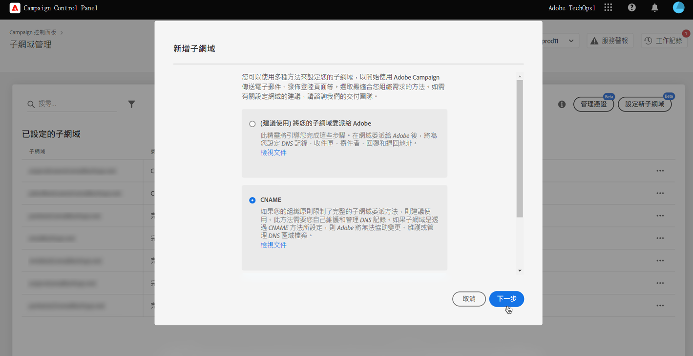
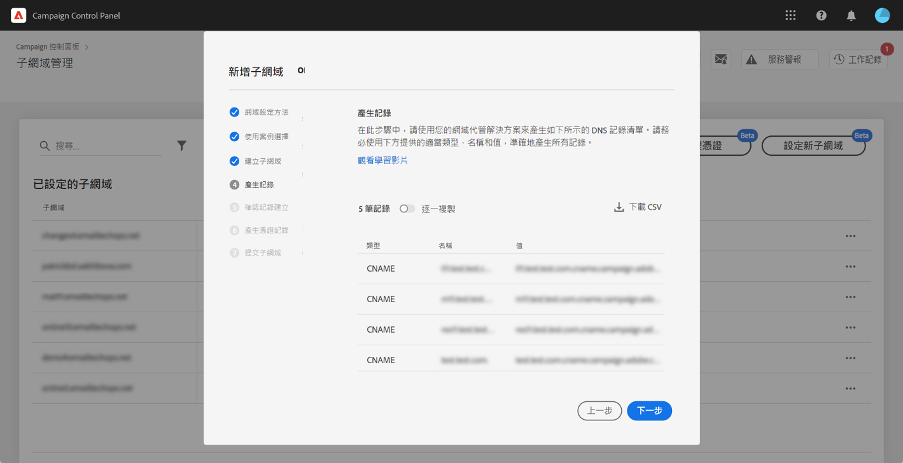
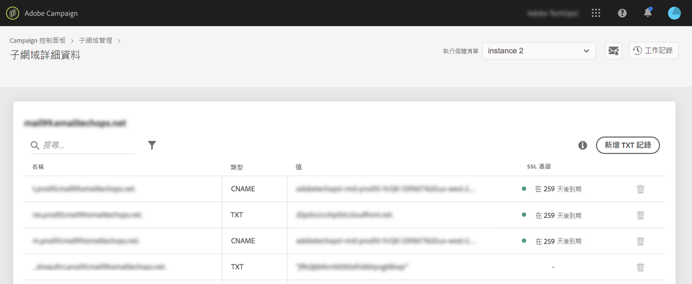

# 設定新的子網域{#setting-up-subdomain}

>[!CONTEXTUALHELP]
>id="cp_subdomain_management"
>title="設定新的子網域和管理憑證"
>abstract="您必須設定新的子網域和管理子網域的 SSL 憑證，才能開始使用 Adobe Campaign 傳送電子郵件或發佈登陸頁面。"
>additional-url="https://docs.adobe.com/content/help/zh-Hant/control-panel/using/subdomains-and-certificates/monitoring-ssl-certificates.html" text="如何監視子網域的 SSL 憑證"

## 必讀 {#must-read}

>[!IMPORTANT]
>
>從「控制面板」設定子網域的功能在測試版中提供，且會不定期更新和修改，恕不另行通知。

本頁面提供如何透過完整子網域委派或 CNAME 來設定新子網域的資訊。 本章節將介紹這兩種方法的全域概念：[子網域品牌化](../../subdomains-certificates/using/subdomains-branding.md)。

**相關主題：**

* [監視子網域](../../subdomains-certificates/using/monitoring-subdomains.md)

### 執行個體選擇

子網域設定僅適用於&#x200B;**生產**&#x200B;執行個體。

如果您在精靈中選擇的執行個體先前沒有設定子網域，則第一個設定的子網域將成為該執行個體的&#x200B;**主要子網域**，而日後您將無法更改該子網域。

因此，將利用此主子網域為其他子網域建立&#x200B;**反向 DNS 記錄**。 **其他子網域的回覆和退信地址會由主要子網域產生。**

### 名稱伺服器設定

設定命名伺服器時，請務必&#x200B;**不要將根子網域委派給 Adobe**。否則，網域只能與 Adobe 搭配使用。您不能用於任何其他用途，例如傳送內部電子郵件給您組織的員工。

此外，**請勿為此新子網域建立個別的區域檔案**。

## 完全子網域委派{#full-subdomain-delegation}

若要將子網域完全委派給 Adobe Campaign，請執行以下步驟。

利用 [Campaign Classic](https://experienceleague.adobe.com/docs/campaign-classic-learn/control-panel/subdomains-and-certificates/subdomain-delegation.html?lang=zh-Hant#subdomains-and-certificates) 或 [Campaign Standard](https://experienceleague.adobe.com/docs/campaign-standard-learn/control-panel/subdomains-and-certificates/subdomain-delegation.html?lang=zh-Hant#subdomains-and-certificates) 在影片中瞭解此功能

1. 在 **[!UICONTROL Subdomains & Certificates]** 卡片中，選取所需的生產執行個體，再按一下 **[!UICONTROL Setup new subdomain]**。

   

1. 按一下 **[!UICONTROL Next]** 以確認採取完全委派的方法。

   

1. 在您組織使用的託管解決方案中，建立所需的子網域和名稱伺服器。若要這麼做，請複製並貼上精靈中顯示的 Adobe Nameserver 資訊。如需進一步瞭解如何在託管解決方案中建立子網域，請參考[教學課程影片](https://video.tv.adobe.com/v/30175)。

   

1. 在使用對應的 Adobe 名稱伺服器資訊建立子網域後，請按一下 **[!UICONTROL Next]**。

1. 如果您選擇了 Campaign Classic 執行個體，請為子網域選擇想用的使用案例：**行銷通訊**&#x200B;或&#x200B;**交易與營運通訊**。[本章節](../../subdomains-certificates/using/subdomains-branding.md#about-subdomains-use-cases)介紹子網域使用案例的全域概念。

   

1. 輸入您建立到託管解決方案的子網域，再按一下「**[!UICONTROL Submit]**」。

   請務必填寫要委派之子網域的&#x200B;**完整名稱**。舉例來說，若要委派「usoffers.email.weretail.com」子網域，請輸入「usoffers.email.weretail.com」。

   

在提交子網域後，控制面板將執行各種檢查及設定步驟。 更鍋詳細資訊，請參閱[子網域檢查及設定](#subdomain-checks-and-configuration)。

## 利用 CNAME 設定子網域{#use-cnames} 

若要使用 CNAME 來設定子網域，請遵循下列步驟。

利用 [Campaign Classic](https://experienceleague.adobe.com/docs/campaign-classic-learn/control-panel/subdomains-and-certificates/delegating-subdomains-using-cname.html?lang=zh-Hant#subdomains-and-certificates) 或 [Campaign Standard](https://experienceleague.adobe.com/docs/campaign-standard-learn/control-panel/subdomains-and-certificates/delegating-subdomains-using-cname.html?lang=zh-Hant) 在影片中瞭解此功能

1. 在 **[!UICONTROL Subdomains & Certificates]** 卡片中，選取所需的生產執行個體，再按一下 **[!UICONTROL Setup new subdomain]**。

   

1. 選取 **[!UICONTROL CNAME]** 方法，然後按一下 **[!UICONTROL Next]**。

   

1. 如果您選擇了 Campaign Classic 執行個體，請為子網域選擇想要的使用案例：**行銷通訊**&#x200B;或&#x200B;**交易與營運通訊**。 有關子網域使用案例的全域概念在[本章節](../../subdomains-certificates/using/subdomains-branding.md#about-subdomains-use-cases)中介紹。

   

1. 輸入您建立到託管解決方案的子網域，再按一下 **[!UICONTROL Next]**。

   請務必填寫子網域的&#x200B;**完整名稱**&#x200B;以進行設置。舉例來說，若要設定「usoffers.email.weretail.com」子網域，請輸入「usoffers.email.weretail.com」。

   

1. 要放置在 DNS 伺服器顯示中的記錄清單。 逐一複製這些記錄，或下載 CSV 檔案，然後導覽至您的網域託管解決方案，以產生相符的 DNS 記錄。

   

1. 請確定先前步驟中的所有 DNS 記錄都已產生至您的網域託管解決方案。 如果所有項目都已正確設定，請選取第一個陳述式，然後按一下 **[!UICONTROL Submit]** 以確認。

   

   >[!NOTE]
   >
   >如果要建立記錄並稍後提交子網域設定，請選擇第二個陳述式，然後按一下 **[!UICONTROL Submit later]**。 然後，您就可以直接從子網域管理螢幕&#x200B;**[!UICONTROL Processing]**&#x200B;區域恢復子網域設定。
   >
   >請注意，要放置在伺服器上的 DNS 記錄將由控制面板保留 30 天。 在這段期間之後，您必須從頭開始設定子網域。

在提交子網域後，控制面板將執行各種檢查及設定步驟。 詳細資訊，請參閱[子網域確認和設定](#subdomain-checks-and-configuration)。

## 子網域確認和設定{#subdomain-checks-and-configuration}

1. 提交子網域後，「控制面板」會確認它是否正確指向 Adobe NS 記錄，以及此子網域不存在開始授權 (SOA) 記錄。

   >[!NOTE]
   >
   >請注意，子網域設定執行時，透過「控制面板」中的其他請求將會進入佇列，並只會在子網域設定完成後才執行，以免出現任何效能問題。

1. 如果確認成功，「控制面板」將會開始設定包含 DNS 記錄、其他 URL、收件匣等等的子網域。

   

   您可以按一下子網域設定的&#x200B;**[!UICONTROL Details]**&#x200B;按鈕，以取得有關設定進度的詳細資訊。

   

1. 最後，**傳遞團隊**&#x200B;將會收到關於新子網域的通知，以便稽核該子網域。設定子網域後，稽核流程最多需要 10 個工作天的時間。

   >[!IMPORTANT]
   >
   >執行的檢查包括回饋迴圈和垃圾郵件投訴迴圈測試。因此，我們不建議在稽核完成之前使用子網域，因為這可能導致子網域信譽不佳。

1. 程序結束時，子網域將設定為與您的 Adobe Campaign 執行個體搭配使用，並會建立下列元素：

   * 具有下列 DNS 記錄&#x200B;**的**&#x200B;子網域：SOA、MX、CNAME、DKIM、SPF、TXT，
   * 託管鏡射、資源、追蹤頁面和網域金鑰的&#x200B;**其他子網域**，
   * **收件匣**：寄件人、錯誤、回覆。

   依預設，「控制面板」的「回覆」收件匣會設為清除電子郵件，且無法重新檢視。如果您想要監視行銷活動的「回覆」收件匣，請勿使用此位址。

您可以按一下 **[!UICONTROL Subdomain details]**&#x200B;和 **[!UICONTROL Sender info]** 按鈕，以取得子網域的詳細資訊。

## 疑難排解{#troubleshooting}

* 在某些情況下，子網域會完成設定，但可能無法成功驗證子網域。會將子網域持續列在 **[!UICONTROL Configured]** 清單中，而且會包含作業記錄，其中會提供關於錯誤的資訊。如果您無法解決問題，請聯絡客戶服務。
* 如果在設定後，子網域顯示為「未驗證」，請啟動新的子網域驗證　(**...** / **[!UICONTROL Verify subdomain]**)。如果它仍顯示相同的狀態，原因可能是對收件者架構進行某些自訂，而無法使用標準流程進行驗證。請嘗試使用該子網域傳送行銷活動。
* 如果子網域設定在進行傳遞稽核步驟時花費太長時間（超過 10 個工作日），請聯繫客戶服務。
